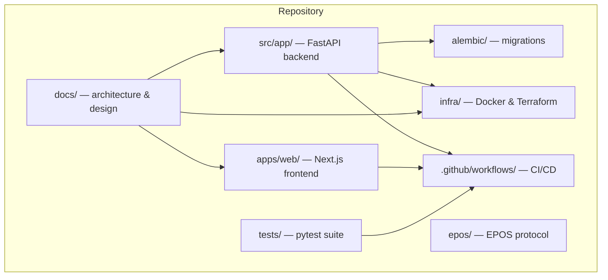

# 01_REPOSITORY_MAP

## Purpose

This document maps the complete structure of the StayOS repository, including folders, applications, entry points, and how the codebase is organized. It is intended to build a shared mental model of the repository before any audit or implementation begins.

## Repository Root

```
StayOS/
├── .github/workflows/         # CI/CD pipelines
├── .ai/ .akwb/ .claude/ .devin/  # AI/assistant scratch space and workflow folders
├── alembic/                   # Database migration scripts
├── apps/web/                  # Next.js frontend
├── archive/                   # Archived outputs and legacy prompts
├── business/                  # Business documentation (finance, product, roadmap, sprint)
├── dist/                      # Build output directory
├── docs/                      # Product, architecture, system design, and standards
├── epos/                      # EPOS (external project operating system) protocol files
├── htmlcov/                   # Coverage report output
├── infra/                     # Docker and Terraform infrastructure
├── knowledge/                 # Operational and domain knowledge base
├── research/                  # Market, competitor, interview, and risk research
├── scripts/                   # Utility scripts
├── src/app/                   # FastAPI backend application
├── tests/                     # Python pytest suite
├── tools/                     # Development and research tools
├── .env.example               # Development environment template
├── .env.staging.example       # Staging environment template
├── .env.test                  # Test environment values
├── docker-compose.yml         # Local development stack
├── docker-compose.staging.yml # Staging compose stack
├── docker-compose.test.yml    # Test infrastructure stack
├── pyproject.toml             # Python project configuration
├── requirements.txt           # Production Python dependencies
├── requirements-dev.txt       # Development dependencies
├── README.md                  # Repository overview
├── MASTER_DELIVERY_BACKLOG.md
├── MASTER_EXECUTION_BOARD.md
├── SPRINT_0_ENGINEERING_FOUNDATION.md
└── STAYOS_*                   # Planning, audit, and implementation documents
```

## Codebase by Area

| Area | Path | Approximate Python/TS Lines | Primary Responsibility |
|------|------|-----------------------------|------------------------|
| Backend | `src/app/` | 10,117 | FastAPI API, business logic, models, workers |
| Tests | `tests/` | 6,191 | Pytest unit, integration, and hardening tests |
| Frontend | `apps/web/` | 132 | Next.js web application (pages, layouts, i18n) |
| Migrations | `alembic/versions/` | 1,145 | Schema change scripts for PostgreSQL |
| Infrastructure | `infra/` | 1,004 | Dockerfile and Terraform AWS configuration |

## Major Entry Points

| Entry Point | File / Command | Description |
|-------------|----------------|-------------|
| HTTP API | `src/app/main.py` | `FastAPI` application, routers, middleware, health checks |
| Database session | `src/app/database.py` | Async SQLAlchemy engine and `get_session` dependency |
| Configuration | `src/app/config.py` | `pydantic-settings` based `Settings` singleton |
| Celery worker | `src/app/celery_app.py` | `Celery` app + beat schedule for background jobs |
| Local API | `docker-compose.yml` | `uvicorn app.main:app --reload` on port 8000 |
| Local worker | `docker-compose.yml` | `celery -A app.celery_app worker -Q high,default,low` |
| Frontend dev | `apps/web/` | `next dev` on port 3000 |
| Migrations | `alembic/` | `alembic upgrade head` |
| Tests | `tests/` | `pytest tests/` |
| Docker image | `infra/docker/api/Dockerfile` | Multi-stage Python 3.11 image, runs uvicorn |
| Terraform | `infra/terraform/` | `terraform init / plan / apply` for AWS |
| CI | `.github/workflows/ci.yml` | Lint, type, security, test, build |
| Staging deploy | `.github/workflows/deploy-staging.yml` | ECR build, ECS migration, service update |

## High-Level Repository Diagram



## Supporting Documentation Folders

- `docs/architecture/adr/` — Architecture Decision Records
- `docs/system-design/` — System overview, DDD, API spec, DB design, security, deployment, RBAC, event catalog
- `docs/deployment/` — Deployment guides, runbooks, checklists, risk register
- `docs/standards/` — Repository, naming, commit, and documentation conventions
- `business/` — Business model, financial, operations, product, roadmap, sprint
- `knowledge/` — Customer success, finance, operations, trust, support playbooks
- `research/` — Market, competitor, interviews, feature evaluation, risk
- `archive/` — Legacy prompts and AI outputs
- `epos/` — EPOS session/project control files

## Notes

- The repository is a monorepo: backend, frontend, infrastructure, documentation, and business artifacts live in the same root.
- Python source is organized under `src/app/` rather than the package name `stayos`, so `PYTHONPATH=src` is required in containers.
- The `.venv/` directory contains an active Python environment; caches for pytest, mypy, and ruff are also present.
