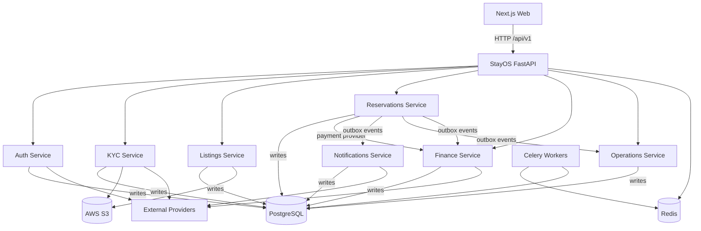

# 03_SYSTEM_MAP

## Purpose

This document identifies the major subsystems in StayOS and how they connect to one another. It describes the runtime architecture at a high level without evaluating implementation quality.

## Major Subsystems

| Subsystem | Package / Location | Responsibility |
|-----------|--------------------|----------------|
| **StayOS API** | `src/app/main.py` | Central FastAPI application that mounts all routers and middleware |
| **Authentication** | `src/app/auth/` | User identity, JWT tokens, refresh tokens, OTP via Twilio, Firebase |
| **KYC** | `src/app/kyc/` | Document upload, Textract OCR, Rekognition face comparison |
| **Listings (PMS)** | `src/app/listings/` | Property units, listings, calendar rules, availability, host dashboard |
| **Reservations** | `src/app/reservations/` | Booking creation, payment confirmation, check-in/out, cancellation, promos |
| **Finance** | `src/app/finance/` | Wallets, escrow, ledger, payouts, Paymob and Stripe providers |
| **Operations** | `src/app/operations/` | Field staff, tasks, maintenance requests, property readiness, dashboard |
| **Notifications** | `src/app/notifications/` | Event-driven SMS, email, WhatsApp notifications |
| **Security** | `src/app/security/` | Logging, audit logs, Sentry, rate limiting, security headers, PII masking |
| **Shared** | `src/app/shared/` | Base models, exceptions, middleware, Redis state, outbox, schemas |
| **Celery Workers** | `src/app/celery_app.py` + `tasks.py` files | Background job processing and Celery Beat schedules |
| **Web Frontend** | `apps/web/` | Next.js application with locale-based routing |
| **Database** | PostgreSQL + PostGIS | Persistent data for all subsystems |
| **Cache / Queue** | Redis | Broker, backend, cache, sessions, idempotency |

## Runtime Data Flow

## Subsystem Relationships

### Authentication to Other Subsystems

- `auth` provides `get_current_user`, `require_active_user`, `require_role`, and `require_kyc_verified` dependencies.
- All routers except the public search/listing endpoints depend on these auth dependencies.
- `User` is referenced by `listings.Unit.host_id`, `reservations.Reservation.guest_id`, `kyc.KycDocument.user_id`, `finance.Wallet.owner_id`, `operations.FieldStaff.user_id`, and `operations.OperationTask.field_staff_id`.

### Listings to Reservations

- `listings.Unit` and `listings.CalendarRule` store inventory and availability.
- `reservations.Reservation.unit_id` is a foreign key to `pms.units.id`.
- `reservations` uses `listings.pricing` to compute nightly totals and `listings.repository` to fetch unit details and calendar rules.

### Reservations to Finance

- `reservations.services` calls `finance.providers` to create Paymob/Stripe payment intents.
- `reservations` writes `booking.payment_confirmed`, `booking.checked_in`, `booking.checked_out`, and `booking.cancelled` events to `outbox`.
- `finance.consumers` polls the outbox to create escrows, ledger entries, and release/hold funds.

### Reservations to Operations

- `reservations` writes `booking.checked_in`, `booking.checked_out`, and `booking.cancelled` to the outbox.
- `operations.consumers` polls those events to create or update property readiness and recurring tasks.

### Reservations / Finance / Operations to Notifications

- `notifications.consumers` polls outbox events such as `reservation.created`, `reservation.confirmed`, `payment.failed`, `payment.captured`, `booking.checked_in`, `booking.checked_out`, `booking.cancelled`.
- `notifications.services` creates `Notification` rows and dispatches via SMS, email, or WhatsApp.

### Celery Task Boundaries

| Module | Celery Task File | Purpose |
|--------|------------------|---------|
| KYC | `app.kyc.tasks` | `process_kyc_document` — background identity verification |
| Operations | `app.operations.tasks` | `process_outbox_events`, `process_pending_payouts` |
| Finance | `app.finance.tasks` | `process_outbox_events`, `process_pending_payouts` |
| Notifications | `app.notifications.tasks` | `process_outbox_events`, `process_pending_notifications` |

## Outbox Pattern

- `app.shared.outbox.write_event` writes to `outbox.outbox_events` within the same database transaction as the originating domain change.
- Celery Beat schedules poll the outbox every 30–60 seconds.
- Consumers in `finance`, `operations`, and `notifications` each read events relevant to their subdomain and mark them `processed_at` once handled.

## External Service Boundaries

| Subsystem | External Service | Protocol |
|-----------|------------------|----------|
| Auth | Firebase Admin / Twilio Verify | SDK / REST |
| KYC | AWS S3, Textract, Rekognition | SDK |
| Listings | AWS S3 | SDK |
| Finance | Paymob, Stripe | REST |
| Notifications | Twilio SMS, AWS SES, Meta WhatsApp | REST |
| Monitoring | Sentry | SDK |

## Web Frontend Boundary

- `apps/web` is a Next.js 14 application.
- It communicates with the FastAPI backend over HTTP.
- It currently has locale routing, a search page, and Arabic-first styling.
- There is no mobile application code in the repository; mobile design documents exist under `docs/MOBILE_NATIVE_DESIGN_P*.md`.
