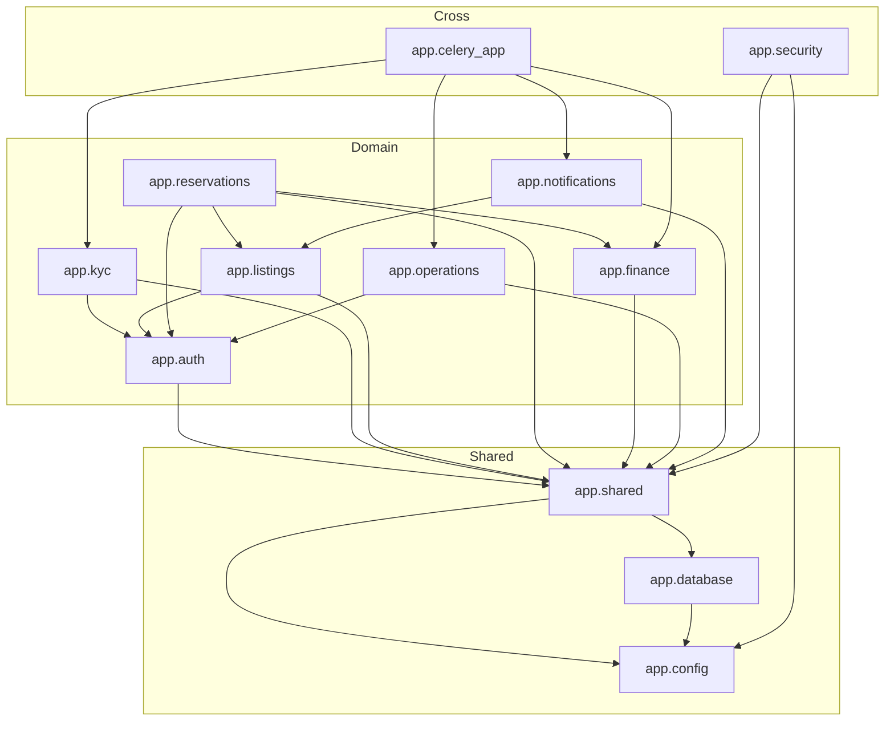

# 04_MODULE_MAP

## Purpose

This document maps every major module/package in the repository, the files it contains, and its responsibilities. It does not judge implementation status.

## Backend Modules (`src/app/`)

### `app.main`

- `main.py` — FastAPI application factory, lifespan (Redis, logging, Sentry), exception handlers, middleware, health/version/metrics endpoints, router includes.

### `app.config`

- `config.py` — `pydantic-settings` `Settings` class. Loads `DATABASE_URL`, `REDIS_URL`, service credentials (Firebase, Twilio, Paymob, Stripe, AWS, Meta, Sentry), JWT keys, OTP settings, and pricing/fee constants.

### `app.database`

- `database.py` — Async SQLAlchemy engine, `AsyncSessionLocal`, `get_session` dependency with automatic commit/rollback/close.

### `app.celery_app`

- `celery_app.py` — Celery app configuration using Redis as broker/backend, includes `kyc`, `operations`, `finance`, `notifications` task modules, beat schedule, and queue definitions (`high`, `default`, `low`).

### `app.shared`

- `models.py` — `Base` (DeclarativeBase), `TimestampMixin`, `UUIDMixin`, `OutboxEvent`.
- `schemas.py` — Common Pydantic schemas: `BaseResponse`, `PaginatedResponse`, `HealthResponse`, `ErrorResponse`.
- `exceptions.py` — Domain exception hierarchy (`StayOSError`, `NotFoundError`, `ValidationError`, `AuthenticationError`, `AuthorizationError`, `ConflictError`, `PaymentError`) and `to_http_exception` mapper.
- `middleware.py` — CORS setup, `add_request_id` middleware.
- `redis.py` — Module-level `redis_client` variable.
- `outbox.py` — `write_event` helper for the outbox table.

### `app.auth`

- `models.py` — `User`, `Account`, `RefreshToken`.
- `schemas.py` — Request/response Pydantic models for OTP, Firebase, tokens, user/account.
- `services.py` — JWT creation/validation, OTP via Twilio, Firebase auth, refresh token rotation, account management.
- `repository.py` — Database access for users, accounts, refresh tokens.
- `dependencies.py` — `get_current_user`, `require_active_user`, `require_role`, `require_kyc_verified`, `get_public_key`.
- `router.py` — `/otp/send`, `/otp/verify`, `/firebase`, `/refresh`, `/logout`, `/me`, `/me/account`, `/.well-known/jwks.json`.
- `constants.py` — `UserRole`, `KycStatus`, `KycDocumentType`.

### `app.kyc`

- `models.py` — `KycDocument`.
- `schemas.py` — Initiate, submit, status, upload URL schemas.
- `services.py` — Presigned S3 upload URLs, Textract ID analysis, Rekognition face comparison, status update, Celery task dispatch.
- `repository.py` — CRUD for KYC documents.
- `router.py` — `/initiate`, `/documents/{id}/submit`, `/status`, `/documents/{id}/process`.
- `tasks.py` — Celery wrapper for `process_kyc_document`.

### `app.listings`

- `models.py` — `Unit`, `UnitListing`, `CalendarRule`.
- `schemas.py` — Search, create, update, calendar, availability, dashboard schemas.
- `services.py` — Search, create, update, publish/unpublish/archive, calendar rule CRUD, bulk availability/pricing, host dashboard, host reservation calendar.
- `repository.py` — Data access for units, listings, calendar rules, host views.
- `pricing.py` — Price calculation for reservations.
- `router.py` — Listing CRUD, availability, calendar, publish/unpublish/archive, host dashboard/reservations.
- `constants.py` — `UnitStatus`, `CalendarStatus`.

### `app.reservations`

- `models.py` — `Reservation`, `PaymentIntent`, `PromoCode`, `PromoApplication`.
- `schemas.py` — Reservation CRUD, payment confirmation, cancel, promo, list filters, pagination.
- `services.py` — Create, confirm by provider, fail by provider, cancel, check-in/out, promo application, amount calculation.
- `repository.py` — Reservation data access.
- `router.py` — `/reservations` CRUD, confirm, cancel, check-in, check-out, promo.
- `constants.py` — `ReservationStatus`, `PaymentStatus`, `PaymentMethod`, `PaymentProvider`, `CancellationReason`.

### `app.finance`

- `models.py` — `Wallet`, `EscrowAccount`, `FinancialTransaction`, `LedgerEntry`, `PayoutRequest`.
- `schemas.py` — Wallet, ledger, escrow, payout, webhook schemas.
- `services.py` — Wallet/escrow/ledger/payout business logic, outbox event handlers.
- `repository.py` — Wallet, escrow, transaction, ledger, payout data access.
- `providers.py` — Paymob and Stripe payment creation, webhook verification, payout disbursement.
- `consumers.py` — Outbox consumer for payment/checked-in/cancel events.
- `tasks.py` — Celery tasks for outbox polling and pending payouts.
- `router.py` — Wallets, escrow, payouts, Paymob/Stripe webhooks.
- `constants.py` — `EscrowStatus`, `TransactionStatus`, `PayoutStatus`, `PaymentProvider`.

### `app.operations`

- `models.py` — `FieldStaff`, `OperationTask`, `TaskEvent`, `MaintenanceRequest`, `PropertyReadiness`, `RecurringMaintenance`.
- `schemas.py` — Task, staff, maintenance, readiness, dashboard schemas.
- `services.py` — Task lifecycle, staff, maintenance, readiness, dashboard, outbox event handlers.
- `repository.py` — Operations data access.
- `consumers.py` — Outbox consumer for check-in/check-out/cancel events.
- `tasks.py` — Celery tasks for outbox polling and recurring maintenance.
- `metrics.py` — Prometheus metrics and middleware.
- `router.py` — Tasks, staff, maintenance, readiness, dashboard, recurring maintenance.
- `constants.py` — `TaskStatus`, `TaskPriority`, `MaintenanceRequestStatus`, `ReadinessStatus`.

### `app.notifications`

- `models.py` — `Notification`, `NotificationTemplate`.
- `schemas.py` — Notification data schemas.
- `services.py` — Resolve recipient, render templates, create notifications, dispatch to providers, retry logic.
- `repository.py` — Notification and template data access.
- `providers.py` — WhatsApp (Meta Graph), email (AWS SES), SMS (Twilio) dispatchers.
- `templates.py` — Default bilingual (ar/en) templates for reservation/payment events.
- `consumers.py` — Outbox consumer for notification-relevant events.
- `tasks.py` — Celery tasks for outbox polling and pending notifications.
- `constants.py` — `NotificationChannel`, `NotificationStatus`.
- No HTTP router; notifications are triggered entirely by outbox events.

### `app.security`

- `models.py` — `AuditLog`.
- `logging.py` — PII-masking filter, JSON formatter, `setup_logging`.
- `audit.py` — `audit_middleware` placeholder and `AuditLog` writing helpers.
- `middleware.py` — `security_headers_middleware` (CSP, HSTS, X-Frame, etc.).
- `rate_limit.py` — `rate_limit` decorator and rate limit error.
- `sentry.py` — `init_sentry` integration.
- `pii.py` — PII masking helpers.
- `secrets.py` — Placeholder module for secret management.

## Frontend Module (`apps/web/`)

- `app/layout.tsx` — Root layout with Arabic `dir="rtl"`.
- `app/page.tsx` — Redirects `/` to `/ar`.
- `app/ar/page.tsx` — Arabic landing route.
- `app/[locale]/layout.tsx` — Locale validation (`ar`, `en`) and direction.
- `app/[locale]/page.tsx` — Redirects to `/{locale}/search`.
- `app/[locale]/search/page.tsx` — Search page with query form.
- `lib/utils.ts` — `cn` (Tailwind class merge), `formatMoney`, `formatDate`.
- `messages/en.json`, `messages/ar.json` — i18n message dictionaries.
- `next.config.mjs` — Next.js configuration (React Strict Mode, SWC minify).
- `tailwind.config.ts` — Tailwind content paths.
- `tsconfig.json`, `.eslintrc.json`, `package.json`.

## Database Migration Module (`alembic/`)

- `env.py` — Async Alembic environment, imports all model modules, sets `sqlalchemy.url` from settings.
- `script.py.mako` — Migration template.
- `versions/001_...` through `010_...` — Incremental migration scripts.

## Infrastructure Modules

### `infra/docker/api`

- `Dockerfile` — Multi-stage Python 3.11 image, installs libpq, copies `src/` and `alembic/`, runs `uvicorn`.

### `infra/terraform/`

- `main.tf` — Terraform block, AWS provider, S3 backend, local tags.
- `variables.tf` — Environment, region, DB password, ECS task sizing.
- `vpc.tf` — VPC, subnets, routing.
- `rds.tf` — RDS PostgreSQL instance and parameter group.
- `elasticache.tf` — Redis cluster.
- `ecs.tf` — ECS Fargate services, task definitions, clusters.
- `alb.tf` — Application Load Balancer.
- `iam.tf` — IAM roles and policies.
- `s3.tf` — S3 buckets for listings and KYC.
- `ecr.tf` — ECR repositories.
- `secrets.tf` — AWS Secrets Manager references.

## Test Module (`tests/`)

- `conftest.py` — Test environment variables, JWT key generation, Redis mock, `TestClient` fixture.
- `test_*.py` — Module-specific test files for auth, kyc, listings, reservations, finance, operations, security, database, models, schemas, repositories, consumers, tasks, calendar concurrency, main, exceptions, outbox, hardening coverage, and Celery app.

## Module Dependency Diagram

