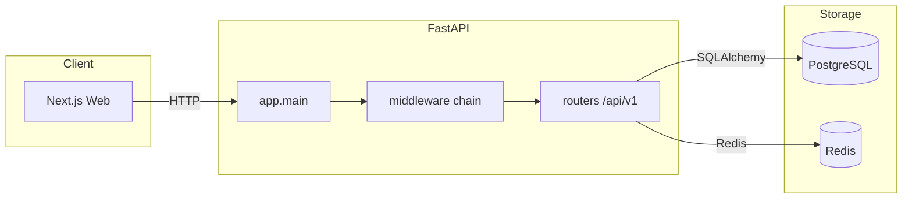
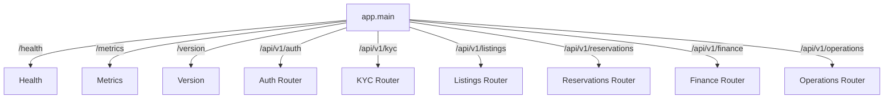

# 05_API_MAP

## Purpose

This document maps every HTTP API endpoint and background event consumer in the StayOS repository. All routes are mounted by `src/app/main.py` and are organized by FastAPI `APIRouter`.

## Global Base Path

- All domain routers are included under the prefix `/api/v1`.
- Global application endpoints are mounted at `/`.

## Request Flow

## Application-Level Endpoints

| Method | Path | Response Model | Description |
|--------|------|----------------|-------------|
| GET | `/` | JSON | Welcome message |
| GET | `/health` | `HealthResponse` | Database + Redis health |
| GET | `/health/live` | `HealthResponse` | Liveness probe |
| GET | `/health/ready` | `HealthResponse` | Readiness probe |
| GET | `/health/deep` | `HealthResponse` | Deep health check |
| GET | `/metrics` | Plain text | Prometheus metrics |
| GET | `/version` | JSON | API name, version, environment |

## Auth Router (`/api/v1/auth`)

| Method | Path | Auth | Description |
|--------|------|------|-------------|
| POST | `/otp/send` | Public | Send OTP via Twilio Verify |
| POST | `/otp/verify` | Public | Verify OTP and receive token pair |
| POST | `/firebase` | Public | Authenticate with Firebase ID token |
| POST | `/refresh` | Public refresh token | Rotate access/refresh tokens |
| POST | `/logout` | Refresh token | Revoke refresh token |
| GET | `/me` | Bearer | Current user profile |
| GET | `/me/account` | Bearer | Current user account |
| PATCH | `/me/account` | Bearer | Update account details |
| GET | `/.well-known/jwks.json` | Public | Public key for JWT verification |

## KYC Router (`/api/v1/kyc`)

| Method | Path | Auth | Description |
|--------|------|------|-------------|
| POST | `/initiate` | Active user | Create KYC document and return S3 upload URLs |
| POST | `/documents/{document_id}/submit` | Active user | Mark document uploaded, queue verification |
| GET | `/status` | Active user | KYC status and document list |
| POST | `/documents/{document_id}/process` | Admin | Trigger document OCR/face comparison |

## Listings Router (`/api/v1/listings`)

| Method | Path | Auth | Description |
|--------|------|------|-------------|
| GET | `/` | Public | Search listings with filters |
| POST | `/` | Host | Create a new listing |
| GET | `/{unit_id}` | Public | Listing detail |
| PATCH | `/{unit_id}` | Host | Update listing |
| GET | `/{unit_id}/availability` | Public | Availability for date range |
| POST | `/{unit_id}/publish` | Host | Publish listing |
| POST | `/{unit_id}/unpublish` | Host | Unpublish listing |
| POST | `/{unit_id}/archive` | Host | Archive listing |
| POST | `/{unit_id}/calendar` | Host | Create calendar rule |
| PATCH | `/{unit_id}/calendar/{rule_id}` | Host | Update calendar rule |
| DELETE | `/{unit_id}/calendar/{rule_id}` | Host | Delete calendar rule |
| POST | `/{unit_id}/calendar/bulk-availability` | Host | Bulk availability update |
| POST | `/{unit_id}/calendar/bulk-pricing` | Host | Bulk pricing update |
| GET | `/host/dashboard` | Host | Host dashboard stats |
| GET | `/host/reservations` | Host | Host reservation calendar |

## Reservations Router (`/api/v1/reservations`)

| Method | Path | Auth | Description |
|--------|------|------|-------------|
| POST | `/` | Current user | Create reservation |
| GET | `/` | Current user | List reservations |
| GET | `/{reservation_id}` | Current user | Reservation detail |
| POST | `/{reservation_id}/confirm` | Admin | Confirm reservation by payment |
| POST | `/{reservation_id}/cancel` | Current user | Cancel reservation |
| POST | `/{reservation_id}/check-in` | Current user | Check in |
| POST | `/{reservation_id}/check-out` | Current user | Check out |
| POST | `/{reservation_id}/promo` | Current user | Apply promo code |

## Finance Router (`/api/v1/finance`)

| Method | Path | Auth | Description |
|--------|------|------|-------------|
| GET | `/wallets/me` | Current user | My wallet |
| GET | `/wallets/{wallet_id}/ledger` | Admin / Host | Wallet ledger entries |
| GET | `/escrow` | Admin / Host | List escrows |
| GET | `/escrow/{escrow_id}` | Admin / Host | Escrow detail |
| POST | `/escrow/{escrow_id}/release` | Admin | Manually release escrow |
| POST | `/escrow/{escrow_id}/hold` | Admin | Manually hold escrow |
| POST | `/payouts` | Host | Request payout |
| GET | `/payouts` | Admin / Host | List payouts |
| POST | `/payouts/{payout_id}/process` | Admin | Process payout |
| POST | `/webhooks/paymob` | Public (HMAC) | Paymob payment webhook |
| POST | `/webhooks/stripe` | Public (signature) | Stripe payment webhook |

## Operations Router (`/api/v1/operations`)

| Method | Path | Auth | Description |
|--------|------|------|-------------|
| POST | `/tasks` | Admin / Operations | Create task |
| GET | `/tasks/{task_id}` | Admin / Operations / Field staff | Task detail |
| PATCH | `/tasks/{task_id}` | Admin / Operations / Field staff | Update task |
| POST | `/tasks/{task_id}/assign` | Admin / Operations | Assign task |
| POST | `/tasks/{task_id}/start` | Admin / Operations / Field staff | Start task |
| POST | `/tasks/{task_id}/complete` | Admin / Operations / Field staff | Complete task |
| POST | `/tasks/{task_id}/notes` | Admin / Operations / Field staff | Add note |
| POST | `/tasks/{task_id}/attachments` | Admin / Operations / Field staff | Add attachment |
| GET | `/tasks/{task_id}/timeline` | Admin / Operations / Field staff | Task timeline |
| POST | `/staff` | Admin / Operations | Create field staff |
| GET | `/staff` | Admin / Operations | List field staff |
| POST | `/maintenance` | Admin / Operations / Host / Guest | Create maintenance request |
| GET | `/maintenance/{request_id}` | Admin / Operations | Maintenance detail |
| PATCH | `/maintenance/{request_id}` | Admin / Operations | Update maintenance request |
| GET | `/maintenance` | Admin / Operations | List open maintenance requests |
| GET | `/readiness/{unit_id}` | Admin / Operations | Property readiness |
| PATCH | `/readiness/{unit_id}` | Admin / Operations | Update property readiness |
| GET | `/dashboard` | Admin / Operations | Operations dashboard |
| POST | `/recurring-maintenance` | Admin / Operations | Create recurring maintenance |

## Event / Outbox Consumers

Notifications, Finance, and Operations modules run Celery consumers that poll `outbox.outbox_events`.

| Consumer | Relevant Event Types | Handler Location |
|----------|----------------------|------------------|
| Finance | `booking.payment_confirmed`, `reservation.confirmed`, `booking.checked_in`, `booking.cancelled` | `app.finance.consumers` |
| Operations | `booking.checked_out`, `booking.checked_in`, `booking.cancelled` | `app.operations.consumers` |
| Notifications | `reservation.created`, `reservation.confirmed`, `payment.failed`, `payment.captured`, `booking.checked_in`, `booking.checked_out`, `booking.cancelled` | `app.notifications.consumers` |

## Celery Tasks

| Task | Module | Schedule |
|------|--------|----------|
| `process_kyc_document` | `app.kyc.tasks` | On-demand (sent from KYC service) |
| `process_outbox_events` | `app.operations.tasks` | Every 30s (beat) |
| `process_outbox_events` | `app.finance.tasks` | Every 30s (beat) |
| `process_pending_payouts` | `app.finance.tasks` | Every hour (beat) |
| `process_outbox_events` | `app.notifications.tasks` | Every 30s (beat) |
| `process_pending_notifications` | `app.notifications.tasks` | Every 60s (beat) |

## API Router Mount Diagram

