# 06_DATABASE_MAP

## Purpose

This document maps the database engine, ORM, migration system, schemas, tables, and relationships in the StayOS repository.

## Database Engine

- **Primary database:** PostgreSQL 16
- **Spatial extension:** PostGIS 3.3 (image `postgis/postgis:16-3.3-alpine`)
- **Driver:** `asyncpg` via SQLAlchemy 2.0 async engine
- **Connection string pattern:** `postgresql+asyncpg://...`
- **Migration tool:** Alembic with `sqlalchemy.ext.asyncio` support
- **Connection pool:** `pool_size=10`, `max_overflow=20`

## ORM Stack

- **Base:** `app.shared.models.Base` = `sqlalchemy.orm.DeclarativeBase`
- **Mixins:**
  - `UUIDMixin` — `id` primary key as `String(36)` default `uuid4()`
  - `TimestampMixin` — `created_at` and `updated_at` server default `now()`
- **Column style:** `Mapped[T] = mapped_column(...)` (SQLAlchemy 2.0 mapped style)
- **Async session:** `AsyncSessionLocal` in `app.database` with `expire_on_commit=False`, autocommit/flushed disabled.
- **Session scope:** `get_session` FastAPI dependency yields a session, commits on success, rolls back on exception, closes in `finally`.

## PostgreSQL Schemas

| Schema | Purpose |
|--------|---------|
| `auth` | Users, accounts, refresh tokens, KYC documents |
| `pms` | Property units, listings, calendar rules |
| `reservation` | Reservations, payment intents, promo codes, promo applications |
| `finance` | Wallets, escrow, transactions, ledger, payout requests |
| `operations` | Field staff, tasks, task events, maintenance, readiness, recurring maintenance |
| `notify` | Notifications and notification templates |
| `outbox` | Outbox event store |
| `security` | Audit logs |

## Migrations

- Location: `alembic/versions/`
- Current migrations:
  1. `001_create_schemas.py` — Creates all schemas above.
  2. `002_create_outbox_events.py` — Outbox table.
  3. `003_create_auth_tables.py` — Users, accounts, refresh tokens.
  4. `004_create_pms_tables.py` — Units, unit listings, calendar rules.
  5. `005_create_reservation_tables.py` — Reservations, payment intents, promo codes, promo applications.
  6. `006_add_host_operations_columns.py` — Host and operations additions.
  7. `007_add_operations_tables.py` — Field staff, tasks, maintenance, readiness.
  8. `008_create_finance_tables.py` — Wallets, escrow, transactions, ledger, payouts.
  9. `009_add_calendar_exclusion.py` — Calendar rule additions.
  10. `010_add_notifications_and_security.py` — Notifications, templates, audit logs.

## Entity Relationship Diagram

```mermaid
erDiagram
    AUTH_USER {
        string id PK
        string phone_number
        string email
        string firebase_uid
        string display_name
        string locale
        string role
        string kyc_status
        boolean is_active
        datetime created_at
        datetime updated_at
    }

    AUTH_ACCOUNT {
        string id PK
        string user_id FK
        string legal_name
        string national_id
        date date_of_birth
        string tax_id
        json address
    }

    AUTH_REFRESH_TOKEN {
        string id PK
        string user_id FK
        string token_hash
        datetime expires_at
        datetime revoked_at
    }

    AUTH_KYC_DOCUMENT {
        string id PK
        string user_id FK
        string account_id FK
        string document_type
        string document_number
        string status
        string legal_name
        string front_image_key
        string back_image_key
        string selfie_image_key
        json verification_payload
        datetime verified_at
        datetime rejected_at
        string rejection_reason
    }

    PMS_UNIT {
        string id PK
        string host_id FK
        string property_type
        string status
        geometry coordinates
        string governorate
        string city
        string district
        string google_place_id
        int max_guests
        int bedrooms
        int bathrooms
    }

    PMS_UNIT_LISTING {
        string id PK
        string unit_id FK
        string title_ar
        string title_en
        text description_ar
        text description_en
        array amenities
        array cultural_tags
        text house_rules
        text check_in_instructions
        text policies
        int base_price_egp
        float weekend_mult
        float peak_mult
        int min_nights
        int max_nights
        tsvector search_vector
    }

    PMS_CALENDAR_RULE {
        string id PK
        string unit_id FK
        date date_from
        date date_to
        string status
        string block_type
        int price_override
        string reservation_id
    }

    RESERVATION {
        string id PK
        string unit_id FK
        string guest_id FK
        string status
        date check_in
        date check_out
        int adults
        int children
        int infants
        int total_amount_egp
        int host_amount_egp
        int platform_fee_egp
        int guest_fee_egp
        string payment_method
        datetime checked_in_at
        datetime checked_out_at
        datetime cancelled_at
        text cancel_reason
        int refund_amount_egp
    }

    PAYMENT_INTENT {
        string id PK
        string reservation_id FK
        string provider
        string provider_ref
        int amount_egp
        string status
        json metadata
        datetime captured_at
    }

    PROMO_CODE {
        string id PK
        string code
        float discount_pct
        int max_uses
        int uses
        boolean is_active
        datetime valid_from
        datetime valid_until
    }

    PROMO_APPLICATION {
        string id PK
        string reservation_id FK
        string promo_code_id FK
        float discount_pct
        int discount_amount_egp
    }

    FIN_WALLET {
        string id PK
        string owner_id
        string wallet_type
        string currency
        int balance_egp
        int available_balance_egp
    }

    FIN_ESCROW_ACCOUNT {
        string id PK
        string reservation_id
        string host_id
        int amount_egp
        string status
        datetime hold_until
        datetime released_at
        datetime refunded_at
    }

    FIN_FINANCIAL_TRANSACTION {
        string id PK
        string reservation_id
        string transaction_type
        int amount_egp
        string status
        string provider
        string provider_ref
        string idempotency_key
        json provider_metadata
    }

    FIN_LEDGER_ENTRY {
        string id PK
        string transaction_id FK
        string wallet_id FK
        string escrow_id FK
        string ledger_account
        string account_type
        string entry_type
        int amount_egp
        int balance_after
        string description
        datetime created_at
    }

    FIN_PAYOUT_REQUEST {
        string id PK
        string wallet_id FK
        string host_id
        int amount_egp
        string status
        string provider
        string provider_ref
        json bank_account_info
        datetime processed_at
        string failure_reason
    }

    OPS_FIELD_STAFF {
        string id PK
        string user_id FK
        string name
        string phone
        string role
        boolean is_active
    }

    OPS_OPERATION_TASK {
        string id PK
        string unit_id FK
        string reservation_id
        string parent_task_id FK
        string task_type
        string status
        string priority
        string field_staff_id FK
        datetime due_by
        datetime started_at
        datetime completed_at
        string verified_by_staff_id FK
        text notes
        json checklist
        json attachments
        string created_by_id
    }

    OPS_TASK_EVENT {
        string id PK
        string task_id FK
        string actor_id
        string event_type
        json payload
    }

    OPS_MAINTENANCE_REQUEST {
        string id PK
        string unit_id FK
        string reporter_id
        string issue_type
        text description
        string status
        string related_task_id FK
    }

    OPS_PROPERTY_READINESS {
        string id PK
        string unit_id FK
        string reservation_id
        string status
        datetime blocked_until
        text reason
        datetime updated_at
    }

    OPS_RECURRING_MAINTENANCE {
        string id PK
        string unit_id FK
        string task_type
        string frequency
        int interval_days
        datetime next_run_at
        boolean is_active
        text description
    }

    NOTIFY_NOTIFICATION {
        string id PK
        string event_id
        string event_type
        string channel
        string recipient
        string locale
        string status
        int retry_count
        text subject
        text body
        text error
        datetime sent_at
    }

    NOTIFY_NOTIFICATION_TEMPLATE {
        string id PK
        string event_type
        string channel
        string locale
        text subject
        text body
        array placeholders
    }

    OUTBOX_EVENT {
        string id PK
        string aggregate_type
        string aggregate_id
        string event_type
        json payload
        datetime processed_at
    }

    SECURITY_AUDIT_LOG {
        string id PK
        datetime timestamp
        string user_id
        string role
        string ip_address
        string request_id
        string method
        string path
        int status_code
        string resource_type
        string resource_id
        string action
        text payload
    }

    AUTH_USER ||--o{ AUTH_ACCOUNT : "has one"
    AUTH_USER ||--o{ AUTH_REFRESH_TOKEN : "has many"
    AUTH_USER ||--o{ AUTH_KYC_DOCUMENT : "has many"
    AUTH_ACCOUNT ||--o{ AUTH_KYC_DOCUMENT : "optional"
    PMS_UNIT ||--o| PMS_UNIT_LISTING : "has one"
    PMS_UNIT ||--o{ PMS_CALENDAR_RULE : "has many"
    AUTH_USER ||--o{ PMS_UNIT : "host"
    PMS_UNIT ||--o{ RESERVATION : "booked"
    AUTH_USER ||--o{ RESERVATION : "guest"
    RESERVATION ||--o{ PAYMENT_INTENT : "has many"
    RESERVATION ||--o{ PROMO_APPLICATION : "has many"
    PROMO_CODE ||--o{ PROMO_APPLICATION : "used in"
    RESERVATION ||--o| FIN_ESCROW_ACCOUNT : "one escrow"
    FIN_WALLET ||--o{ FIN_LEDGER_ENTRY : "has many"
    FIN_ESCROW_ACCOUNT ||--o{ FIN_LEDGER_ENTRY : "has many"
    FIN_FINANCIAL_TRANSACTION ||--o{ FIN_LEDGER_ENTRY : "has many"
    FIN_PAYOUT_REQUEST ||--|| FIN_WALLET : "from wallet"
    AUTH_USER ||--o{ OPS_FIELD_STAFF : "optional"
    PMS_UNIT ||--o{ OPS_OPERATION_TASK : "has many"
    OPS_FIELD_STAFF ||--o{ OPS_OPERATION_TASK : "assigned"
    OPS_OPERATION_TASK ||--o{ OPS_TASK_EVENT : "timeline"
    PMS_UNIT ||--o{ OPS_MAINTENANCE_REQUEST : "has many"
    PMS_UNIT ||--o| OPS_PROPERTY_READINESS : "per unit"
    PMS_UNIT ||--o{ OPS_RECURRING_MAINTENANCE : "has many"
```

## Indexes and Constraints Summary

| Table | Key Indexes / Constraints |
|-------|---------------------------|
| `auth.users` | Unique `phone_number`, `email`, `firebase_uid` |
| `auth.accounts` | Unique `user_id`, FK to `auth.users.id` |
| `auth.refresh_tokens` | Unique `token_hash`, index on `user_id` |
| `auth.kyc_documents` | Index on `user_id`, FK to `auth.users.id` and `auth.accounts.id` |
| `pms.units` | Check constraints on `max_guests`, `bedrooms`, `bathrooms`; PostGIS spatial index on `coordinates` |
| `pms.unit_listings` | GIN indexes on `search_vector`, `amenities`, `cultural_tags`; index on `unit_id`; index on `base_price_egp`; check `base_price_egp >= 100` |
| `pms.calendar_rules` | Index on `unit_id, date_from, date_to`; check `date_to > date_from` |
| `reservation.reservations` | Check `check_out > check_in` |
| `reservation.payment_intents` | FK to `reservation.reservations.id` |
| `reservation.promo_codes` | Unique `code` |
| `reservation.promo_applications` | FK to reservations and promo codes |
| `finance.wallets` | Unique constraint `(owner_id, wallet_type)` |
| `finance.escrow_accounts` | Unique `reservation_id` |
| `finance.financial_transactions` | Unique `idempotency_key` |
| `finance.ledger_entries` | FK to transaction, wallet, escrow |
| `finance.payout_requests` | FK to `finance.wallets.id` |
| `operations.operation_tasks` | Indexes on `unit_id`, `reservation_id`, `status`, `due_by` |
| `operations.task_events` | Index on `task_id` |
| `operations.maintenance_requests` | Indexes on `unit_id`, `status` |
| `operations.property_readiness` | Index on `unit_id` |
| `operations.recurring_maintenance` | Index on `unit_id` |
| `notify.notifications` | Indexes on `(status, created_at)`, `event_id` |
| `notify.notification_templates` | Unique `(event_type, channel, locale)` |
| `security.audit_logs` | Indexes on `user_id`, `(resource_type, resource_id)` |
