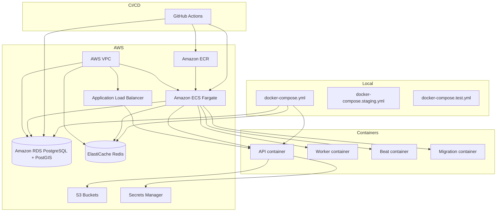

# 09_INFRASTRUCTURE_MAP

## Purpose

This document maps the infrastructure, containerization, cloud resources, CI/CD, secrets, monitoring, and logging components of the StayOS repository.

## Local Development Stack

### `docker-compose.yml`

Services for local development:

| Service | Image | Ports | Notes |
|---------|-------|-------|-------|
| `postgres` | `postgis/postgis:16-3.3-alpine` | `5432:5432` | Persistent volume, healthcheck |
| `redis` | `redis:7-alpine` | `6379:6379` | Persistent volume, healthcheck |
| `api` | Build from `infra/docker/api/Dockerfile` | `8000:8000` | Mounts `src/` and `alembic/`, runs uvicorn with reload |
| `worker` | Same image | — | Celery worker on `high,default,low` queues |

### `docker-compose.staging.yml`

Services for a containerized staging environment:

- `postgres` with memory limit 1G.
- `redis` with AOF, maxmemory 512M, `noeviction` policy.
- `migrate` profile for `alembic upgrade head`.
- `api` with 2 uvicorn workers and healthcheck on `/health`.
- `worker` with concurrency 2 and Celery ping healthcheck.
- `beat` Celery scheduler with `PersistentScheduler`.

### `docker-compose.test.yml`

- PostgreSQL on `5433:5432` with `test/test` credentials.
- Redis on `6380:6379`.
- Used by CI and local integration tests.

## Docker Image

### `infra/docker/api/Dockerfile`

- Multi-stage build based on `python:3.11-slim`.
- Builder stage installs `gcc` and `libpq-dev` and runs `pip install -r requirements.txt`.
- Runtime stage installs `libpq5`.
- Copies site-packages and binaries from builder.
- Copies `src/` and `alembic/`.
- Sets `PYTHONPATH=/app/src`, `PYTHONDONTWRITEBYTECODE=1`, `PYTHONUNBUFFERED=1`.
- Runs as `nobody`.
- Exposes port `8000`.
- Default `CMD` runs `uvicorn app.main:app` with 4 workers.

## Terraform Infrastructure

### State and Provider

- Backend: S3 bucket `stayos-terraform-state` in `me-south-1`, key `terraform.tfstate`, DynamoDB locking.
- Provider: AWS `~> 5.0`.
- Region defaults: `me-south-1` (state backend) and variable `region` (defaults to `me-south-1`).

### Terraform Modules

| File | Responsibility |
|------|----------------|
| `main.tf` | Terraform block, provider, S3 backend, common tags |
| `variables.tf` | Environment, region, DB password, ECS task sizing |
| `vpc.tf` | VPC, subnets, routing |
| `rds.tf` | RDS PostgreSQL instance, parameter group for PostgreSQL 16 + PostGIS |
| `elasticache.tf` | Redis cluster / ElastiCache |
| `ecs.tf` | ECS Fargate cluster, services, task definitions for API, worker, beat, migrations |
| `alb.tf` | Application Load Balancer |
| `iam.tf` | ECS task execution and task roles, policies |
| `s3.tf` | S3 buckets for listing photos and KYC documents |
| `ecr.tf` | ECR repositories for API image |
| `secrets.tf` | AWS Secrets Manager references for runtime secrets |

## CI/CD Pipelines

### `.github/workflows/ci.yml`

Triggers on pull requests to `develop` and `main`.

| Stage | Tool / Command |
|-------|----------------|
| Setup | Python 3.11, cache pip |
| Install | `pip install -r requirements-dev.txt` |
| Lint | `ruff check src/ tests/` |
| Type check | `mypy src/` |
| Security | `bandit -r src/ -ll` |
| Dependency scan | `safety check` |
| Migrations | `alembic upgrade head` against test Postgres |
| Test | `pytest tests/ --cov=app --cov-report=term-missing --cov-fail-under=80` |
| Frontend | `pnpm install`, `pnpm lint`, `pnpm type-check`, `pnpm build` |

### `.github/workflows/deploy-staging.yml`

Triggers on pushes to `develop`.

| Step | Description |
|------|-------------|
| Configure AWS | Assumes `secrets.AWS_ROLE_ARN_STAGING` in `me-south-1` |
| Login to ECR | `amazon-ecr-login` |
| Build & push | Docker build from `infra/docker/api/Dockerfile`, tag with Git SHA |
| Run migrations | `aws ecs run-task` for one-off migration task |
| Update services | `aws ecs update-service` for `stayos-staging-api` and `stayos-staging-worker` |
| Wait | `aws ecs wait services-stable` |
| Smoke test | `curl -f https://api-staging.stayos.com/health` |

### Other Workflows

- `deploy-prod.yml` — Production deployment (similar structure).
- `release.yml` — Release automation.
- `security.yml` — Security scanning workflow.
- `docs.yml` — Documentation publishing.

## Runtime Environment Variables

Key groups loaded via `app.config.Settings`:

- `DATABASE_URL`, `REDIS_URL`
- `ENVIRONMENT`, `LOG_LEVEL`, `CORS_ORIGINS`
- Firebase project credentials
- Twilio account / verify service
- Paymob API key and HMAC secret
- Stripe secret and webhook secret
- Meta WhatsApp token and phone number ID
- AWS S3, region, and access keys
- Sentry DSN
- OTP configuration
- JWT private/public keys
- Booking / pricing fee percentages and cancellation windows

## Secrets Management

- Local: `.env` files (`.env.example`, `.env.staging.example`, `.env.test`).
- Staging/Production: AWS Secrets Manager (referenced in `infra/terraform/secrets.tf` and mounted into ECS tasks).
- CI: GitHub repository secrets (`AWS_ROLE_ARN_STAGING`, etc.).

## Monitoring and Logging

| Concern | Implementation |
|---------|----------------|
| Application logging | `app.security.logging` with JSON formatter and PII masking |
| Error tracking | `app.security.sentry` (Sentry SDK with FastAPI/Starlette integrations) |
| Metrics | `app.operations.metrics` with Prometheus collector and `/metrics` endpoint |
| Request tracing | `app.shared.middleware.add_request_id` adds `X-Request-ID` |
| Audit logging | `security.audit_logs` table written by `app.security.audit` |
| Security headers | `app.security.middleware.security_headers_middleware` (CSP, HSTS, etc.) |

## AWS Services in Use

| Service | Purpose |
|---------|---------|
| ECS (Fargate) | Runs API, worker, beat, and migration tasks |
| ECR | Stores container images |
| RDS (PostgreSQL 16 + PostGIS) | Primary database |
| ElastiCache (Redis 7) | Cache, broker, backend, sessions |
| ALB | Routes HTTP traffic to ECS API service |
| S3 | Listing photos and KYC document storage |
| IAM | Roles and policies for ECS, Terraform, CI |
| Secrets Manager | Runtime secrets |
| VPC | Networking, subnets, security groups |

## Infrastructure Diagram

