# 10_TESTING_MAP

## Purpose

This document maps the testing structure, frameworks, configuration, test files, and CI pipeline in the StayOS repository.

## Test Frameworks and Tools

| Tool | Version / Source | Purpose |
|------|------------------|---------|
| pytest | `>= 7.4.3` | Test runner |
| pytest-asyncio | `>= 0.21.1` | Async test support |
| pytest-cov | `>= 4.1.0` | Coverage measurement and reporting |
| ruff | `>= 0.1.8` | Linting and import sorting |
| mypy | `>= 1.7.0` | Static type checking |
| bandit | `>= 1.7.6` | Security linting |
| safety | `>= 2.3.5` | Dependency vulnerability scanning |
| FastAPI TestClient | `fastapi` | Sync HTTP client for API tests |
| AsyncMock | `unittest.mock` | Async dependency mocking |

## Test Configuration

### `pyproject.toml`

- `testpaths = ["tests"]`
- `pythonpath = ["src"]`
- `asyncio_mode = auto`
- `addopts = "--cov=app --cov-report=term-missing --cov-report=html --cov-fail-under=80"`

### `tests/conftest.py`

- Generates a fresh RSA key pair for JWT testing.
- Sets all required environment variables at import time so `app.config` loads in test mode.
- `mock_redis_client` fixture patches `redis.asyncio.from_url` with an `AsyncMock`.
- `client` fixture creates a `TestClient(app)` with mocked Redis.
- `fake_session` fixture returns an `AsyncMock` for unit tests.

## Test File Inventory

| Test File | Target |
|-----------|--------|
| `tests/test_auth.py` | Authentication endpoints and services |
| `tests/test_kyc.py` | KYC endpoints and services |
| `tests/test_listings.py` | Listings endpoints |
| `tests/test_listings_services.py` | Listings service logic |
| `tests/test_listings_repository.py` | Listings repository |
| `tests/test_reservations.py` | Reservation endpoints |
| `tests/test_reservations_services.py` | Reservation services |
| `tests/test_reservations_repository.py` | Reservation repository |
| `tests/test_finance.py` | Finance endpoints |
| `tests/test_finance_repository.py` | Finance repository |
| `tests/test_finance_consumers.py` | Finance outbox consumers |
| `tests/test_finance_tasks.py` | Finance Celery tasks |
| `tests/test_operations_services.py` | Operations services |
| `tests/test_operations_repository.py` | Operations repository |
| `tests/test_operations_consumers.py` | Operations outbox consumers |
| `tests/test_operations_hardening.py` | Operations hardening tests |
| `tests/test_notifications.py` | Notifications service/provider tests |
| `tests/test_security.py` | Security helpers and middleware |
| `tests/test_outbox.py` | Outbox event writing |
| `tests/test_database.py` | Database session and connection |
| `tests/test_models.py` | SQLAlchemy models |
| `tests/test_schemas.py` | Pydantic schemas |
| `tests/test_repositories.py` | Shared repository behavior |
| `tests/test_main.py` | FastAPI application and health endpoints |
| `tests/test_celery_app.py` | Celery app configuration |
| `tests/test_calendar_concurrency.py` | Calendar locking and concurrency |
| `tests/test_host_services.py` | Host-facing services |
| `tests/test_host_repository.py` | Host-facing repository |
| `tests/test_hardening_coverage.py` | Coverage hardening tests |
| `tests/test_exceptions.py` | Exception mapping |

## Test Categories

```mermaid
graph TD
    subgraph Tests
        U[Unit Tests]
        I[Integration Tests]
        H[Hardening Tests]
        C[Consumer/Worker Tests]
    end

    U --> test_models
    U --> test_schemas
    U --> test_exceptions
    U --> test_security
    U --> test_repositories
    I --> test_main
    I --> test_auth
    I --> test_kyc
    I --> test_listings
    I --> test_reservations
    I --> test_finance
    I --> test_database
    H --> test_hardening_coverage
    H --> test_operations_hardening
    H --> test_calendar_concurrency
    C --> test_finance_consumers
    C --> test_operations_consumers
    C --> test_finance_tasks
    C --> test_celery_app
```

## Local Test Stack

`docker-compose.test.yml` provides:

- PostgreSQL on `5433:5432`.
- Redis on `6380:6379`.
- Used to run integration tests with a real database.

## Coverage

- Coverage source: `src/`
- Omits: `*/tests/*`, `*/conftest.py`
- Report formats: terminal missing lines, HTML (`htmlcov/`)
- Failure threshold: `80%`
- CI stores coverage artifacts in `.coverage` and `htmlcov/`.

## CI Test Pipeline

GitHub Actions `.github/workflows/ci.yml`:

1. Start Postgres and Redis services.
2. Install `requirements-dev.txt`.
3. Run `ruff check src/ tests/`.
4. Run `mypy src/`.
5. Run `bandit -r src/ -ll`.
6. Run `safety check`.
7. Run `alembic upgrade head`.
8. Run `pytest tests/ --cov=app --cov-report=term-missing --cov-fail-under=80`.
9. Upload coverage comment via `actions/github-script`.

## Security Scanning

- `bandit -r src/ -ll` — identifies common Python security issues.
- `safety check` — checks dependencies against known vulnerability databases.
- Security workflow `security.yml` runs on a separate schedule.

## Test Data and Mocks

- Test environment uses a generated RSA key pair for JWT signing/verification.
- Redis is mocked to avoid requiring a live Redis instance for unit tests.
- External service calls (Twilio, Firebase, Paymob, Stripe, AWS, Meta) are typically mocked or bypassed when `ENVIRONMENT == "test"`.

## Frontend Testing

- The frontend pipeline runs `pnpm lint`, `pnpm type-check`, and `pnpm build`.
- There is no `test` script or test framework configured in `apps/web/package.json`.
- No E2E, component, or unit tests for the Next.js app are present.
