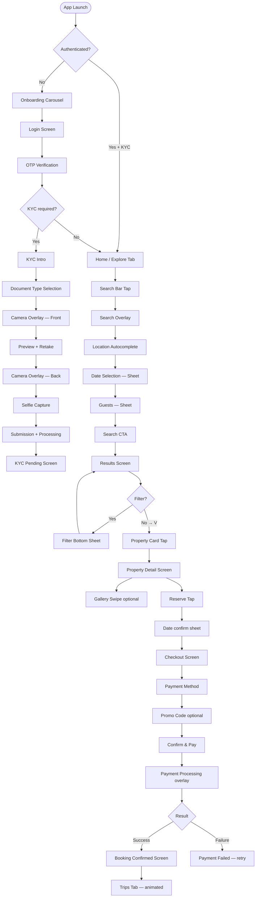

# StayOS — Native Mobile Design System
## P2: Native Mobile Component Library · User Flows

**Version:** 1.0 | **Status:** Production-Ready
**Continues from:** MOBILE_NATIVE_DESIGN_P1.md

---

# PART 4 — NATIVE MOBILE COMPONENT LIBRARY

> All measurements are in logical pixels (pt/dp). Platform-specific values are marked iOS/Android.
> All components inherit design tokens from VISUAL_DESIGN_SYSTEM_P1.md.

---

## 4.01 — Buttons (Mobile-Specific)

### Primary Button

```
Height: 52px (mobile) — larger than web's 44px
Width: full-width (content margin to content margin)
R: 14px
BG: #2C5FFF
FG: white
Font: Inter 16px/600
Letter-spacing: -0.1px
Shadow: 0 4px 14px rgba(44,95,255,0.32)
Padding: 0 24px

States:
  Default:  as above
  Pressed:  BG:#1A3FCC  scale:0.98  shadow reduces  duration:80ms
  Loading:  text opacity:0  spinner(20px, white, 2px stroke) centered
  Disabled: BG:#2C5FFF opacity:0.35  no shadow  cursor:not-allowed
  Success:  BG:#059669  checkmark icon replaces text (animated)
```

**Haptic feedback:** `light` impact on press-down, `success` notification on completion.

### Secondary Button

```
Height: 52px
R: 14px
BG: transparent
Border: 1.5px #2C5FFF
FG: #2C5FFF
Font: Inter 16px/600

Pressed: BG:#EEF2FF  border:1.5px #1A3FCC  scale:0.98
```

### Destructive Button

```
Height: 52px  R: 14px  BG: #DC2626  FG: white
Pressed: BG:#B91C1C  scale:0.98
Haptic: warning impact on press
```

### Ghost / Text Button

```
Height: 44px  R: 8px  BG:transparent  FG:#374151
Pressed: BG:#F3F4F6  scale:0.97
No border
```

### Icon Button

```
W:44px  H:44px  R:radius-full
BG: transparent (default) / #F3F4F6 (on surfaces)
Icon: 24px
Pressed: BG:#E5E7EB  scale:0.92
```

---

## 4.02 — Floating Action Button (Mobile FAB)

```
Regular FAB:
  Size: 56×56px  R:16px (not full-round in Material 3)
  BG: #2C5FFF  icon: 24px white
  Shadow: 0 6px 16px rgba(44,95,255,0.35)
  Pressed: scale:0.93  shadow:reduce  haptic:medium
  Position: fixed  bottom:16+safeArea  right:20px

Extended FAB:
  H:56px  W:auto (icon+label)  R:16px
  SP: 16px 20px  gap: 12px
  Icon: 24px white  label: Inter 15px/600 white
  Collapses to icon-only on scroll-down
  Expands back on scroll-up
  Transition: width 250ms spring
```

---

## 4.03 — Bottom Navigation Bar

*(Full spec in Part 2.4 — only mobile-specific additions here)*

### Badge Variants

```
Dot (no count): W:8px H:8px R:full BG:#EF4444
  Position: top-right of icon, offset: -2px -2px

Number badge (1–9): W:18px H:18px R:full
  BG:#EF4444  FG:white  Inter 10px/700  centered

Number badge (10–99): W:auto H:18px R:full SP:0 5px
  BG:#EF4444  FG:white  Inter 10px/700

Overflow (99+): "99+" same style
```

### Tab Transition Animation

When switching tabs:
- Icon: cross-fade from outline → filled, 150ms
- Label: opacity 0→1, 150ms, delay: 50ms
- Active indicator (Android): pill scales from 0→64dp width, 200ms spring
- No tab-to-tab slide transition — content appears immediately

---

## 4.04 — Navigation Bar (Screen-level)

### iOS Navigation Bar Spec

```
Structure: [Back] [Title] [Actions]

Back button:
  Icon: chevron-left 17px #2C5FFF
  Label: Truncated previous screen title or "Back" (max 12 chars)
  Touch target: 44×44px (extends beyond visual)
  Tap: pop current screen + haptic: light

Title:
  Position: centered
  Font: Inter 17px/600
  Color: #111827
  Truncation: ellipsis at 60% of bar width
  Large title (on root tabs): Inter 34px/700 at top, animates to 17px on scroll

Right actions: max 2 items
  Text action: Inter 17px/400 #2C5FFF
  Icon action: 24px icon #2C5FFF  touch target: 44×44px

Bar background: rgba(255,255,255,0.92) + blur
Border: none (uses shadow or natural scroll blur)
```

### Android Top App Bar Spec

```
Small AppBar: H:64dp
  Nav icon: 24dp  SP: 16dp left
  Title: Inter 22sp/400  SP: 16dp from nav icon
  Actions: 24dp icons  SP: 8dp between  SP: 16dp right edge
  BG: surface-card (#FFFFFF)
  Elevation on scroll: Material 3 tonal surface

Center-Aligned AppBar (used on auth/onboarding):
  Title: centered  Inter 22sp/400
```

---

## 4.05 — Action Sheet / Bottom Action Menu

### iOS Action Sheet

```
Presented from bottom — full-width
Separated into: action group + cancel group

Action group:
  R:14px (container)  BG:rgba(242,242,247,0.92)  blur effect
  Each item: H:57px  Inter 20px/400 #2C5FFF
  Destructive item: Inter 20px/400 #FF3B30
  Divider: 0.5px rgba(0,0,0,0.15) between items
  SP: 0 16px (within items)

Cancel button:
  Separate container, 8px gap above action group
  H:57px  R:14px  BG:rgba(242,242,247,0.92)
  Inter 20px/600 #2C5FFF  text: "Cancel"

Backdrop: rgba(0,0,0,0.4)
Animation: slide up from bottom 300ms spring
Dismiss: tap backdrop or cancel button
```

### Android Bottom Action Menu (Material 3)

```
Bottom sheet style (not centered dialog)
H: auto (content height)  R: 16dp top corners

Header (optional): Icon + Title  H:56dp
List items:
  Each: H:56dp  SP:0 24dp  flex align-center gap:16dp
  Icon: 24dp #374151  Label: Inter 16sp/400 #111827
  Destructive: icon+label #DC2626
Divider: 0.5dp #E5E7EB between item groups
```

---

## 4.06 — Property Cards (Mobile)

### Full Property Card (Search / Explore)

```
W: content-width (see grid, P1 Part 3)
R: 16px
BG: white
Shadow: 0 2px 8px rgba(0,0,0,0.08)
overflow: hidden

Photo section:
  Aspect: 4:3 (mobile-optimized, taller than 3:2 desktop)
  BG: #F3F4F6 (placeholder while loading)
  Skeleton: shimmer gradient
  
  Wishlist button (♥):
    Position: absolute  top:12px  right:12px
    W:36px H:36px  R:18px (full)
    BG:rgba(255,255,255,0.88)
    Icon: heart 18px
    Saved: FG:#EF4444  fill:#EF4444
    Haptic on save: light
    Animation: scale 1→1.5→1  spring  280ms
  
  Photo count dots (if multiple):
    Position: absolute  bottom:10px  center
    Each dot: W:6px H:6px R:3px BG:white opacity:0.6
    Active dot: W:16px R:8px opacity:1
  
  "Instant Book" badge:
    Position: absolute  top:12px  left:12px
    BG:rgba(0,0,0,0.65)  FG:white R:6px SP:4px 8px
    ⚡ 12px  Inter 11px/600

Info section:
  SP: 12px

  Row 1 — Name + Rating:
    Name: Inter 15px/600 #111827  flex:1  line-clamp:1
    Rating: star 14px #FACC15 + "4.9" Inter 13px/600 #111827

  Row 2 — Location:
    Inter 13px/400 #6B7280  margin-top:4px

  Row 3 — Price:
    "$120" Inter 16px/700 #111827
    "/night" Inter 13px/400 #6B7280
    margin-top:8px

  Availability line (optional):
    "Aug 1–5 · $600 total"  Inter 12px/400 #9CA3AF  margin-top:4px

Total card height at 375px: ~300px (photo 229px + info 71px + SP)
```

### Compact Property Card (Wishlist / Saved)

```
flex horizontal  W:content-width  H:96px
BG:white  R:12px  SH:0 1px 4px rgba(0,0,0,0.06)

Left:
  Photo: W:96px H:96px  R:12px left side  object-fit:cover

Right: SP:12px  flex-col justify-center
  Name: Inter 15px/600 #111827  line-clamp:2
  Location: Inter 12px/400 #6B7280  margin-top:4px
  Price: Inter 14px/600 #111827  margin-top:4px
  Rating: ⭐ 13px inline  margin-left:4px
```

### Host Card (Property Management List)

```
W:content-width  H:auto
BG:white  R:16px  SH:shadow-sm
SP:16px

Row 1:
  Property photo thumbnail: W:56px H:56px R:8px
  Right: Name Inter 15px/600  Status badge  Occupancy "78%"
  Gap: 12px

Row 2 (stats): 3 equal cols, dividers between
  "$3,240" Inter 16px/700 + "Revenue" label
  "12" + "Bookings" label
  "⭐4.86" + "Rating" label
  Labels: Inter 11px/500 #6B7280

Row 3 (actions):
  [View Calendar] [Manage] [···]
  ghost buttons  H:36px  R:8px
```

### Booking Card (Trips screen)

```
W:content-width  H:auto
BG:white  R:16px  SH:shadow-sm

Photo: W:100% aspect:16:9  R:16px top  object-fit:cover
Status badge: position:absolute top:12px left:12px

Info: SP:16px

Property name: Inter 17px/600 #111827
Dates: Inter 14px/400 #6B7280  margin-top:4px
Guests: Inter 14px/400 #6B7280
Price total: Inter 14px/600 #111827  margin-top:8px

Action row: flex  gap:12px  margin-top:16px
  [Message Host]  [View Details]  — secondary + primary
```

### Review Card

```
W:content-width
BG:white  R:12px  SP:16px  SH:shadow-xs

Row 1: Avatar(36px) + Name(Inter 15px/600) + Date(Inter 12px/400 #9CA3AF right)

Rating: ★★★★★ 14px #FACC15  margin-top:8px

Review text: Inter 14px/400 #374151  line-height:1.6  margin-top:8px
  Collapsed: 3 lines  "Show more" Inter 13px/600 #2C5FFF

Property name (if on profile): Inter 12px/400 #6B7280  margin-top:8px
```

---

## 4.07 — Form Components (Mobile)

### Text Input

```
Label: Inter 14px/600 #4B5563  margin-bottom:6px

Container: W:100%  H:52px (mobile larger than web's 44px)
BG:white  R:12px  border:1.5px #D1D5DB
SP: 0 14px  flex align-center

Leading icon (optional): 20px #9CA3AF  margin-right:10px
Input text: Inter 16px/400 #111827  flex:1
  (16px prevents iOS auto-zoom)
Trailing clear ×: 16px #9CA3AF  tap target:44px

Focus: border:2px #2C5FFF  shadow:0 0 0 3px rgba(44,95,255,0.15)
Error: border:2px #EF4444  shadow:0 0 0 3px rgba(239,68,68,0.15)

Error message: Inter 13px/400 #DC2626  margin-top:6px  flex align-center gap:4px
  ⚠ icon:14px #DC2626

Helper: Inter 13px/400 #6B7280  margin-top:6px
```

### OTP Input (6 boxes)

```
Row: flex  justify-center  gap:8px (375px) / gap:10px (390px+)

Each box:
  W:48px H:60px (375px) / W:52px H:64px (390px+)
  R:12px  BG:white  border:1.5px #D1D5DB
  Inter 28px/700 #111827  text-align:center

  Empty: border:#D1D5DB  BG:#F9FAFB
  Active (focused): border:2px #2C5FFF  BG:white  shadow:0 0 0 3px rgba(44,95,255,0.15)
  Filled: border:1.5px #2C5FFF  BG:white
  Error: border:2px #EF4444  BG:#FFF5F5
    Shake animation: ±8px  3× iterations  350ms  ease-in-out
    Haptic: error

Auto-advance: on each digit entry, focus jumps to next box
Auto-backspace: delete in empty box focuses previous box
Paste: full OTP from clipboard populates all boxes instantly

Keyboard: numberPad (iOS) / numberDecimal (Android)
```

### PIN Input (4-digit security)

```
Row: flex  justify-center  gap:16px

Each dot:
  W:20px H:20px R:10px
  Empty: border:2px #D1D5DB  BG:transparent
  Filled: BG:#111827  border:none
  Error: BG:#EF4444  animate

Haptic: light on each entry
Hidden characters: dots replace typed digits immediately
Biometric option: face/fingerprint icon button below PIN field
```

### Date Picker (Mobile)

**iOS:**
```
Bottom sheet (compact, 50%)
Header: "Select dates"  [Cancel] [Done]

Native UIDatePicker in graphical calendar mode
Displayed inside StayOS bottom sheet
R:20px top  BG:white
Month header: Inter 20px/600
Day cells: 44pt each  (iOS native renders this)
Selected: brand blue background
Range: brand blue ends, brand-50 middle
```

**Android:**
```
Material 3 DatePickerDialog
Presented as modal dialog (centered)
Header: "Select check-in date"
Calendar: Material 3 graphical date picker
Month: arrows left/right
Colors: override primaryColor=#2C5FFF
```

### Calendar (Host Availability)

```
Full-screen view (not a sheet)

Month header: flex space-between
  [←] "July 2026" [→]
  Arrow touch targets: 44×44px

Day grid: 7 cols
  Day labels row: H:32px  Inter 12px/600 #9CA3AF  uppercase

  Each day cell: W:(content-width/7)  H:auto min:44px
    Day number: Inter 15px/600
    Available: #111827 on transparent
    Booked: white on #2C5FFF background
    Blocked: #9CA3AF on #F3F4F6 strikethrough
    Today: circular border:2px #2C5FFF
    Selected: filled circle #2C5FFF white text
    Price label (below number): Inter 10px/400 #6B7280

  Long-press on day: shows date options action sheet
  Drag to select range: continuous touch-drag selects range

Legend: horizontal chips below calendar
  [● Available] [● Booked] [● Blocked]
  Inter 12px/500  SP:6px 10px R:full
```

### Guest Selector

```
Bottom sheet (compact)
Title: "Who's coming?"

Each category row: H:64px  flex space-between align-center  border-bottom:1px #F3F4F6
  Left: category name Inter 16px/600 + description Inter 13px/400 #6B7280
  Right: [−] count [+]
    Minus button: W:36px H:36px R:18px
      BG:#F3F4F6  icon:16px  disabled:opacity:0.3
    Count: W:32px Inter 18px/600 #111827 text-center
    Plus button: W:36px H:36px R:18px BG:#EEF2FF icon:16px #2C5FFF

Categories: Adults · Children (2–12) · Infants (<2) · Pets

[Apply] button: full-width primary  H:52px  margin-top:20px + safe area
```

### Price Slider

```
Track: W:content-width  H:4px  R:2px
Background track: #E5E7EB
Active track: #2C5FFF

Two handles:
  W:28px H:28px R:14px
  BG:white  border:2px #2C5FFF
  SH:0 2px 8px rgba(0,0,0,0.2)
  Touch target: 44×44px (larger than visual)
  Active (dragging): scale:1.2  SH increases

Value display: above each handle
  BG:#111827  FG:white R:8px SP:4px 8px
  Inter 13px/600
  Arrow indicator pointing down

Range below slider:
  "EGP 500 — EGP 3,000"  Inter 14px/500 #374151  text-center
  margin-top:16px

Haptic: light on each 100-unit step during drag
```

---

## 4.08 — Map Card

```
Map preview card (embedded in property detail):
W:content-width  H:200px  R:16px  overflow:hidden
Tap → opens full-screen map

Full-screen map:
  Map engine: Google Maps / Mapbox
  Controls: position bottom-right above nav
    [+] [-] zoom: W:44px H:88px stacked R:8px BG:white SH:md
    [📍 My location]: W:44px H:44px R:22px BG:white SH:md

  Property pin:
    Custom pin: BG:#2C5FFF R:8px SP:6px 10px
    "$120" Inter 14px/700 white
    Pulsing availability animation: concentric circles expand from pin

  Bottom sheet (property mini-card) on pin tap:
    H:auto snap:30%
    Photo(80×64px) + Name + Rating + Price/night + [View] button
```

---

## 4.09 — Chat Bubble & Message Input

### Chat Bubble

```
Sent bubble (right aligned):
  BG:#2C5FFF  FG:white
  R: 18px 18px 4px 18px (bottom-right cut)
  SP: 10px 14px  max-W:80% of content width
  Inter 15px/400  line-height:1.5
  Timestamp: Inter 11px/400 rgba(255,255,255,0.7)  margin-top:4px  text-right

Received bubble (left aligned):
  BG:#F3F4F6  FG:#111827
  R: 18px 18px 18px 4px (bottom-left cut)
  SP: 10px 14px  max-W:80%
  Inter 15px/400
  Timestamp: Inter 11px/400 #9CA3AF  margin-top:4px

System message (centered):
  BG:transparent  FG:#9CA3AF  Inter 13px/400
  text-center  margin:8px auto

Booking card within message:
  BG:white  R:12px  border:1px #E5E7EB  SH:shadow-xs
  W:260px  SP:12px
  Property photo 260×120px
  Name Inter 14px/600 + dates Inter 12px/400
  Status badge + [View Booking] link

Avatar (received): W:28px H:28px R:14px  margin-right:8px  align:flex-end

Read receipts:
  Sent: single ✓ 10px #A5B4FC
  Delivered: double ✓ 10px #A5B4FC
  Read: double ✓ 10px #2C5FFF

Image message:
  Max W:240px  R:12px  tap → full-screen lightbox
```

### Message Input Bar

```
Position: pinned above keyboard
BG:white  border-top:1px #E5E7EB  SP:8px 12px  flex align-center gap:8px

Left action buttons:
  [📷] camera  W:36px H:36px R:18px BG:#F3F4F6
  [📎] attach  W:36px H:36px R:18px BG:#F3F4F6

Input field:
  Min H:40px  Max H:120px  auto-grow
  BG:#F9FAFB  R:20px  SP:10px 14px
  Inter 16px/400 #111827  placeholder:#9CA3AF

Send button (right):
  W:36px H:36px R:18px
  Empty input: BG:#F3F4F6  icon:send 18px #9CA3AF  disabled
  Has input: BG:#2C5FFF  icon:send 18px white  enabled
  Tap: haptic light + message sends
  Transition: 150ms ease (color change)
```

---

## 4.10 — Camera & Gallery Components

### Camera Button (KYC / Photo capture)

```
Shutter button:
  Outer ring: W:80px H:80px R:40px border:3px white
  Inner fill: W:64px H:64px R:32px BG:white
  Pressed: inner scales to 56px  80ms spring + haptic:medium

Zoom controls:
  Segmented: [0.5×] [1×] [2×]  R:full  H:32px
  BG:rgba(0,0,0,0.5)  FG:white
  Active: BG:white FG:#111827

Flash:
  Icon button top-right: 44×44px tap target
  States: auto / on / off  cycle on tap
```

### Gallery Picker

```
Header: "[X] selected" + [Done] button
Photos grid: 3 columns  gap:2px
Each cell: square W:(screen-width/3)  aspect:1
  Tap: toggle selection
  Selected: white checkmark 20px in #2C5FFF circle  dim overlay

Bottom: selected count + [Add X photos] button

Long-press on photo: preview (iOS peek effect)
```

---

## 4.11 — Progress, Loaders, Skeleton

### Activity Indicator (Spinner)

```
StayOS custom spinner:
  W:32px H:32px  rotating arc
  Arc: 270° of circumference  stroke:3px  #2C5FFF
  Tail fades: gradient from transparent to #2C5FFF
  Rotation: 750ms linear infinite

Page-level loader (blocking):
  Full-screen overlay: rgba(255,255,255,0.85)
  Spinner centered + label below: Inter 14px/400 #374151

Small inline loader:
  W:20px H:20px  stroke:2px  same animation
```

### Progress Bar

```
Linear:
  Track: H:4px  R:2px  BG:#E5E7EB  W:100%
  Fill: BG:#2C5FFF  R:2px  animated width
  Indeterminate: sliding animation left-right (material-style)

Step progress (KYC, onboarding):
  Dots: W:8px H:8px R:4px  BG:#E5E7EB
  Active dot: W:24px R:12px  BG:#2C5FFF  (pill shape)
  Completed: W:8px R:4px  BG:#10B981
  Gap:6px between steps
```

### Skeleton Screen

```
All skeleton elements:
  BG: linear-gradient(90deg, #F3F4F6 25%, #EAECF0 50%, #F3F4F6 75%)
  background-size: 400% 100%
  animation: shimmer 1.4s ease-in-out infinite
  R: same as target element

Property card skeleton:
  Photo: 100% × (4:3 height)  R:16px
  Line 1 (name): 75%W H:16px R:6px  mt:12px
  Line 2 (location): 50%W H:12px R:6px  mt:8px
  Line 3 (price): 40%W H:20px R:6px  mt:8px

List item skeleton:
  Avatar circle: W:40px H:40px R:20px
  Line 1: 60%W H:14px R:6px
  Line 2: 40%W H:12px R:6px  mt:6px

KPI skeleton:
  Label: 40%W H:12px R:4px
  Value: 60%W H:32px R:6px  mt:8px
  Trend: 50%W H:12px R:4px  mt:8px
```

---

## 4.12 — Offline Banner

```
Position: below navigation bar  W:100%  H:36px
BG:#1F2937  FG:white  flex center  gap:8px
Icon: wifi-off 16px #9CA3AF
Text: "No internet connection"  Inter 13px/500 white
Slide down from top: 250ms ease-out on appear
Slide up: 200ms ease-in on dismiss

Reconnected variant:
  BG:#059669
  Text: "Back online ·  Syncing..."
  Auto-dismiss: 3s
  Spinner: 14px white while syncing
```

---

## 4.13 — Avatar

```
Sizes:
  xs: W:24px H:24px R:12px  (message thread list)
  sm: W:32px H:32px R:16px  (compact lists)
  md: W:40px H:40px R:20px  (default)
  lg: W:56px H:56px R:28px  (property/host cards)
  xl: W:80px H:80px R:40px  (profile screen)
  2xl: W:112px H:112px R:56px  (host public profile hero)

Photo: object-fit:cover  W:100% H:100%
Initials fallback: BG:#2C5FFF  FG:white  Inter weight:600
  xs: 10px  sm:13px  md:16px  lg:22px  xl:32px

Status dot (online indicator):
  W:10px H:10px R:5px  border:2px white
  Online: BG:#10B981  position:absolute bottom:0 right:0

Verified badge:
  W:18px H:18px  check-circle filled  BG:#2C5FFF  FG:white
  position:absolute bottom:0 right:0 (for larger sizes)
```

---

## 4.14 — Badges & Tags

*(Full token spec in P1 — mobile-specific sizing only)*

```
Mobile badge sizes:
  H:20px SP:4px 8px R:10px  Inter 11px/500  (default mobile)
  H:24px SP:4px 10px R:12px Inter 13px/500  (large variant)

Notification badge (on icon):
  W:18px H:18px or auto  R:9px  BG:#EF4444  FG:white  Inter 10px/700
  Min-W:18px  SP:0 4px

KYC verification checkmark:
  W:20px H:20px  check-circle-filled icon  BG:#2C5FFF  FG:white
  Shown inline next to name on host profiles
```

---

## 4.15 — Tabs & Segmented Controls

### Tabs (horizontal scrollable)

```
H:48px  border-bottom:2px #E5E7EB  overflow:scroll-x  hide-scrollbar

Each tab:
  H:48px  SP:0 16px  white-space:nowrap
  Inter 14px/500 #6B7280
  Active: FG:#111827  border-bottom:2px #2C5FFF (overlays container border)
  Pressed: BG:#F3F4F6

Badge on tab: inline red dot W:6px H:6px R:3px  margin-left:4px
```

### Segmented Control (iOS style)

```
H:36px  BG:#E5E7EB  R:9px  SP:2px  flex

Each segment: flex:1  H:32px  R:8px
  Default: transparent  Inter 13px/500 #374151
  Active: BG:white  SH:0 1px 3px rgba(0,0,0,0.12)  Inter 13px/600 #111827
  Transition: active segment slides 180ms spring
```

### Filter Chips (Horizontal scrolling row)

```
Row: H:44px  overflow:scroll-x  hide-scrollbar  SP:0 16px  gap:8px

Each chip: H:36px  SP:0 14px  R:18px  flex align-center gap:6px
  Default: BG:white  border:1.5px #D1D5DB  Inter 13px/500 #374151
  Active: BG:#EEF2FF  border:1.5px #2C5FFF  FG:#1D4ED8
  With icon: icon 14px left of text
  With count: "(3)" appended to label  FG:#6B7280

Active filter indicator: blue dot W:6px above row
[Clear all]: text button right of row when any filter active
```

---

## 4.16 — Share Sheet / Native Dialog

### Native Share Sheet

```
Triggered by: share icon button (top-right of property detail)
Content passed to OS share API:
  Title: "Luxury Nile View Apartment — StayOS"
  URL: deep link to property
  Image: property hero image

iOS: UIActivityViewController — system native
Android: Intent.ACTION_SEND — system native
Do NOT implement custom share UI
```

### Native Confirmation Dialog

```
iOS: UIAlertController  (centered dialog)
  Title: Inter 17px/600 #111827
  Message: Inter 13px/400 #374151
  Actions: stacked (2 buttons vertical)
    Cancel: bottom or left  #2C5FFF  Inter 17px/400
    Confirm / Destructive: top or right  #FF3B30 (destructive) or #2C5FFF

Android: AlertDialog (Material 3)
  Title: Inter 22sp/400 #111827
  Message: Inter 14sp/400 #374151
  Buttons: horizontal row (text buttons)
    Cancel: left  #6B7280
    Confirm: right  #2C5FFF
```

### Permissions Dialog (Custom pre-prompt)

```
Presented BEFORE native permission request
Purpose: explain WHY we need the permission first

BG:white  R:20px  SH:shadow-2xl
W:content-width - 32px  centered

Illustration: 80px centered  margin-bottom:16px
Title: Inter 20px/700 #111827  text-center
Body: Inter 14px/400 #374151  text-center  line-height:1.6
[Allow] primary button: full-width  H:52px
[Not now] ghost button: full-width  H:48px  margin-top:8px

Note: if user taps "Not now" — do NOT ask again in same session
Note: if user taps "Allow" — THEN trigger native permission dialog
```

---

# PART 5 — NATIVE MOBILE USER FLOWS

## 5.01 — Guest: Complete Booking Flow



---

## 5.02 — Guest: Login Flow (Detail)

```
Screen 1 — Login
  Logo centered (72px)  margin-top: 48px
  "Welcome back"  type-display-md  centered
  Sub: "Sign in to continue"  type-body-md  #6B7280

  Method tabs: [📱 Phone] [✉️ Email]  segmented control

  Phone flow:
    Country code picker + phone input (16px font)
    [Continue →] primary full-width button
    Terms note: "By continuing you agree to our Terms"  12px centered

  → OTP Screen:
    "Enter the code sent to +20 100 XXXX"
    6 OTP boxes (spec in 4.07)
    "Resend in 0:59" countdown
    Auto-submit on 6th digit

  → Home screen (transition: slide up, full screen replaces)

Errors:
  Invalid phone: shake input + "Enter a valid phone number" error
  Wrong OTP: shake all 6 boxes + haptic error + "Incorrect code"
  Too many attempts: lock screen "Try again in 15 minutes" with countdown
```

---

## 5.03 — Guest: Search & Filters Flow

```
Entry points:
  A. Home search bar tap → search overlay
  B. Bottom nav Explore → directly on search results

Search Overlay:
  Full-screen slide-up (300ms)
  Row 1: [← Back] [Where are you going?    ] (focused input, keyboard opens)
  Row 2: [📅 Check-in date  |  Check-out date]  (tap → date sheet)
  Row 3: [👥 2 guests  ▼]  (tap → guest selector sheet)
  
  Below input: sections
    Recent searches: [🕐] location name [×]
    Popular: [📍] city name

Date Selection Sheet (half, 50%):
  Month calendar (2 months vertical scroll)
  Selected range: start date → end date
  Below: "5 nights selected"  + [Apply] button

Guests Sheet (compact, 40%):
  Adults / Children / Infants / Pets counters
  [Apply] button

Search Results:
  Header: "124 places · Cairo · Aug 1–5"
  Sort + Filter bar (sticky below header):
    [🔽 Sort] [⚡ Instant] [💰 Price] [🏠 Type] [More]
    Horizontal chips, scroll if overflow

  Filter Sheet (expanded, 92%):
    Full filter form
    Price range slider
    Property types (chips)
    Amenities (checkbox grid)
    Rating (star selector)
    [Show X results] button sticky at bottom

  Map/List toggle: [☰] [🗺] top-right, H:36px
  
  Property grid: 1-col (375px) / 2-col (430px+)
  Infinite scroll: load 20 more on reaching 80% scroll
  Pull-to-refresh: refresh results
```

---

## 5.04 — Guest: Checkout & Payment Flow

```
Screen: Checkout
  Nav: [← Back] "Confirm and Pay"
  
  Sticky top summary card:
    Property photo(56px) + name + dates + guests
    Tappable → expands to full price breakdown sheet

  Sections (scrollable):
    1. Trip details (dates, guests, edit links)
    2. Price breakdown (expandable by default)
    3. Payment method
       Saved cards: radio list
       [+ Add card] → card entry form
       Apple Pay / Google Pay button (if available — shown first)
    4. Promo code input
    5. Cancellation policy (collapsed accordion)
    6. Terms checkbox

  Sticky bottom:
    Total: "$600"  [Pay $600 →]

  Payment processing:
    Full-screen overlay (cannot dismiss)
    Spinner + "Processing your payment securely..."
    Stripe integration handles 3DS if required
    
  Success screen:
    Animated checkmark (draw animation, 500ms)
    Confetti particles (24 pieces, 1200ms)
    "Booking Confirmed!" Inter 28px/700
    Booking reference: "BK-00123" mono 16px
    [View Booking Details] primary button
    [Done] ghost button → Trips tab
    
  Haptic sequence on success:
    success notification → 100ms delay → success notification
```

---

## 5.05 — Guest: Cancellation Flow

```
Entry: Booking Detail → [Cancel Booking]

Step 1 — Policy Review Sheet (half)
  "Cancellation Policy"  title
  Policy text with refund calculation
  "You'll receive $300 (50% refund)"  highlighted
  [Continue to Cancel]  danger button
  [Keep Booking]  ghost button

Step 2 — Reason (optional, bottom sheet compact)
  "Why are you cancelling?" (helps improve service)
  Radio list: Change of plans / Found alternative / Emergency / Other
  [Submit Cancellation]  danger button

Step 3 — Confirmation
  Native confirmation dialog:
    "Cancel booking?"
    "This cannot be undone. You'll receive a $300 refund within 5–7 days."
    [Cancel Booking] (destructive)  [Keep Booking] (cancel)

Step 4 — Cancelled state
  Booking detail shows: large red "Cancelled" badge
  Refund timeline shown
  Push notification sent to guest
  Push notification sent to host
```

---

## 5.06 — Host: Listing Creation Wizard (Mobile)

```
Entry: FAB (+ icon) on Host Listings screen

Navigation: full-screen flow (no bottom tabs visible)
Progress: top step bar (9 steps as dots)
Each step: [← Back] [Step N of 9] [Skip / Next →]

Step 1 — Property Type
  "What kind of place is this?"
  3-row icon grid: Apartment / Villa / Room / Studio / Penthouse / Hotel
  Tap selects (visual fill animation)
  [Next] activates when selection made

Step 2 — Location
  Map-centric screen
  Search bar at top: "Enter your address"
  Map fills 60% of screen
  Draggable pin in center
  Address result appears below map as card
  [Confirm Location] button fixed at bottom

Step 3 — Rooms & Beds
  Step-counter rows: Bedrooms / Beds / Bathrooms / Max Guests
  Same [−] count [+] UI as guest selector

Step 4 — Amenities
  "What amenities do you offer?"
  Chip grid (2-col, scrollable): WiFi / AC / Pool / Kitchen / Parking / etc.
  Tap toggles selection (filled chip = selected)
  Search amenity bar at top

Step 5 — Photos
  "Add photos of your place"
  Required: 5 minimum, recommended: 20+
  
  Upload grid:
    First slot: [+ Add photos] tappable area
    Uploaded: thumbnail grid  3-col  reorderable (drag)
    Min count indicator: "3/5 minimum photos"
    
  Source options (action sheet):
    [Take Photo]  [Choose from Library]  [Cancel]
  
  Cover photo: first in grid = cover  drag to reorder

Step 6 — Title & Description
  Title input: max 50 chars  character count shown
  Description textarea: min 100, max 500 chars
  "Suggestions:" AI-generated prompts as tappable chips

Step 7 — Pricing
  Base price input: currency prefix  numeric keyboard
  Below: preview "Guests will see $120/night"
  (platform fee shown transparently)
  
  Pricing options (expandable):
    [Weekend pricing]  [Weekly discount]  [Monthly discount]

Step 8 — House Rules
  Toggle rows: Pets allowed / Smoking / Parties / Quiet hours
  Custom rule input: [+ Add custom rule]

Step 9 — Review & Submit
  All sections shown as read-only summary cards
  Tap any card → jump back to that step
  [Submit for Review] primary full-width button
  
  Submission:
    Loading overlay 2s
    Success: "Your listing is under review"
    Estimated: "We'll notify you within 24 hours"
    [View My Listings] → host listings screen
```

---

## 5.07 — Host: Calendar & Availability Management

```
Full screen: calendar view (no sheet)

Month navigation: [←] "August 2026" [→]
  Swipe left/right = change month (gesture navigation)

Day cells: see component spec 4.07

Top actions bar:
  [Block dates] [Set price] [Availability settings]
  Horizontal, overflow → [···] more

Block dates flow:
  Tap day → selects (highlighted)
  Drag across days → range selection
  Selection confirmed: action sheet appears
    [Block selected dates]  [Set custom price]  [Cancel]

Price override (bottom sheet compact):
  "Override price for Aug 15–20"
  Input: $120 → enter new amount
  [Save]  [Cancel]

Sync settings (separate screen):
  iCal import URL input
  Sync frequency: [Manual] [Hourly] [Daily]
  [Sync Now] button
```

---

## 5.08 — Admin: KYC Review Flow (Mobile)

```
Entry: Ops tab → KYC Queue

Queue screen:
  List of KYC cases sorted by oldest first
  Each row: Avatar + Name + Submitted time + Doc type + [Review] button
  Urgent cases (>48h): left border red  BG:danger-50

Review screen (full-screen):
  Nav: [← Back] "KYC Review" [Approve ✓] [Reject ✗]
  (Action buttons in nav right — accessible)

  Photo viewer (top 50%):
    Document front → back → selfie (swipeable tabs)
    Tap photo → full-screen zoom
    Pinch zoom supported
    Rotate: auto-rotate for better readability

  Data panel (bottom 50%, scrollable):
    Extracted data vs account data
    Mismatch field: highlighted amber
    
  Action:
    [Approve]: confirmation dialog → approved → success toast → next case
    [Reject]: reason sheet → confirm → rejected → notification sent
    [Request resubmit]: reason → confirm → notification sent

  Swipe right between cases: next/prev case navigation
```

---

## 5.09 — Host: Message + Response Flow

```
Messages tab:
  Conversation list: sorted by most recent
  Each row: H:72px
    Avatar (40px) + Host/Guest name + Property name (small)
    Preview: last message text  line-clamp:1
    Timestamp: relative time ("2m ago")
    Unread dot: W:10px #2C5FFF

Conversation thread:
  Full-screen
  Nav: [← Back] Guest name + "Nile View Apt"
  [···] options → action sheet: [View Booking] [Block Guest] [Report]

  Messages list (see chat bubble spec 4.09)
  
  Quick reply templates (host feature):
    Above keyboard: horizontal scroll of tappable template chips
    "Check-in is at 3PM" / "Welcome! Let me know if you need anything"
    Tap → fills input
  
  Message input bar (spec 4.09)

  Booking card in thread:
    Auto-inserted when booking is created
    Shows booking details + status
    Tap → booking detail screen
```

---

## 5.10 — Push Notification Deep Link Flows

| Notification | Deep Link Target | Transition |
|-------------|-----------------|------------|
| New booking | Booking Detail | Push onto trips stack |
| Booking cancelled | Booking Detail (cancelled state) | Push |
| New message | Message thread | Switch to messages tab + push thread |
| Review request | Review form sheet | Push property + open review sheet |
| KYC approved | Profile screen | Switch to profile tab |
| KYC rejected | KYC retry screen | Push |
| Payout sent | Payouts screen | Push from host tab |
| Listing approved | Listing detail | Push from host listings |
| Price alert | Property detail | Push |
| Check-in reminder | Booking detail | Push |

**Deep link handling rule:** If app is in background — resume to appropriate screen. If app is killed — cold start → auth check → deep link target.
