# StayOS — Product Experience Design Specification

**Version:** 1.0  
**Status:** Production-Ready  
**Classification:** Internal — Product & Design  
**Audience:** Frontend Engineering, QA, Design Implementation  

> When this document is complete, a frontend team must be able to build every screen without asking a single product question.

---

## Design Principles

| # | Principle | What It Means |
|---|-----------|---------------|
| 1 | **Trust First** | Every touchpoint must reduce anxiety and increase confidence |
| 2 | **Progressive Disclosure** | Show the minimum required; reveal complexity on demand |
| 3 | **Speed as Feature** | Skeleton states everywhere. No blank screens. Ever. |
| 4 | **Zero Ambiguity** | Price, availability, and terms are always explicit and visible |
| 5 | **Mobile Native** | Design mobile first; enhance progressively for larger screens |
| 6 | **Role Precision** | Every role sees exactly what they need — nothing more |
| 7 | **Recoverable Errors** | Every error state offers a clear next action |

---

# STEP 1 — Platform Information Architecture

## 1.1 Complete Sitemap

```mermaid
graph TD
  ROOT[StayOS Platform]

  ROOT --> PUBLIC[Public Zone]
  ROOT --> AUTH[Auth Zone]
  ROOT --> GUEST[Guest Zone]
  ROOT --> HOST[Host Zone]
  ROOT --> PM[Property Manager Zone]
  ROOT --> SUPPORT[Support Zone]
  ROOT --> OPS[Operations Zone]
  ROOT --> FINANCE[Finance Zone]
  ROOT --> ADMIN[Admin Zone]
  ROOT --> SUPERADMIN[Super Admin Zone]

  %% Public
  PUBLIC --> P_HOME[Home / Landing]
  PUBLIC --> P_SEARCH[Search Results]
  PUBLIC --> P_PROPERTY[Property Detail]
  PUBLIC --> P_HOW[How It Works]
  PUBLIC --> P_TRUST[Trust & Safety]
  PUBLIC --> P_HELP[Help Center]
  PUBLIC --> P_ABOUT[About]
  PUBLIC --> P_BLOG[Blog]
  PUBLIC --> P_LEGAL[Terms / Privacy / Cookies]

  %% Auth
  AUTH --> A_SIGNUP[Sign Up — Guest]
  AUTH --> A_HOST_SIGNUP[Sign Up — Host]
  AUTH --> A_LOGIN[Login]
  AUTH --> A_OTP[OTP Verify]
  AUTH --> A_RESET[Reset Password]
  AUTH --> A_2FA[2FA Setup]
  AUTH --> A_KYC[KYC — Identity Verification]

  %% Guest
  GUEST --> G_DASHBOARD[Guest Dashboard]
  GUEST --> G_TRIPS[My Trips]
  GUEST --> G_BOOKING[Booking Detail]
  GUEST --> G_CHECKOUT[Checkout — Payment]
  GUEST --> G_WISHLIST[Wishlists]
  GUEST --> G_MESSAGES[Messages / Inbox]
  GUEST --> G_REVIEWS[Reviews]
  GUEST --> G_NOTIFICATIONS[Notifications]
  GUEST --> G_WALLET[Wallet & Payments]
  GUEST --> G_PROFILE[Guest Profile]
  GUEST --> G_SETTINGS[Account Settings]
  GUEST --> G_SUPPORT[Support Request]

  %% Host
  HOST --> H_DASHBOARD[Host Dashboard]
  HOST --> H_LISTINGS[Listings]
  HOST --> H_LISTING_CREATE[Create Listing — Wizard]
  HOST --> H_LISTING_EDIT[Edit Listing]
  HOST --> H_CALENDAR[Calendar Management]
  HOST --> H_RESERVATIONS[Reservations]
  HOST --> H_RESERVATION_DETAIL[Reservation Detail]
  HOST --> H_MESSAGES[Messages / Inbox]
  HOST --> H_REVENUE[Revenue & Analytics]
  HOST --> H_PAYOUTS[Payouts]
  HOST --> H_REVIEWS[Reviews]
  HOST --> H_PROFILE[Host Profile]
  HOST --> H_SETTINGS[Host Settings]

  %% PM
  PM --> PM_DASHBOARD[PM Dashboard]
  PM --> PM_PORTFOLIO[Property Portfolio]
  PM --> PM_OPERATIONS[Operations — Tickets]
  PM --> PM_TEAM[Team Management]
  PM --> PM_CALENDAR[Multi-Property Calendar]
  PM --> PM_REVENUE[Revenue Reports]
  PM --> PM_BOOKINGS[All Bookings]

  %% Support
  SUPPORT --> S_DASHBOARD[Support Dashboard]
  SUPPORT --> S_QUEUE[Ticket Queue]
  SUPPORT --> S_TICKET[Ticket Detail]
  SUPPORT --> S_USER_LOOKUP[User Lookup]
  SUPPORT --> S_BOOKING_LOOKUP[Booking Lookup]
  SUPPORT --> S_DISPUTES[Dispute Management]
  SUPPORT --> S_REFUNDS[Refund Processing]

  %% Operations
  OPS --> O_DASHBOARD[Ops Dashboard]
  OPS --> O_KYC[KYC Review Queue]
  OPS --> O_KYC_DETAIL[KYC Case Detail]
  OPS --> O_LISTING[Listing Approval Queue]
  OPS --> O_LISTING_DETAIL[Listing Review Detail]
  OPS --> O_QUALITY[Quality Control]
  OPS --> O_MONITORING[Platform Monitoring]

  %% Finance
  FINANCE --> F_DASHBOARD[Finance Dashboard]
  FINANCE --> F_TRANSACTIONS[Transactions Ledger]
  FINANCE --> F_PAYOUTS[Payouts Manager]
  FINANCE --> F_ESCROW[Escrow Overview]
  FINANCE --> F_RECONCILE[Reconciliation]
  FINANCE --> F_REPORTS[Financial Reports]
  FINANCE --> F_TAX[Tax Documents]

  %% Admin
  ADMIN --> AD_DASHBOARD[Admin Dashboard]
  ADMIN --> AD_USERS[User Management]
  ADMIN --> AD_USER_DETAIL[User Detail]
  ADMIN --> AD_LISTINGS[Listing Management]
  ADMIN --> AD_BOOKINGS[Booking Management]
  ADMIN --> AD_DISPUTES[Disputes]
  ADMIN --> AD_CONTENT[Content Moderation]
  ADMIN --> AD_PLATFORM[Platform Configuration]
  ADMIN --> AD_REPORTS[Reports & Analytics]

  %% Super Admin
  SUPERADMIN --> SA_COMMAND[Command Center]
  SUPERADMIN --> SA_KILL[Emergency Controls]
  SUPERADMIN --> SA_AUDIT[Audit Logs]
  SUPERADMIN --> SA_ROLES[Role Management]
  SUPERADMIN --> SA_INTEGRATIONS[Integrations]
  SUPERADMIN --> SA_FEATURE_FLAGS[Feature Flags]
```

## 1.2 URL Structure

| Zone | URL Pattern | Example |
|------|-------------|---------|
| Public — Home | `/` | `stabyos.com/` |
| Public — Search | `/search` | `/search?location=Cairo&checkin=2026-08-01` |
| Public — Property | `/property/:slug` | `/property/luxury-nile-view-cairo` |
| Auth — Login | `/auth/login` | `/auth/login` |
| Auth — KYC | `/auth/verify` | `/auth/verify` |
| Guest — Dashboard | `/dashboard` | `/dashboard` |
| Guest — Trips | `/trips` | `/trips` |
| Guest — Booking | `/booking/:id` | `/booking/BK-00123` |
| Guest — Checkout | `/checkout/:propertyId` | `/checkout/prop-456` |
| Guest — Wishlist | `/wishlists` | `/wishlists` |
| Guest — Wallet | `/wallet` | `/wallet` |
| Host — Dashboard | `/host` | `/host` |
| Host — Listings | `/host/listings` | `/host/listings` |
| Host — Create Listing | `/host/listings/new` | `/host/listings/new` |
| Host — Calendar | `/host/calendar/:listingId` | `/host/calendar/LST-001` |
| Host — Reservations | `/host/reservations` | `/host/reservations` |
| PM — Dashboard | `/pm` | `/pm` |
| Support — Dashboard | `/support` | `/support` |
| Ops — Dashboard | `/ops` | `/ops` |
| Finance — Dashboard | `/finance` | `/finance` |
| Admin — Dashboard | `/admin` | `/admin` |
| Super Admin | `/superadmin` | `/superadmin` |
| Messages | `/messages` | `/messages` |
| Messages — Thread | `/messages/:threadId` | `/messages/THR-789` |
| Notifications | `/notifications` | `/notifications` |

---

# STEP 2 — Navigation Architecture

## 2.1 Top Navigation (Public / Guest)

**Desktop (1280px+)**

```
┌─────────────────────────────────────────────────────────────────────────────┐
│  [StayOS Logo]  [Search: Where · Check-in · Check-out · Guests]  [Become a Host]  [🌐 EN] [👤 Ahmed ▼]  │
└─────────────────────────────────────────────────────────────────────────────┘
```

**Components:**
- **Logo:** Left-aligned. Clickable → `/`
- **Unified Search Bar:** Center. Three-segment pill: Location | Dates | Guests. Click → opens Search Modal overlay
- **Become a Host CTA:** Ghost button. Visible only to guests who have not listed
- **Language / Currency Selector:** Icon + label. Opens a popover with language grid + currency list
- **User Menu:** Avatar + chevron. Dropdown: Profile, Trips, Wishlists, Help, Sign out. If unauthenticated: Login / Sign Up buttons

**Scroll Behavior:**
- On homepage: transparent background, white text, hero image behind nav
- On scroll past 80px: solid white background, shadow dp-1, dark text
- On search results / property: always solid white

---

## 2.2 Sidebar Navigation (Dashboard Views)

All authenticated dashboard views use a left sidebar. Sidebar is persistent on desktop, drawer on mobile.

### Guest Sidebar

```
┌──────────────┐
│  [Avatar]    │
│  Ahmed M.    │
│  Guest       │
├──────────────┤
│ 🏠 Dashboard │
│ ✈️  My Trips  │
│ 💬 Messages  │
│ ♥  Wishlists │
│ 💳 Wallet    │
│ ⭐ Reviews   │
│ 🔔 Notifs    │
├──────────────┤
│ ⚙️  Settings  │
│ ❓ Help      │
└──────────────┘
```

### Host Sidebar

```
┌──────────────┐
│  [Avatar]    │
│  Omar H.     │
│  Host        │
├──────────────┤
│ 📊 Dashboard │
│ 🏢 Listings  │
│ 📅 Calendar  │
│ 📋 Reservations│
│ 💬 Messages  │
│ 💰 Revenue   │
│ 💵 Payouts   │
│ ⭐ Reviews   │
│ 🔔 Notifs    │
├──────────────┤
│ ⚙️  Settings  │
└──────────────┘
```

### Property Manager Sidebar

```
┌──────────────┐
│  [Avatar]    │
│  Sara K.     │
│  PM          │
├──────────────┤
│ 📊 Dashboard │
│ 🏢 Portfolio │
│ 📅 Calendar  │
│ 📋 Bookings  │
│ 🔧 Operations│
│ 👥 Team      │
│ 📈 Revenue   │
│ 💬 Messages  │
│ 🔔 Notifs    │
└──────────────┘
```

### Support Sidebar

```
┌──────────────┐
│  [Avatar]    │
│  Nour A.     │
│  Support     │
├──────────────┤
│ 📊 Dashboard │
│ 🎫 Queue     │
│ 🔍 User Lookup│
│ 📖 Booking Lookup│
│ ⚖️  Disputes  │
│ 💸 Refunds   │
└──────────────┘
```

### Admin Sidebar

```
┌──────────────┐
│  [Avatar]    │
│  Admin       │
│  Admin       │
├──────────────┤
│ 📊 Dashboard │
│ 👤 Users     │
│ 🏢 Listings  │
│ 📋 Bookings  │
│ ⚖️  Disputes  │
│ 🛡️ Content   │
│ 💰 Finance   │
│ 📈 Reports   │
│ ⚙️  Platform  │
└──────────────┘
```

### Sidebar Behavior Rules

| State | Behavior |
|-------|----------|
| Desktop (1280px+) | Fixed, 240px wide, always visible |
| Tablet (768–1279px) | Collapsed to 64px icon-only strip; hover expands to 240px |
| Mobile (<768px) | Hidden by default; hamburger opens full-screen overlay drawer |
| Active item | Left border accent `#2C5FFF` + background `#F0F4FF` |
| Badge | Unread count on Messages, Notifications, Queue items |
| Collapse toggle | Arrow icon at bottom collapses to 64px icon-only mode |

---

## 2.3 Bottom Navigation (Mobile Only)

Shown only on mobile (`<768px`) for Guest and Host zones.

**Guest Bottom Nav:**
```
┌───────┬──────────┬──────────┬──────────┬──────────┐
│  🔍   │    ♥     │   ✈️      │    💬    │   👤     │
│Explore│ Wishlists│   Trips  │ Messages │ Profile  │
└───────┴──────────┴──────────┴──────────┴──────────┘
```

**Host Bottom Nav:**
```
┌───────┬──────────┬──────────┬──────────┬──────────┐
│  📊   │    🏢    │   📋     │    💬    │   👤     │
│Insights│ Listings│ Reservations│ Messages│ Profile │
└───────┴──────────┴──────────┴──────────┴──────────┘
```

**Rules:**
- Active tab: icon filled, label color `#2C5FFF`
- Inactive: icon outline, label color `#6B7280`
- Notification dot: red `#EF4444`, 8px, top-right of icon
- Height: 64px, background white, top border `#E5E7EB`
- Safe area padding for iOS (env(safe-area-inset-bottom))

---

## 2.4 Breadcrumbs

Used on all detail pages within dashboards.

```
Home  /  My Trips  /  Booking BK-00123
```

**Rules:**
- Font: 14px, color `#6B7280`
- Current page: color `#111827`, not a link
- Max 3 levels. If deeper, collapse middle levels to `…`
- Not shown on mobile (≤768px)

---

## 2.5 Search Architecture

### Global Search Bar (Top Nav)

Opens a full overlay modal on click. Three input stages:

**Stage 1 — Location**
- Text input with autocomplete (cities, neighborhoods, property names)
- Suggestions grouped: Recent Searches, Popular Destinations
- "Near Me" option with geolocation

**Stage 2 — Dates**
- Inline calendar, 2-month view on desktop, 1-month on mobile
- Date range selection: Check-in / Check-out
- "Flexible dates" toggle: ± 1 day, ± 3 days, ± 7 days, specific month

**Stage 3 — Guests**
- Counter inputs: Adults, Children, Infants, Pets
- Total guest count visible in summary

**Search CTA:** `Search` button — `#2C5FFF` background, white text, full-width on mobile

---

## 2.6 Global Actions

| Action | Trigger | Location |
|--------|---------|----------|
| New Message | Compose button in Messages | Nav + Messages page |
| Notifications panel | Bell icon | Top nav |
| Quick booking status | Avatar → My Trips | User menu |
| Emergency help | Help center link | Footer + sidebar |
| Currency switch | Globe icon | Top nav |
| Dark mode toggle | Settings → Appearance | Settings page only |

---

# STEP 3 — User Roles & Permissions Matrix

## 3.1 Role Overview

| Role | Primary Job | Access Level |
|------|------------|--------------|
| **Guest** | Find and book accommodations | Own bookings, messages, reviews, wallet |
| **Host** | List and manage properties | Own listings, reservations, revenue, payouts |
| **Property Manager** | Operate multiple properties at scale | All host capabilities + team + portfolio analytics |
| **Field Staff** | Execute operational tasks (cleaning, maintenance) | Assigned task queue + own schedule |
| **Support Agent** | Resolve tickets and disputes | Read-all users, write-support actions, no billing |
| **Operations** | KYC review, listing approval, quality control | Read all, approve/reject KYC and listings |
| **Finance** | Transactions, payouts, reconciliation | Full financial read, controlled payout write |
| **Admin** | Platform-wide management | All except super admin controls |
| **Super Admin** | Emergency controls, role management, audit | Full platform access + kill switches |

## 3.2 Permission Matrix

| Feature | Guest | Host | PM | Support | Ops | Finance | Admin | SuperAdmin |
|---------|-------|------|----|---------|-----|---------|-------|------------|
| Search listings | ✅ | ✅ | ✅ | ✅ | ✅ | ✅ | ✅ | ✅ |
| Book a property | ✅ | ❌ | ❌ | ❌ | ❌ | ❌ | ❌ | ❌ |
| Create listing | ❌ | ✅ | ✅ | ❌ | ❌ | ❌ | ✅ | ✅ |
| Approve listing | ❌ | ❌ | ❌ | ❌ | ✅ | ❌ | ✅ | ✅ |
| View all users | ❌ | ❌ | ❌ | ✅ | ✅ | ✅ | ✅ | ✅ |
| Modify user accounts | ❌ | ❌ | ❌ | Limited | ❌ | ❌ | ✅ | ✅ |
| Process refunds | ❌ | ❌ | ❌ | Limited | ❌ | ✅ | ✅ | ✅ |
| View financial data | Own | Own | Own portfolio | ❌ | ❌ | ✅ | ✅ | ✅ |
| Approve payouts | ❌ | ❌ | ❌ | ❌ | ❌ | ✅ | ✅ | ✅ |
| Review KYC | ❌ | ❌ | ❌ | ❌ | ✅ | ❌ | ✅ | ✅ |
| Manage disputes | ❌ | ❌ | ❌ | ✅ | ❌ | ❌ | ✅ | ✅ |
| Platform config | ❌ | ❌ | ❌ | ❌ | ❌ | ❌ | ✅ | ✅ |
| Emergency controls | ❌ | ❌ | ❌ | ❌ | ❌ | ❌ | ❌ | ✅ |
| Audit logs | ❌ | ❌ | ❌ | ❌ | ❌ | ❌ | ❌ | ✅ |
| Feature flags | ❌ | ❌ | ❌ | ❌ | ❌ | ❌ | ❌ | ✅ |

---

# STEP 4 — User Flows

## 4.1 Guest Registration

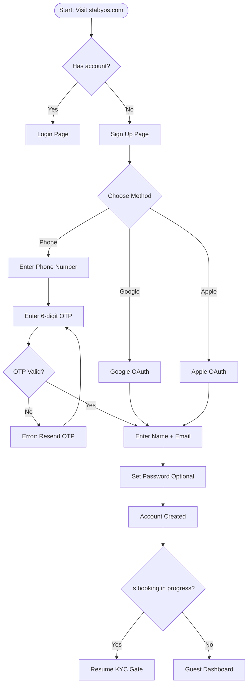

**Screens:**
1. Sign Up page (method selection)
2. Phone number entry + OTP verification
3. Profile completion (name, email)
4. Welcome screen with onboarding checklist

**Validation Rules:**
- Phone: international format, E.164 standard
- OTP: 6 digits, 5-minute expiry, max 3 attempts before cooldown
- Name: 2–60 characters, no special characters
- Email: RFC 5322 compliant

---

## 4.2 Host Registration

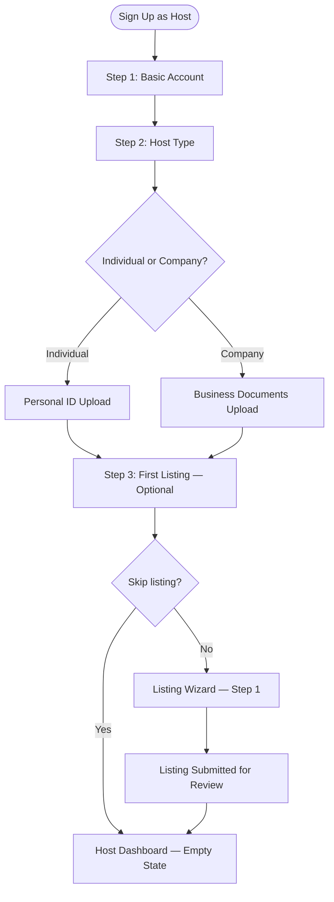

**Steps:**
1. Same phone/social auth as guest
2. Choose role: "I want to list my property"
3. Business type selection (individual / company)
4. Agree to Host Terms of Service
5. Redirect to listing wizard or host dashboard

---

## 4.3 KYC — Identity Verification

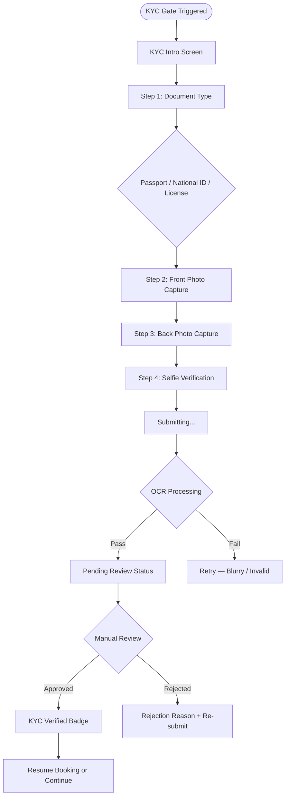

**KYC States:**
- `not_started` → CTA to begin
- `in_progress` → uploading / processing
- `pending_review` → estimated 24h, amber badge
- `verified` → green badge, booking unlocked
- `rejected` → red banner, reason shown, re-submit allowed

---

## 4.4 Search & Discovery Flow

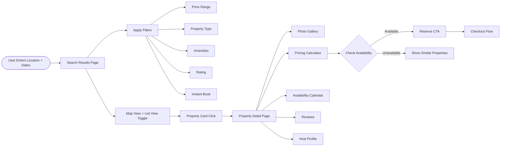

---

## 4.5 Booking Flow

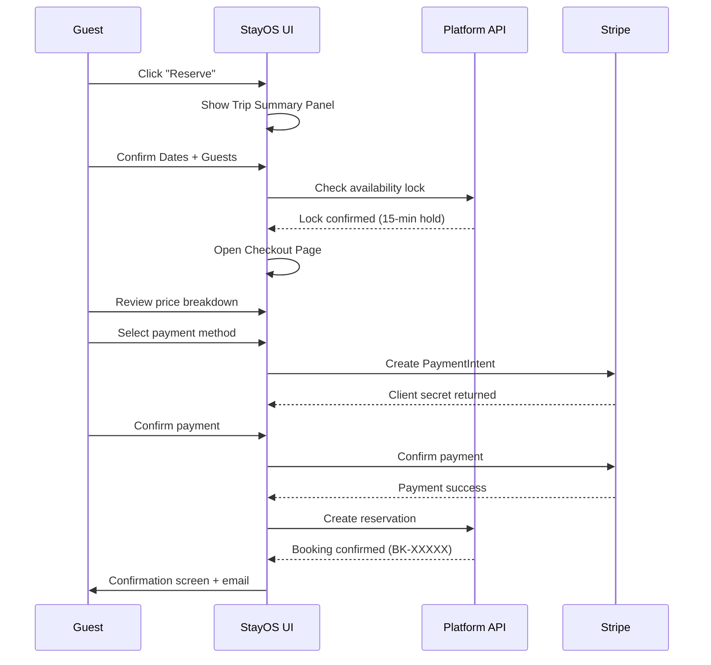

**Checkout Page Price Breakdown Components:**
- Nightly rate × nights
- Cleaning fee (if any)
- Service fee (platform %)
- Occupancy taxes (geo-calculated)
- Promo code / discount (if applied)
- **Total** (bold, large, primary color)
- Payment security note (Stripe-powered)

**Booking States:**
| State | Guest View | Host View |
|-------|-----------|-----------|
| `pending` | "Awaiting confirmation" | "New request" |
| `confirmed` | "Confirmed" | "Upcoming" |
| `checked_in` | "Active stay" | "Guest in-stay" |
| `checked_out` | "Complete — leave review" | "Complete" |
| `cancelled` | "Cancelled" | "Cancelled" |
| `disputed` | "In dispute" | "Dispute open" |

---

## 4.6 Cancellation & Refund Flow

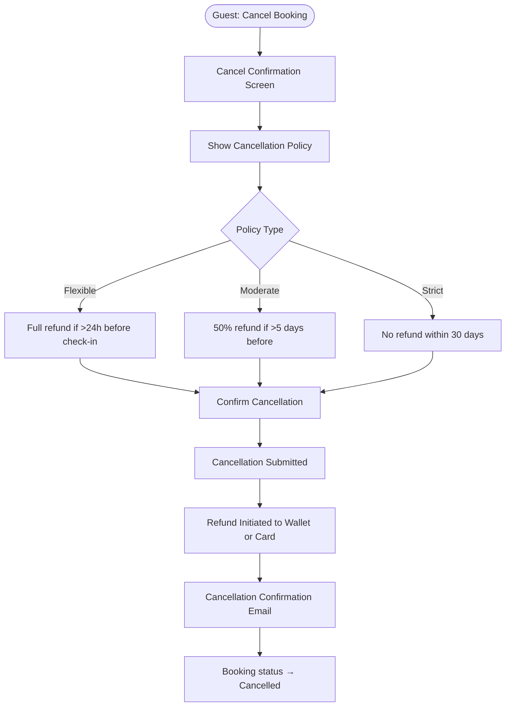

---

## 4.7 Messaging Flow

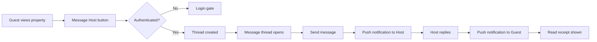

**Message Thread Components:**
- Bubble-style messages (guest right, host left)
- Timestamps
- Read receipts (single tick = sent, double tick = read)
- Message types: text, image attachment, booking card, system message
- Quick reply templates (for hosts)
- Report / Flag message action

---

## 4.8 Review Flow

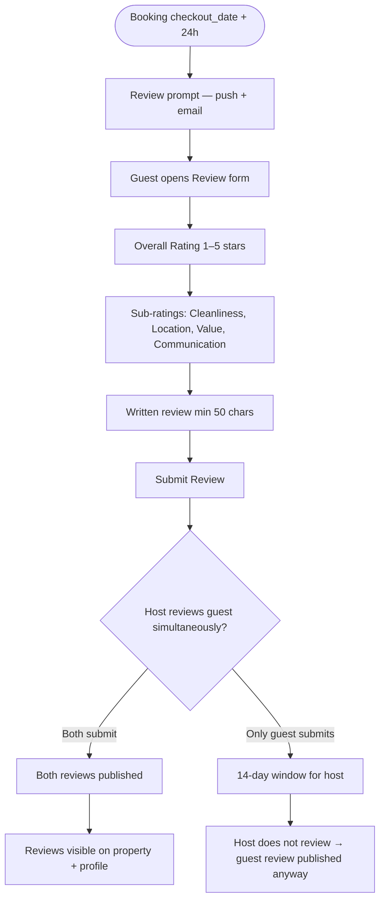

---

## 4.9 Listing Creation Wizard (Host)

```mermaid
graph LR
  A([Start: Create Listing]) --> B[Step 1: Property Type]
  B --> C[Step 2: Location & Map Pin]
  C --> D[Step 3: Bedrooms & Bathrooms]
  D --> E[Step 4: Amenities Checklist]
  E --> F[Step 5: Photos Upload min 5]
  F --> G[Step 6: Title & Description]
  G --> H[Step 7: Pricing]
  H --> I[Step 8: House Rules]
  I --> J[Step 9: Availability & Calendar]
  J --> K[Review & Submit]
  K --> L[Listing Submitted → Ops Review Queue]
```

**Wizard Rules:**
- Progress bar at top: 9 steps visible
- Each step: back + next buttons
- Draft saved automatically every 30 seconds
- Exit and resume anytime (draft stored server-side)
- Cannot submit unless all required fields complete
- Required fields marked with asterisk *

---

## 4.10 Listing Approval (Ops Flow)

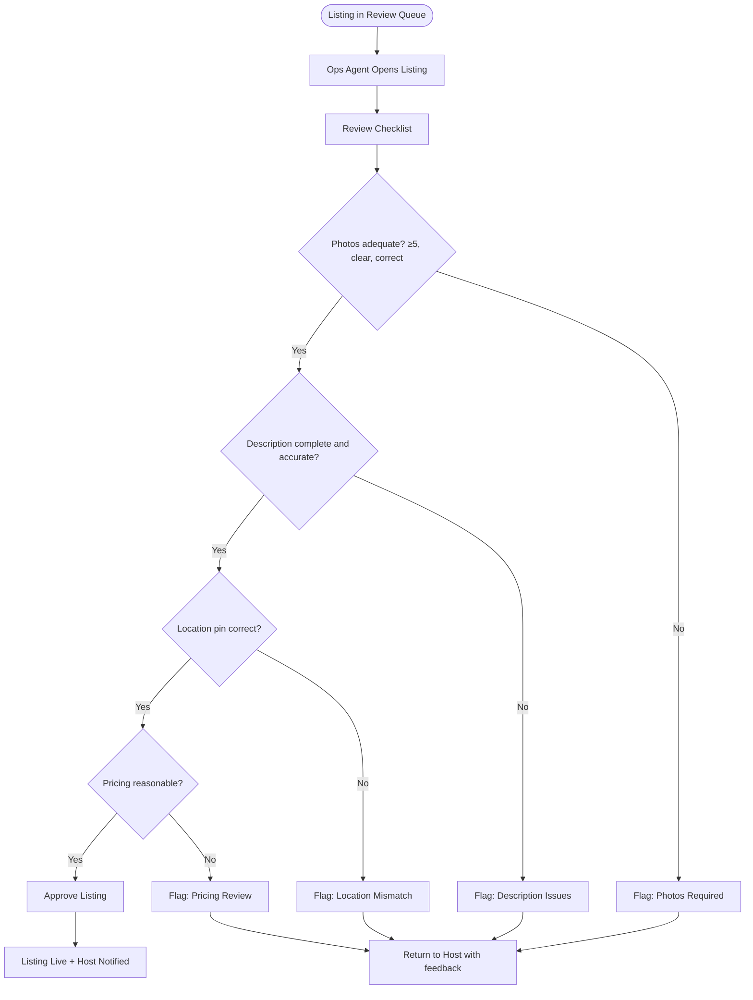

---

## 4.11 Dispute Resolution Flow

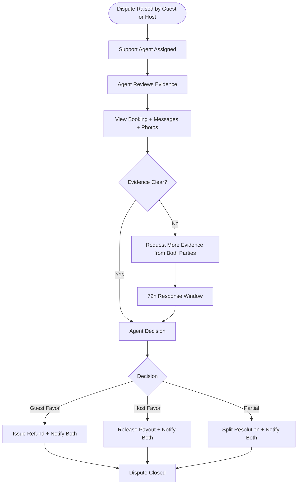

---

## 4.12 Wallet & Withdrawal Flow

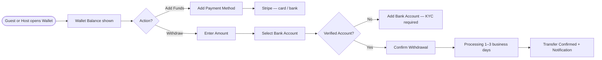

---

# STEP 5 — Page Inventory

## 5.1 Public Pages

### P01 — Home / Landing

| Field | Detail |
|-------|--------|
| **Purpose** | Convert unauthenticated visitors to registered users via search initiation |
| **Primary Actions** | Search (location/dates/guests), Sign up, Become a Host |
| **Components** | Hero with search bar, featured destinations, trending properties carousel, trust indicators, how it works section, host CTA banner, footer |
| **KPIs** | Search CTR, sign-up conversion %, scroll depth, hero CTA clicks |
| **Permissions** | Public — no authentication required |

### P02 — Search Results

| Field | Detail |
|-------|--------|
| **Purpose** | Surface matching inventory and drive property page visits |
| **Primary Actions** | Filter, sort, toggle map/list view, save to wishlist, open property |
| **Components** | Filter sidebar (desktop) / bottom sheet (mobile), property card grid, map view with clustered pins, active filters chips, sort dropdown, results count, pagination |
| **KPIs** | Click-through rate per card, filter usage rate, map vs list preference, conversion to booking |
| **Permissions** | Public — wishlist requires login |

### P03 — Property Detail

| Field | Detail |
|-------|--------|
| **Purpose** | Convert search visitors to booking initiators |
| **Primary Actions** | Reserve, Save to Wishlist, Message Host, Share |
| **Components** | Photo gallery (fullscreen), title + rating, location map, price calculator (sticky on desktop), calendar availability, amenities grid, reviews section, host card, similar properties, house rules, cancellation policy |
| **KPIs** | Reserve CTA click %, time on page, gallery engagement, wishlist add rate |
| **Permissions** | Public — reserve and message require login + KYC |

---

## 5.2 Authentication Pages

### A01 — Login

| Field | Detail |
|-------|--------|
| **Purpose** | Authenticate returning users quickly |
| **Primary Actions** | Login with phone/email/Google/Apple, forgot password |
| **Components** | Method tabs, phone input + OTP, social buttons, forgot password link |
| **KPIs** | Login success rate, method distribution, OTP resend rate |
| **Permissions** | Public — redirect authenticated users to dashboard |

### A02 — Sign Up

| Field | Detail |
|-------|--------|
| **Purpose** | Register new guest or host account |
| **Primary Actions** | Register with phone/Google/Apple, switch to host registration |
| **Components** | Role selector (Guest/Host), phone input, OTP, name/email fields, ToS agreement checkbox |
| **KPIs** | Sign-up completion rate, drop-off step, method distribution |
| **Permissions** | Public only |

### A03 — KYC Verification

| Field | Detail |
|-------|--------|
| **Purpose** | Capture and submit government ID for identity verification |
| **Primary Actions** | Upload document front/back, selfie capture, submit |
| **Components** | Step progress bar, document type selector, camera capture component, image preview + retake, submission CTA |
| **KPIs** | KYC completion rate, failure reasons, review time |
| **Permissions** | Authenticated users — all roles require KYC |

---

## 5.3 Guest Pages

### G01 — Guest Dashboard

| Field | Detail |
|-------|--------|
| **Purpose** | Central hub for the guest's current and upcoming activity |
| **Primary Actions** | View upcoming trip, continue saved searches, browse recommendations |
| **Components** | Upcoming trip card, past trips mini-list, wishlist preview, search bar, personalized property recommendations |
| **KPIs** | Return visit rate, recommendation CTR, search re-initiation rate |
| **Permissions** | Authenticated guest |

### G02 — My Trips

| Field | Detail |
|-------|--------|
| **Purpose** | Full history of all bookings |
| **Primary Actions** | View booking detail, cancel, message host, leave review, re-book |
| **Components** | Tabs (Upcoming / Past / Cancelled), booking card (image, dates, property name, status, CTA), empty state |
| **KPIs** | Review submission rate from here, rebooking rate |
| **Permissions** | Authenticated guest |

### G03 — Booking Detail

| Field | Detail |
|-------|--------|
| **Purpose** | Full context for a single reservation |
| **Primary Actions** | Cancel, message host, get directions, access digital key, download receipt |
| **Components** | Status badge, property photo, date summary, price breakdown, host info, check-in instructions, house rules, CTA buttons per status |
| **KPIs** | Support ticket rate per booking, cancellation rate |
| **Permissions** | Authenticated guest — own bookings only |

### G04 — Checkout

| Field | Detail |
|-------|--------|
| **Purpose** | Finalize booking and collect payment |
| **Primary Actions** | Confirm booking, apply promo code, add payment method, pay |
| **Components** | Trip summary card, price breakdown table, promo code input, payment method selector (cards, wallet), order total, ToS agree, Pay CTA, security badges |
| **KPIs** | Checkout abandonment rate, promo usage, payment failure rate |
| **Permissions** | Authenticated + KYC verified guest |

### G05 — Wishlists

| Field | Detail |
|-------|--------|
| **Purpose** | Organize saved properties into named collections |
| **Primary Actions** | Create list, rename list, remove property, share list |
| **Components** | Wishlist cards (cover photo, name, count), property grid within list, empty state with search CTA |
| **KPIs** | Wishlist → booking conversion, lists created per user |
| **Permissions** | Authenticated guest |

### G06 — Wallet

| Field | Detail |
|-------|--------|
| **Purpose** | Manage credits, payment methods, and transaction history |
| **Primary Actions** | Add payment method, withdraw balance, view transactions |
| **Components** | Balance card, payment methods list (add/remove), transaction history table (date, description, amount, status), withdrawal modal |
| **KPIs** | Wallet balance utilization rate, payment method diversity |
| **Permissions** | Authenticated guest |

---

## 5.4 Host Pages

### H01 — Host Dashboard

| Field | Detail |
|-------|--------|
| **Purpose** | Operational overview of listings, revenue, and reservations |
| **Primary Actions** | View reservations, see revenue summary, respond to messages, manage calendar |
| **Components** | Revenue KPI cards (MTD, last 30 days), reservation table (today's arrivals/departures), listing status cards, messages preview, payout status |
| **KPIs** | Occupancy rate, response rate, response time, average review score |
| **Permissions** | Authenticated host |

### H02 — Listings Management

| Field | Detail |
|-------|--------|
| **Purpose** | View and manage all listings |
| **Primary Actions** | Create listing, edit listing, pause/activate, archive |
| **Components** | Listing cards (photo, name, status badge, quick stats), create new CTA, status filter tabs (Active/Paused/Pending/Draft) |
| **KPIs** | Active listing count, occupancy per listing |
| **Permissions** | Host — own listings |

### H03 — Listing Edit

| Field | Detail |
|-------|--------|
| **Purpose** | Modify any aspect of an active or draft listing |
| **Primary Actions** | Edit all wizard sections independently (not step-by-step), save changes, preview as guest |
| **Components** | Section-based navigation sidebar (photos, details, pricing, rules, calendar), inline edit forms, save indicator, preview CTA |
| **KPIs** | Edit frequency, edit-to-relist time |
| **Permissions** | Host — own listings only |

### H04 — Calendar Management

| Field | Detail |
|-------|--------|
| **Purpose** | Control property availability and blocked dates |
| **Primary Actions** | Block dates, unblock dates, set minimum stay, view confirmed bookings |
| **Components** | Full-month calendar grid, color legend (booked/blocked/available), date range click to block, booking preview on hover, pricing override per date |
| **KPIs** | Blocking pattern (are hosts over-blocking?), availability rate |
| **Permissions** | Host — own listings only |

### H05 — Revenue & Analytics

| Field | Detail |
|-------|--------|
| **Purpose** | Understand financial performance and occupancy trends |
| **Primary Actions** | Export report, filter by date range, filter by listing |
| **Components** | Revenue chart (line, monthly), occupancy bar chart, ADR card, RevPAR card, booking source breakdown, top-performing listing table |
| **KPIs** | This page's KPIs are the platform KPIs themselves |
| **Permissions** | Host — own listings only |

### H06 — Payouts

| Field | Detail |
|-------|--------|
| **Purpose** | View upcoming and past payouts |
| **Primary Actions** | Add bank account, edit payout schedule, view transaction history |
| **Components** | Upcoming payout card, payout history table (date, amount, status, booking reference), bank account card, schedule settings |
| **KPIs** | Average payout time, failed payout rate |
| **Permissions** | Host + KYC verified |

---

## 5.5 Admin Pages

### AD01 — Admin Dashboard

| Field | Detail |
|-------|--------|
| **Purpose** | Platform-wide operational overview |
| **Primary Actions** | Navigate to any management section, see platform health |
| **Components** | GMV card, active users card, bookings today card, pending reviews queue count, dispute count, alert banners |
| **KPIs** | All platform KPIs |
| **Permissions** | Admin + Super Admin |

### AD02 — User Management

| Field | Detail |
|-------|--------|
| **Purpose** | Search, view, and manage all users |
| **Primary Actions** | Search user, view profile, ban/suspend, reset password, force KYC |
| **Components** | Search bar, user table (name, email, role, KYC status, created date, last active, actions), user detail panel/drawer |
| **KPIs** | User growth rate, KYC conversion rate, suspension rate |
| **Permissions** | Admin |

### AD03 — Finance Dashboard

| Field | Detail |
|-------|--------|
| **Purpose** | Full financial visibility across the platform |
| **Primary Actions** | Export transactions, approve payouts, override escrow |
| **Components** | Revenue chart, transaction ledger table, pending payouts queue, high-risk transactions flag, tax report download |
| **KPIs** | Platform fee revenue, payout volume, escrow balance |
| **Permissions** | Finance + Admin |

---

# STEP 6 — Wireframes

## 6.1 Home / Landing Page

```
┌──────────────────────────────────────────────────────────────────┐
│ NAV: Logo          [Location · Dates · Guests Search Bar]   [CTA] │
├──────────────────────────────────────────────────────────────────┤
│                                                                  │
│   HERO IMAGE (full-width, 600px height)                         │
│   ┌───────────────────────────────────────┐                      │
│   │  Find your perfect stay               │                      │
│   │  [Location]  [Check-in] [Check-out] [Guests] [🔍 Search]   │
│   └───────────────────────────────────────┘                      │
│                                                                  │
├──────────────────────────────────────────────────────────────────┤
│  Popular Destinations                              [See all →]  │
│  [Cairo] [Alexandria] [Sharm] [Hurghada] [Luxor] [Aswan]        │
├──────────────────────────────────────────────────────────────────┤
│  Trending Properties                                            │
│  ┌──────┐ ┌──────┐ ┌──────┐ ┌──────┐                           │
│  │ Card │ │ Card │ │ Card │ │ Card │  → Horizontal scroll       │
│  └──────┘ └──────┘ └──────┘ └──────┘                           │
├──────────────────────────────────────────────────────────────────┤
│  Trust Bar: 🔒 Secure Payments | ✅ Verified Hosts | 📞 24/7 Support │
├──────────────────────────────────────────────────────────────────┤
│  How It Works                                                   │
│  [1. Search] → [2. Book] → [3. Stay] → [4. Review]             │
├──────────────────────────────────────────────────────────────────┤
│  Become a Host Banner                                           │
│  "Earn money from your property"         [Get Started →]        │
├──────────────────────────────────────────────────────────────────┤
│  FOOTER: Links | Social | App Download | © StayOS              │
└──────────────────────────────────────────────────────────────────┘
```

---

## 6.2 Search Results Page

```
┌──────────────────────────────────────────────────────────────────┐
│ NAV (white, shadow)                                             │
├───────────────┬──────────────────────────────────────────────────┤
│ FILTERS       │ RESULTS HEADER                                   │
│ ─────────     │ "124 properties in Cairo · Aug 1–5 · 2 guests"  │
│ Price Range   │ [Sort: Recommended ▼]  [☰ List | 🗺 Map]        │
│ [$] ─────[$] │ ─────────────────────────────────────────────── │
│               │ ┌────────┐ ┌────────┐ ┌────────┐               │
│ Property Type │ │ [Photo]│ │ [Photo]│ │ [Photo]│               │
│ ○ Apartment  │ │ Name   │ │ Name   │ │ Name   │               │
│ ○ Villa      │ │ ⭐ 4.8  │ │ ⭐ 4.5  │ │ ⭐ 4.9  │               │
│ ○ Room       │ │ Cairo  │ │ Cairo  │ │ Giza   │               │
│               │ │ $120/n │ │ $85/n  │ │ $200/n │               │
│ Amenities    │ │ [Save ♥]│ │ [Save ♥]│ │ [Save ♥]│              │
│ ☐ Pool       │ └────────┘ └────────┘ └────────┘               │
│ ☐ Wifi       │ ─────────────────────────────────────────────── │
│ ☐ Kitchen    │ ┌────────┐ ┌────────┐ ┌────────┐               │
│ ☐ Parking    │ │ ...    │ │ ...    │ │ ...    │               │
│               │ └────────┘ └────────┘ └────────┘               │
│ Rating       │                                                  │
│ ⭐⭐⭐⭐+ only  │ [← Prev]  Page 1 of 9  [Next →]                │
│               │                                                  │
│ Instant Book │                                                  │
│ [Toggle]     │                                                  │
└───────────────┴──────────────────────────────────────────────────┘
```

**Map View:**
- Full-width interactive map (Mapbox/Google Maps)
- Property price bubbles as pins
- Click pin → mini property card popup
- List panel collapses to 40% width sidebar on desktop

---

## 6.3 Property Detail Page

```
┌──────────────────────────────────────────────────────────────────┐
│ NAV                                                             │
├──────────────────────────────────────────────────────────────────┤
│ PHOTO GALLERY (5 grid: 1 large left + 4 small right)           │
│ ┌──────────────┬────┬────┐                                       │
│ │              │    │    │                                       │
│ │  MAIN PHOTO  │ P2 │ P3 │  [Show all photos]                   │
│ │              ├────┼────┤                                       │
│ │              │ P4 │ P5 │                                       │
│ └──────────────┴────┴────┘                                       │
├────────────────────────────────────┬─────────────────────────────┤
│ PROPERTY INFO                      │ BOOKING WIDGET (sticky)    │
│ "Luxury Nile View Apartment"       │ ┌───────────────────────┐  │
│ ⭐ 4.9 (127 reviews) · Cairo, Egypt│ │ $120 / night           │  │
│                                    │ │ ┌──────────┬─────────┐│  │
│ 👤 Hosted by Omar                  │ │ │ CHECK-IN │CHECK-OUT││  │
│ 🛏 2 beds · 🛁 1 bath · 👥 4 guests│ │ │ Aug 1    │ Aug 5   ││  │
│                                    │ │ └──────────┴─────────┘│  │
│ ── About ──────────────────────── │ │ [2 guests         ▼]  │  │
│ Spacious apartment with panoramic  │ │                        │  │
│ Nile views, modern kitchen...      │ │ Subtotal:    $480      │  │
│                                    │ │ Cleaning fee: $40      │  │
│ ── Amenities ──────────────────── │ │ Service fee:  $52      │  │
│ ✅ Pool ✅ WiFi ✅ Kitchen ✅ AC   │ │ Taxes:        $28      │  │
│ ✅ Parking ✅ Washer ⬡ Gym        │ │ ────────────────────── │  │
│                                    │ │ Total:       $600      │  │
│ ── Availability ──────────────── │ │                        │  │
│ [2-month calendar]                 │ │ [Reserve]              │  │
│                                    │ │ No charge yet          │  │
│ ── Reviews ────────────────────── │ └───────────────────────┘  │
│ 127 reviews · ⭐ 4.9               │                             │
│ [Review cards carousel]            │ [Message Host]             │
│                                    │ [Save to Wishlist]         │
│ ── Location ───────────────────── │                             │
│ [Embedded Map]                     │                             │
│ Zamalek, Cairo                     │                             │
│                                    │                             │
│ ── Host ────────────────────────  │                             │
│ [Avatar] Omar H. · ⭐ 4.9 · 3yr   │                             │
│ "I ensure a perfect experience..." │                             │
│ [View profile] [Message]           │                             │
├────────────────────────────────────┴─────────────────────────────┤
│ Similar Properties carousel                                      │
└──────────────────────────────────────────────────────────────────┘
```

---

## 6.4 Checkout Page

```
┌──────────────────────────────────────────────────────────────────┐
│ ← Back to property                                              │
├─────────────────────────────┬────────────────────────────────────┤
│ CHECKOUT FORM               │ ORDER SUMMARY                      │
│                             │                                    │
│ Trip Details               │ [Photo thumb] Property Name        │
│ Cairo · Aug 1–5 · 2 guests  │ ⭐ 4.9 · Cairo                    │
│                             │                                    │
│ Pay with                   │ $120 × 4 nights    $480           │
│ ○ Card ending 4242          │ Cleaning fee        $40            │
│ ○ New card                  │ Service fee         $52            │
│ [Add card form]             │ Taxes               $28            │
│                             │ ─────────────────────────         │
│ Promo Code                 │ Total (USD)         $600           │
│ [CODE _______] [Apply]      │                                    │
│                             │ 🔒 Secured by Stripe               │
│ Cancellation Policy        │                                    │
│ Free before Aug 1. After,   │                                    │
│ 50% refund.                 │                                    │
│                             │                                    │
│ ☐ I agree to Terms &        │                                    │
│   House Rules               │                                    │
│                             │                                    │
│ [Confirm and Pay $600 →]    │                                    │
└─────────────────────────────┴────────────────────────────────────┘
```

---

## 6.5 Host Dashboard

```
┌────────┬──────────────────────────────────────────────────────────┐
│SIDEBAR │ HOST DASHBOARD                                           │
│        │                                                          │
│  ...   │ Welcome back, Omar 👋                                    │
│        │                                                          │
│        │ ┌──────────────┐ ┌──────────────┐ ┌──────────────┐     │
│        │ │ This Month   │ │ Occupancy    │ │ Avg Rating   │     │
│        │ │ $3,240       │ │ 78%          │ │ ⭐ 4.86       │     │
│        │ │ ↑ 12% vs last│ │ ↑ 5% vs last │ │ ↑ 0.2        │     │
│        │ └──────────────┘ └──────────────┘ └──────────────┘     │
│        │                                                          │
│        │ Today's Activity                                         │
│        │ ┌────────────────────────────────────────────────────┐  │
│        │ │ CHECK-INS (2)                                       │  │
│        │ │ Ahmed M. — Nile View Apt — arrives 3pm             │  │
│        │ │ Sara K.  — Zamalek Studio — arrives 5pm            │  │
│        │ ├────────────────────────────────────────────────────┤  │
│        │ │ CHECK-OUTS (1)                                      │  │
│        │ │ John D.  — Nile View Apt — checkout 11am ✅        │  │
│        │ └────────────────────────────────────────────────────┘  │
│        │                                                          │
│        │ Unread Messages (3)                                      │
│        │ [Message preview cards]                                  │
│        │                                                          │
│        │ Pending Actions                                          │
│        │ 🔴 2 booking requests awaiting response (>24h warning)  │
│        │ 🟡 1 payout ready for bank account setup               │
│        │ 🟢 KYC verified                                         │
└────────┴──────────────────────────────────────────────────────────┘
```

---

## 6.6 Admin Dashboard

```
┌────────┬──────────────────────────────────────────────────────────┐
│SIDEBAR │ ADMIN DASHBOARD                                          │
│        │                                                          │
│  ...   │ Platform Overview — July 2026                           │
│        │                                                          │
│        │ ┌────────┐ ┌────────┐ ┌────────┐ ┌────────┐           │
│        │ │ GMV    │ │ Users  │ │Bookings│ │ Dispts │           │
│        │ │ $2.4M  │ │ 12,450 │ │  847   │ │   12   │           │
│        │ │ ↑ 18%  │ │ ↑ 340  │ │ ↑ 9%   │ │ ↓ 3    │           │
│        │ └────────┘ └────────┘ └────────┘ └────────┘           │
│        │                                                          │
│        │ ⚠️ ALERT: 5 listings pending review (>48h)              │
│        │ ⚠️ ALERT: 3 KYC cases pending (>72h)                    │
│        │                                                          │
│        │ Revenue Chart (MTD vs Prior Month)                       │
│        │ [Line chart — 30 days]                                   │
│        │                                                          │
│        │ Recent Activity Feed                                     │
│        │ 14:32 — New host registered: Sara K.                    │
│        │ 14:15 — Dispute resolved: BK-00891 → Guest favor        │
│        │ 13:50 — Listing approved: LST-00445 "Cairo Studio"      │
│        │ 13:20 — KYC approved: Ahmed M.                          │
│        │                                                          │
│        │ Quick Actions                                            │
│        │ [User Lookup] [Pending Listings] [Active Disputes]      │
└────────┴──────────────────────────────────────────────────────────┘
```

---

# STEP 7 — Design System

## 7.1 Color System

### Brand Colors

| Token | Hex | Usage |
|-------|-----|-------|
| `color-brand-primary` | `#2C5FFF` | Primary CTAs, active states, links |
| `color-brand-dark` | `#1A3FCC` | Hover state of primary |
| `color-brand-light` | `#E8EEFF` | Selected backgrounds, badges |
| `color-brand-surface` | `#F0F4FF` | Sidebar active item background |

### Neutral Colors

| Token | Hex | Usage |
|-------|-----|-------|
| `color-neutral-900` | `#111827` | Primary text, headings |
| `color-neutral-700` | `#374151` | Body text |
| `color-neutral-500` | `#6B7280` | Secondary text, labels |
| `color-neutral-300` | `#D1D5DB` | Borders, dividers |
| `color-neutral-100` | `#F3F4F6` | Background surfaces |
| `color-neutral-50` | `#F9FAFB` | Page background |
| `color-white` | `#FFFFFF` | Cards, modals |

### Semantic Colors

| Token | Hex | Usage |
|-------|-----|-------|
| `color-success` | `#10B981` | Confirmed, verified, success |
| `color-success-light` | `#D1FAE5` | Success badge background |
| `color-warning` | `#F59E0B` | Pending, caution states |
| `color-warning-light` | `#FEF3C7` | Warning badge background |
| `color-error` | `#EF4444` | Errors, rejection, cancellation |
| `color-error-light` | `#FEE2E2` | Error badge background |
| `color-info` | `#3B82F6` | Informational states |
| `color-info-light` | `#DBEAFE` | Info badge background |

### Status Colors (Booking States)

| Status | Color | Background |
|--------|-------|------------|
| Confirmed | `#10B981` | `#D1FAE5` |
| Pending | `#F59E0B` | `#FEF3C7` |
| Cancelled | `#6B7280` | `#F3F4F6` |
| Checked In | `#2C5FFF` | `#E8EEFF` |
| Disputed | `#EF4444` | `#FEE2E2` |
| Completed | `#10B981` | `#D1FAE5` |

---

## 7.2 Typography

| Token | Font | Weight | Size | Line-height | Usage |
|-------|------|--------|------|-------------|-------|
| `text-display-xl` | Inter | 700 | 56px | 1.15 | Hero headlines |
| `text-display-lg` | Inter | 700 | 40px | 1.2 | Section headlines |
| `text-display-md` | Inter | 700 | 32px | 1.25 | Page titles |
| `text-display-sm` | Inter | 600 | 24px | 1.3 | Card headings |
| `text-body-lg` | Inter | 400 | 18px | 1.6 | Lead paragraphs |
| `text-body-md` | Inter | 400 | 16px | 1.6 | Body text |
| `text-body-sm` | Inter | 400 | 14px | 1.5 | Secondary text, labels |
| `text-caption` | Inter | 400 | 12px | 1.4 | Captions, legal |
| `text-label-lg` | Inter | 600 | 16px | 1.4 | Button text, nav items |
| `text-label-md` | Inter | 600 | 14px | 1.4 | Table headers, tags |
| `text-label-sm` | Inter | 500 | 12px | 1.3 | Badges, micro labels |

**Font Family:** `Inter, -apple-system, BlinkMacSystemFont, sans-serif`  
**Numeric variant:** `Inter` with `font-variant-numeric: tabular-nums` for all financial figures  
**Arabic support:** `Cairo, Tajawal` for RTL/Arabic locale

---

## 7.3 Spacing System (4px Base Grid)

| Token | Value | Common Usage |
|-------|-------|--------------|
| `space-1` | 4px | Tight internal padding |
| `space-2` | 8px | Icon padding, tight gaps |
| `space-3` | 12px | Form field internal padding |
| `space-4` | 16px | Default padding, card padding |
| `space-5` | 20px | Section gap |
| `space-6` | 24px | Card margin, form gap |
| `space-8` | 32px | Section padding |
| `space-10` | 40px | Large section gap |
| `space-12` | 48px | Page section gap |
| `space-16` | 64px | Hero padding |
| `space-20` | 80px | Full-page padding |

---

## 7.4 Grid System

| Breakpoint | Name | Columns | Gutter | Margin |
|------------|------|---------|--------|--------|
| `<480px` | Mobile S | 4 | 16px | 16px |
| `480–767px` | Mobile L | 4 | 16px | 24px |
| `768–1023px` | Tablet | 8 | 24px | 32px |
| `1024–1279px` | Desktop S | 12 | 24px | 40px |
| `1280–1535px` | Desktop M | 12 | 32px | 48px |
| `≥1536px` | Desktop L | 12 | 32px | Auto (max 1440px) |

---

## 7.5 Shadow System

| Token | Value | Usage |
|-------|-------|-------|
| `shadow-sm` | `0 1px 2px rgba(0,0,0,0.05)` | Subtle cards |
| `shadow-md` | `0 4px 6px rgba(0,0,0,0.07)` | Cards, dropdowns |
| `shadow-lg` | `0 10px 15px rgba(0,0,0,0.1)` | Modals, popovers |
| `shadow-xl` | `0 20px 25px rgba(0,0,0,0.15)` | Full-screen modals |
| `shadow-focus` | `0 0 0 3px rgba(44,95,255,0.3)` | Keyboard focus ring |

---

## 7.6 Border Radius

| Token | Value | Usage |
|-------|-------|-------|
| `radius-sm` | 4px | Badges, tags, small chips |
| `radius-md` | 8px | Inputs, small cards |
| `radius-lg` | 12px | Cards, panels |
| `radius-xl` | 16px | Property cards, modals |
| `radius-2xl` | 24px | Search bar pill, large cards |
| `radius-full` | 9999px | Avatars, toggles, pills |

---

## 7.7 Component Specifications

### Buttons

| Variant | Background | Text | Border | Usage |
|---------|-----------|------|--------|-------|
| Primary | `#2C5FFF` | White | None | Main CTAs: Reserve, Pay, Submit |
| Secondary | White | `#2C5FFF` | `#2C5FFF` 1.5px | Secondary actions |
| Destructive | `#EF4444` | White | None | Delete, Cancel booking |
| Ghost | Transparent | `#374151` | None | Tertiary actions, nav items |
| Link | None | `#2C5FFF` | None | Inline text actions |

**Button Sizes:**

| Size | Height | Padding | Font |
|------|--------|---------|------|
| `sm` | 32px | 8px 12px | 14px/600 |
| `md` | 40px | 10px 16px | 15px/600 |
| `lg` | 48px | 12px 24px | 16px/600 |
| `xl` | 56px | 14px 32px | 18px/700 |

**States:** default → hover (darken 8%) → active (darken 15%) → focus (shadow-focus) → disabled (opacity 0.4, cursor not-allowed) → loading (spinner replaces text)

---

### Form Inputs

```
┌──────────────────────────────────┐
│ Label *                          │
│ ┌──────────────────────────────┐ │
│ │ Placeholder text          🔍 │ │
│ └──────────────────────────────┘ │
│ Helper text or error message     │
└──────────────────────────────────┘
```

| State | Border | Background | Label Color |
|-------|--------|------------|-------------|
| Default | `#D1D5DB` | White | `#374151` |
| Hover | `#9CA3AF` | White | `#374151` |
| Focus | `#2C5FFF` 2px | White | `#2C5FFF` |
| Error | `#EF4444` 2px | `#FFF5F5` | `#EF4444` |
| Success | `#10B981` 2px | White | `#10B981` |
| Disabled | `#D1D5DB` | `#F9FAFB` | `#9CA3AF` |

Input height: 44px (touch-friendly minimum)  
Border radius: 8px  
Font: 16px (prevents iOS auto-zoom on focus)

---

### Cards — Property Card

```
┌──────────────────────────────────┐
│ [Photo 3:2 aspect ratio]        │
│ ♥ (wishlist icon top-right)     │
├──────────────────────────────────┤
│ Property Name              ⭐4.9 │
│ Cairo, Egypt                     │
│ Aug 1–5                          │
│ $120 /night                      │
│ ($600 total)                     │
└──────────────────────────────────┘
```

- Border: none
- Shadow: `shadow-md` on hover
- Radius: `radius-xl`
- Photo: lazy-loaded, skeleton while loading
- Hover: image scales to 105% (transform), shadow deepens
- Transition: 200ms ease

---

### Status Badges

```
● Confirmed      (green dot + green text + green-light bg)
● Pending        (amber dot + amber text + amber-light bg)
● Cancelled      (gray dot + gray text + gray-light bg)
● Verified       (blue checkmark icon + blue text)
● Under Review   (clock icon + amber text)
```

Padding: 4px 8px  
Font: 12px/500  
Radius: 9999px  

---

### Data Tables

```
┌──────────┬──────────────┬───────────┬────────────┬───────────┐
│ Column A │ Column B     │ Column C  │ Column D   │ Actions   │
├──────────┼──────────────┼───────────┼────────────┼───────────┤
│ Value    │ Value        │ Value     │ ● Status   │ [•••]     │
│ Value    │ Value        │ Value     │ ● Status   │ [•••]     │
└──────────┴──────────────┴───────────┴────────────┴───────────┘
```

- Header: background `#F9FAFB`, font 14px/600, `#374151`
- Row: 48px height, hover `#F9FAFB`
- Divider: 1px `#F3F4F6`
- Sortable column: sort icon on hover, active sort arrow
- Sticky header: on vertical scroll
- Row selection: checkbox column, bulk actions bar appears at top
- Pagination: `← Prev | 1 2 3 ... 9 | Next →`

---

### Modals / Dialogs

| Size | Width | Usage |
|------|-------|-------|
| `sm` | 400px | Confirmation dialogs |
| `md` | 560px | Forms, detail views |
| `lg` | 720px | Complex forms |
| `xl` | 920px | Full data views |
| `full` | 100vw / 100vh | Photo galleries, maps |

All modals:
- Overlay: `rgba(0,0,0,0.5)` backdrop
- Click outside → close (unless critical action in progress)
- `Escape` key → close
- Focus trapped inside modal while open
- `X` close button top-right, 44×44px touch target
- Slide-up animation on mobile (bottom sheet)

---

### Empty States

Every empty state must include:
1. Illustration (SVG, 160px)
2. Heading (20px/600)
3. Body copy (one sentence, 14px)
4. Primary CTA

Examples:
- **No trips:** "You haven't booked a stay yet" → [Start exploring]
- **No listings:** "Ready to earn? Create your first listing" → [Create listing]
- **No messages:** "No messages yet. Start a conversation." → [Explore stays]
- **No results:** "No properties match your filters" → [Clear filters]

---

### Loading States

| Component | Loading Behavior |
|-----------|----------------|
| Page | Full-page skeleton (gray animated pulses matching layout) |
| Property card | Card-shaped skeleton with pulse animation |
| Table rows | Row-shaped skeletons, 5 rows by default |
| Buttons | Spinner (16px) replaces label text |
| Images | Gray background + shimmer until loaded |
| Data widgets | Number replaced by animated bar |

Skeleton animation: `background: linear-gradient(90deg, #F3F4F6, #E5E7EB, #F3F4F6); animation: shimmer 1.5s infinite`

---

### Alert / Toast Notifications

```
┌─────────────────────────────────────────────────────────────┐
│ ✅  Booking confirmed! Your stay is secured.           [×]  │
└─────────────────────────────────────────────────────────────┘
```

| Type | Icon | Color | Auto-dismiss |
|------|------|-------|--------------|
| Success | ✅ | `#10B981` | 4 seconds |
| Error | ❌ | `#EF4444` | 8 seconds |
| Warning | ⚠️ | `#F59E0B` | 6 seconds |
| Info | ℹ️ | `#3B82F6` | 5 seconds |

- Position: top-right desktop, top-center mobile
- Stack: up to 3 toasts visible simultaneously
- Slide-in from right (desktop) / slide-down from top (mobile)
- Manual dismiss: `×` button

---

### Charts

| Chart Type | Usage | Library Recommended |
|-----------|-------|---------------------|
| Line chart | Revenue over time, occupancy trends | Recharts |
| Bar chart | Booking counts, occupancy comparison | Recharts |
| Donut/Pie | Revenue breakdown, booking source | Recharts |
| Area chart | Platform growth, user signups | Recharts |
| Heatmap | Calendar availability | Custom |

**Chart Design Rules:**
- Primary data line/bar: `#2C5FFF`
- Secondary data: `#10B981`
- Tertiary data: `#F59E0B`
- Grid lines: `#F3F4F6`
- Axes labels: 12px, `#6B7280`
- Tooltip: white card, shadow-md, rounded-lg
- Responsive: full width of container
- Loading: skeleton pulse same dimensions as chart

---

# STEP 8 — Dashboard Design

## 8.1 Guest Dashboard

**Layout: Two-column on desktop, single-column on mobile**

```
┌───────────────────────────────────────────────────────────────┐
│ HEADER: Good morning, Ahmed ☀️  |  Quick search bar          │
├────────────────────────────┬──────────────────────────────────┤
│ UPCOMING TRIP (if exists)  │ PERSONALIZED RECOMMENDATIONS    │
│ ┌──────────────────────┐   │ "Based on your searches"        │
│ │ [Property image]     │   │ [3 property cards]              │
│ │ Nile View Apt        │   │                                 │
│ │ Aug 1–5, 2026        │   │ WISHLISTS PREVIEW               │
│ │ ● Confirmed          │   │ [2 wishlist thumbnails]         │
│ │ [View Details]       │   │ [+ Create wishlist]             │
│ └──────────────────────┘   │                                 │
│                             │ RECENTLY VIEWED                 │
│ PAST TRIPS (2)             │ [3 small property cards]        │
│ [Mini list]                 │                                 │
└────────────────────────────┴──────────────────────────────────┘
```

**Key KPI Widgets for Guest:**
- Next check-in countdown (if booked)
- Wallet balance (if credits available)
- Pending reviews to write

---

## 8.2 Host Dashboard

**Layout: Sidebar + main area with KPI grid + activity feed**

**KPI Row (top of content):**

| Widget | Metric | Sub-metric |
|--------|--------|------------|
| Revenue MTD | $3,240 | ↑ 12% vs last month |
| Occupancy Rate | 78% | ↑ 5% vs last month |
| Pending Reservations | 4 | Awaiting response |
| Avg Review Score | 4.86 | Last 30 days |
| Response Rate | 96% | Industry avg: 85% |

**Activity Section:**
- Today's arrivals list
- Today's departures list
- Upcoming reservations (7-day view)

**Chart Section:**
- Revenue trend line chart (90 days)
- Occupancy bar chart by listing (if multiple)

**Action Items (Smart Inbox):**
- Booking requests requiring response
- Messages unanswered >24h (warning indicator)
- Pending payouts needing bank setup
- Missing KYC documents

---

## 8.3 Operations Dashboard

**Layout: Full-width tables + queue management**

```
┌───────────────────────────────────────────────────────────────┐
│ QUEUE HEALTH                                                  │
│ KYC Queue: 12 pending  |  Listing Queue: 7 pending  |  Avg review time: 4.2h │
├──────────────────────────────────────────────────────────────┤
│ TABS: [KYC Review] [Listing Approval] [Quality Control]      │
├──────────────────────────────────────────────────────────────┤
│ KYC REVIEW TABLE                                             │
│ User | Submitted | Document Type | Status | Action           │
│ ──── │ ────────── │ ───────────── │ ────── │ ──────          │
│ Ahmed│ 2h ago     │ National ID   │ ○ New  │ [Review]        │
│ Sara │ 5h ago     │ Passport      │ ○ New  │ [Review]        │
│ Omar │ 1d ago     │ Driver Lic.   │ ⏰ Old │ [Review] ⚠️     │
└──────────────────────────────────────────────────────────────┘
```

**KYC Review Detail (Drawer/Panel):**
- Document front image (zoomable)
- Document back image (zoomable)
- Selfie photo
- OCR extracted data (name, DOB, ID number)
- Approve / Reject / Request Resubmit buttons
- Rejection reason selector (required)

---

## 8.4 Finance Dashboard

**Layout: KPI cards + transaction ledger + payout queue**

**KPI Row:**
| Widget | Value |
|--------|-------|
| Platform GMV (MTD) | $2,400,000 |
| Platform Fee Revenue | $120,000 (5%) |
| Escrow Balance | $340,000 |
| Pending Payouts | $87,000 |
| Failed Payouts | 3 ($4,200) |

**Sections:**
1. Revenue line chart (30/60/90/365 day selectors)
2. Transaction ledger table with filters (type, status, date range)
3. Pending payout approval queue
4. High-risk transaction flags (automated)
5. Tax summary by jurisdiction

---

## 8.5 Support Dashboard

**Layout: Queue management + ticket detail + communication tools**

**Queue Overview:**
| Priority | Count | SLA |
|----------|-------|-----|
| 🔴 Urgent | 2 | <2h remaining |
| 🟠 High | 8 | <8h remaining |
| 🟡 Medium | 23 | <24h |
| 🟢 Low | 41 | <72h |

**Ticket Detail View:**
- Timeline: messages + system events in chronological order
- Booking context sidebar (dates, property, amounts)
- Quick actions: refund, cancel, message user, escalate
- Resolution notes field
- Status + assignee controls

---

# STEP 9 — Mobile Experience

## 9.1 Breakpoint Strategy

```
Mobile S:   320px–479px  (iPhone SE)
Mobile L:   480px–767px  (large phones)
Tablet:     768px–1023px (iPad portrait)
Desktop S:  1024px–1279px (iPad landscape, small laptops)
Desktop M:  1280px–1535px (standard laptops)
Desktop L:  ≥1536px (large monitors)
```

## 9.2 Desktop Patterns

| Pattern | Implementation |
|---------|---------------|
| Property grid | 3–4 columns |
| Dashboard | Sidebar + main content, 2 columns |
| Booking widget | Sticky right column on property page |
| Search modal | Centered overlay |
| Table | Full columns visible, horizontal scroll if needed |
| Navigation | Top nav + sidebar |

## 9.3 Tablet Patterns

| Pattern | Implementation |
|---------|---------------|
| Property grid | 2 columns |
| Dashboard | Collapsed icon sidebar + full content |
| Booking widget | Below property info (not sticky) |
| Search modal | Full-width overlay |
| Table | Fewer columns, priority columns only |
| Navigation | Top nav + icon sidebar |

## 9.4 Mobile Patterns

| Pattern | Implementation |
|---------|---------------|
| Property grid | 1 column (full-width cards) |
| Dashboard | Single column, stacked cards |
| Booking widget | Bottom sticky bar with CTA |
| Search modal | Full-screen native-feeling overlay |
| Table | Card view (rows become cards) |
| Navigation | Top minimal + bottom tab bar |
| Modals | Bottom sheet slide-up animation |
| Filters | Bottom sheet with pill chips |
| Calendar | Single month, full-screen |
| Photo gallery | Full-screen with swipe |

**Mobile-Specific Patterns:**
- All touch targets minimum 44×44px
- Swipe-to-go-back supported on all drill-down screens
- Pull-to-refresh on all list views
- Haptic feedback on booking confirmation (iOS)
- No hover-only interactive elements
- Sticky CTAs at bottom for all conversion screens

**Mobile Bottom Sticky CTA Bar (Property Page):**
```
┌─────────────────────────────────────────────────────┐
│  $120/night  ⭐4.9 (127)         [Reserve →]        │
└─────────────────────────────────────────────────────┘
```

**Mobile Checkout:**
- Single column, full-width
- Payment form takes full screen width
- Large, accessible number inputs
- Numeric keyboard auto-triggered for card/CVV/OTP

---

# STEP 10 — Micro Interactions

## 10.1 Hover States

| Element | Hover Effect | Duration |
|---------|-------------|----------|
| Property card | Image scale 105% + shadow deepen | 200ms ease |
| Button (primary) | Background darken 8% | 150ms |
| Button (secondary) | Border + text darken | 150ms |
| Nav item (sidebar) | Background `#F3F4F6` | 100ms |
| Table row | Background `#F9FAFB` | 100ms |
| Link | Underline appears | 100ms |
| Badge | Subtle scale 1.05 | 150ms |
| Star rating (input) | Stars fill progressively on hover | 100ms |
| Wishlist ♥ icon | Scale 1.2 + fill color transition | 200ms |

---

## 10.2 Loading States

| Scenario | Behavior |
|----------|----------|
| Page navigation | Progress bar at very top (NProgress style), 2px, `#2C5FFF` |
| Search results | Skeleton cards (6 cards) shimmer while results load |
| Booking submission | Button shows spinner, page dims slightly |
| Payment processing | Full-screen loading overlay: "Processing your payment…" |
| Image upload | Progress ring around thumbnail |
| OTP sending | Button disabled + countdown "Resend in 59s" |

---

## 10.3 Success States

| Action | Feedback |
|--------|---------|
| Booking confirmed | Full-screen success animation (confetti or checkmark pulse) → auto redirect to booking detail in 2s |
| Payment accepted | Green checkmark animation + toast: "Booking confirmed!" |
| Wishlist saved | ♥ icon fills red with scale bounce |
| Review submitted | Star rating animates filling + toast: "Thank you for your review!" |
| Message sent | Message bubble slides in from right with sent tick |
| KYC submitted | Animated ID card → checkmark + "Under review" message |
| Listing published | Confetti burst on host screen |
| Payout sent | Money flying animation + "Payment on its way!" |

---

## 10.4 Error States

| Error Type | Display | Duration |
|-----------|---------|---------|
| Form validation | Inline red text below field + field border red | Persistent until fixed |
| Payment failed | Red banner at top of checkout + specific reason | Persistent |
| Network error | "Connection lost" banner + retry button | Until resolved |
| Search no results | Illustrated empty state + filter clear suggestion | Persistent |
| OTP invalid | Shake animation on input + "Incorrect code" text | 3 seconds then clears |
| Upload failed | Red border on upload zone + "Upload failed. Try again." | Persistent |
| Server error (500) | Friendly error page: "Something went wrong" + contact support | Persistent |

---

## 10.5 Animations & Transitions

| Element | Animation | Timing |
|---------|-----------|--------|
| Modal open | Fade-in overlay + scale 0.95→1 content | 200ms ease-out |
| Modal close | Reverse: scale 1→0.95 + fade-out | 150ms ease-in |
| Bottom sheet (mobile) | Slide-up from bottom | 300ms cubic-bezier(0.34,1.56,0.64,1) |
| Sidebar collapse | Width transition 240px→64px | 200ms ease |
| Toast notification | Slide-in right, fade-out | 300ms ease |
| Tab switching | Content fade 0→1 | 150ms |
| Accordion expand | Height transition + chevron rotate | 200ms ease |
| Page transition | Fade: 0→1 opacity | 150ms |
| Skeleton → content | Crossfade | 300ms |
| Star rating fill | Sequential fill with 50ms delay each | 250ms total |
| Number counter | Count-up animation (KPI widgets) | 800ms ease-out |
| Map pin | Bounce on appear | 400ms spring |
| Wishlist ♥ | Scale 1 → 1.4 → 1 | 300ms |

**Reduced Motion:**  
All animations respect `prefers-reduced-motion: reduce`. When set, all transitions use `opacity` only, duration reduced to 50ms.

---

# STEP 11 — Accessibility

## 11.1 WCAG 2.1 AA Compliance Checklist

| Requirement | Implementation |
|-------------|---------------|
| Color contrast — normal text | Minimum 4.5:1 ratio |
| Color contrast — large text | Minimum 3:1 ratio |
| Color contrast — UI components | Minimum 3:1 ratio |
| Text resize | All text scalable to 200% without loss of content |
| Images of text | Avoided entirely — CSS for all text |
| No color-only information | Status uses icon + color + text label |
| Keyboard navigable | All interactive elements reachable via Tab |
| Focus visible | Custom focus ring: `shadow-focus` visible on all elements |
| Skip links | "Skip to main content" as first focusable element |
| Page titled | Unique, descriptive `<title>` per page |
| Language | `lang="ar"` or `lang="en"` on `<html>` |
| Error identification | Error described in text, not color alone |
| Labels | All form inputs have associated `<label>` |
| Purpose of links | All links have descriptive text |
| No keyboard traps | Except modals (intentional focus trap, escapable) |

---

## 11.2 Keyboard Navigation Map

| Key | Action |
|-----|--------|
| `Tab` | Move focus forward |
| `Shift+Tab` | Move focus backward |
| `Enter` / `Space` | Activate button or link |
| `Escape` | Close modal, drawer, dropdown |
| `Arrow keys` | Navigate within components (menus, calendar, tabs) |
| `Home` / `End` | First / last item in list/menu |
| `Page Up / Down` | Scroll content |

**Calendar Keyboard Navigation:**
- Arrow keys: move between days
- `Enter`: select date
- `Page Up/Down`: change month
- `Escape`: close calendar

---

## 11.3 Contrast Ratios — Key Combinations

| Element | Foreground | Background | Ratio | Pass? |
|---------|-----------|------------|-------|-------|
| Body text | `#374151` | `#FFFFFF` | 9.3:1 | ✅ AA |
| Primary button | `#FFFFFF` | `#2C5FFF` | 4.6:1 | ✅ AA |
| Secondary button text | `#2C5FFF` | `#FFFFFF` | 4.6:1 | ✅ AA |
| Placeholder text | `#9CA3AF` | `#FFFFFF` | 2.8:1 | ⚠️ decorative only |
| Success badge | `#065F46` | `#D1FAE5` | 7.2:1 | ✅ AA |
| Error badge | `#991B1B` | `#FEE2E2` | 8.1:1 | ✅ AA |
| Warning badge | `#92400E` | `#FEF3C7` | 6.8:1 | ✅ AA |
| Nav sidebar active | `#1E40AF` | `#EFF6FF` | 7.1:1 | ✅ AA |

---

## 11.4 ARIA Roles & Attributes

| Component | ARIA Implementation |
|-----------|-------------------|
| Navigation | `<nav aria-label="Main navigation">` |
| Search bar | `role="search"`, `aria-label="Search stays"` |
| Modals | `role="dialog"`, `aria-modal="true"`, `aria-labelledby` |
| Alerts | `role="alert"` for error/success toasts |
| Live regions | `aria-live="polite"` for search result count |
| Images | `alt` text required; decorative images `alt=""` |
| Star rating input | `role="radiogroup"`, each star `role="radio"` |
| Table | `<thead>`, `<th scope="col">`, `<caption>` |
| Status badges | `aria-label="Status: Confirmed"` (not color only) |
| Loading spinner | `role="status"`, `aria-label="Loading"` |
| Expandable sections | `aria-expanded="true/false"`, `aria-controls` |
| Tabs | `role="tablist"`, `role="tab"`, `role="tabpanel"` |
| Dropdown menu | `role="menu"`, `role="menuitem"` |
| Breadcrumbs | `<nav aria-label="Breadcrumb">`, `aria-current="page"` on last item |
| Error messages | `aria-describedby` linking input to error |
| Required fields | `aria-required="true"` on required inputs |

---

## 11.5 Focus Management

| Scenario | Focus Behavior |
|----------|---------------|
| Modal opens | Focus moves to first focusable element inside modal |
| Modal closes | Focus returns to element that triggered the modal |
| Route change | Focus moves to main content heading (`<h1>`) |
| Error on form submit | Focus moves to first field with error |
| Toast notification | Not focused (non-critical) — read by screen reader via `aria-live` |
| Drawer opens | Focus moves to drawer, trapped inside |
| Drawer closes | Focus returns to trigger |
| Tab switching | Focus moves to active tab panel content |

---

# STEP 12 — Implementation Summary

## 12.1 Component Build Priority

**Phase 1 — Core (Ship first):**
1. Design tokens (colors, typography, spacing)
2. Button component (all variants + states)
3. Form inputs (text, select, checkbox, radio)
4. Navigation (top nav + sidebar + mobile bottom)
5. Property card
6. Search bar + search modal
7. Photo gallery
8. Booking widget (price calculator)
9. Checkout page
10. Auth screens (login, OTP, KYC)

**Phase 2 — Dashboards:**
1. Guest dashboard + Trips + Booking detail
2. Host dashboard + Listings + Calendar
3. Admin dashboard + User management
4. Ops queue + KYC review
5. Finance dashboard

**Phase 3 — Polish:**
1. Empty states (all)
2. Loading skeletons (all)
3. Error states (all)
4. Micro interactions + animations
5. Mobile optimization pass
6. Accessibility audit + fixes

---

## 12.2 Page Count Summary

| Zone | Pages |
|------|-------|
| Public | 9 |
| Authentication | 6 |
| Guest | 9 |
| Host | 9 |
| Property Manager | 7 |
| Field Staff | 4 |
| Support | 7 |
| Operations | 6 |
| Finance | 7 |
| Admin | 9 |
| Super Admin | 5 |
| Shared (Messages, Notifications) | 3 |
| **Total** | **81 screens** |

---

## 12.3 Design Token File Structure

```
design/
├── tokens/
│   ├── colors.json
│   ├── typography.json
│   ├── spacing.json
│   ├── shadows.json
│   ├── radii.json
│   └── breakpoints.json
├── components/
│   ├── Button.spec.md
│   ├── Input.spec.md
│   ├── Card.spec.md
│   ├── Table.spec.md
│   ├── Modal.spec.md
│   ├── Badge.spec.md
│   ├── Toast.spec.md
│   ├── Chart.spec.md
│   └── EmptyState.spec.md
├── pages/
│   ├── public/
│   ├── auth/
│   ├── guest/
│   ├── host/
│   ├── admin/
│   ├── ops/
│   ├── finance/
│   └── support/
└── PRODUCT_EXPERIENCE_DESIGN.md  ← this file
```

---

## 12.4 RTL / Arabic Language Support

StayOS must support Arabic (RTL) out of the box.

| Rule | Implementation |
|------|---------------|
| Layout direction | `dir="rtl"` on `<html>` for Arabic locale |
| Typography | Font: `Cairo`, `Tajawal` — both excellent Arabic web fonts |
| Icons | Mirror directional icons (arrows, chevrons) using CSS `scale(-1)` |
| Sidebar | Moves to right side in RTL |
| Input text alignment | Right-aligned in RTL mode |
| Number formatting | Arabic-Indic numerals optional (user setting) |
| Date format | Arabic locale: DD/MM/YYYY or Hijri calendar option |
| Currency | EGP (Egyptian Pound) default, $ as secondary |

---

## 12.5 Data States for Every List/Table

Every list or table view must implement all 5 states:

| State | Trigger | Display |
|-------|---------|---------|
| **Loading** | Data fetching | Skeleton rows/cards |
| **Empty** | Zero results | Illustrated empty state + CTA |
| **Populated** | Data available | Normal view |
| **Filtered — no match** | Filters return 0 results | "No results match" + [Clear filters] |
| **Error** | Fetch failed | Error message + [Retry] button |

---

*Document ends.*  
*Version 1.0 — Ready for frontend implementation.*  
*Next: Design handoff to engineering via Figma component mapping.*
