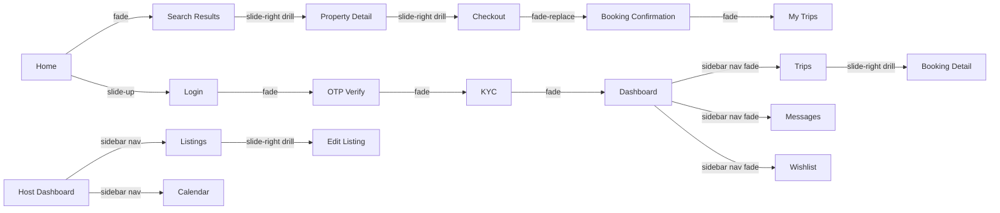
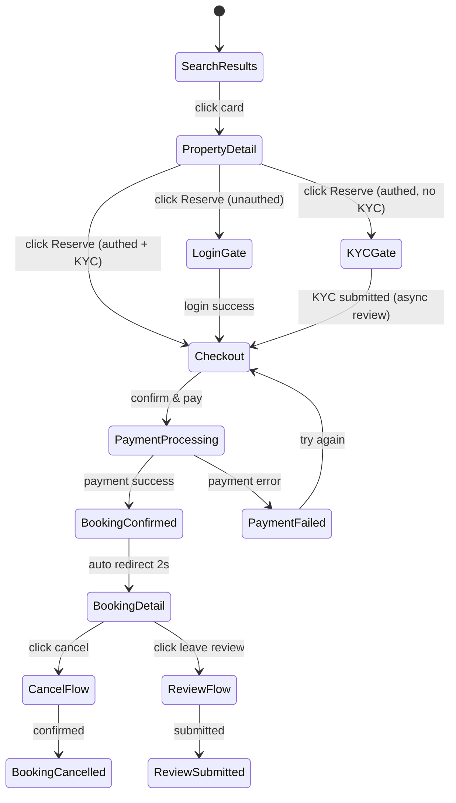

# StayOS — Visual Design System
## Part 4 of 4: Accessibility · Dark Mode · RTL · Prototype Spec

**Continuation of:** VISUAL_DESIGN_SYSTEM_P3.md

---

# 9. ACCESSIBILITY

## 9.1 WCAG 2.1 AA — Full Compliance Checklist

### Perceivable

| Criterion | ID | Requirement | StayOS Implementation |
|-----------|-----|-------------|----------------------|
| Non-text content | 1.1.1 | All images have alt text | All `` have meaningful alt. Decorative images: `alt=""` |
| Captions | 1.2.2 | Video captions | Any platform video has captions file |
| Audio description | 1.2.5 | Audio for video | Not applicable — no video content in v1 |
| Info not color only | 1.3.3 | Color + shape + text | Status: dot + text + background. Errors: icon + text + border |
| Resize text | 1.4.4 | 200% zoom usable | All layouts fluid. No pixel-fixed heights on text containers |
| Images of text | 1.4.5 | No images of text | All text is HTML text. SVG illustrations only |
| Reflow | 1.4.10 | 320px viewport usable | Single column layout on mobile. Horizontal scroll only in tables with scroll affordance |
| Non-text contrast | 1.4.11 | UI components 3:1 | All borders, icons, button outlines meet 3:1 |
| Text spacing | 1.4.12 | Line/letter spacing adjustable | No CSS that breaks when user overrides spacing |
| Content on hover/focus | 1.4.13 | Tooltips persistent | Tooltips stay open until dismissed, not pointer-only |

### Operable

| Criterion | ID | Requirement | StayOS Implementation |
|-----------|-----|-------------|----------------------|
| Keyboard | 2.1.1 | All functions via keyboard | Tab order matches visual order. No mouse-only interactions |
| No keyboard trap | 2.1.2 | Escape any context | Only intentional traps: modal (Escape releases) |
| Skip links | 2.4.1 | Skip to main content | `<a href="#main">Skip to main content</a>` first element |
| Page titled | 2.4.2 | Unique page titles | `<title>Booking Detail BK-00123 | StayOS</title>` |
| Focus order | 2.4.3 | Logical focus order | DOM order matches visual. No tabindex > 0 |
| Link purpose | 2.4.4 | Link text is descriptive | No "click here" — "View booking BK-00123" |
| Focus visible | 2.4.7 | Visible keyboard focus | Custom focus ring: `--shadow-focus-brand` on all interactive elements |
| Pointer gestures | 2.5.1 | Single pointer alternative | All swipe/drag has button alternative |
| Target size | 2.5.5 | Min 44×44px | All interactive elements ≥44×44px on touch |

### Understandable

| Criterion | ID | Requirement | StayOS Implementation |
|-----------|-----|-------------|----------------------|
| Language | 3.1.1 | HTML lang attribute | `<html lang="en">` or `<html lang="ar" dir="rtl">` |
| On focus | 3.2.1 | No unexpected change on focus | No navigation or form submission on focus |
| On input | 3.2.2 | No unexpected change on input | Date picker doesn't navigate on selection without confirm |
| Error identification | 3.3.1 | Errors described in text | Error message below field in text, not just color |
| Labels | 3.3.2 | Inputs are labeled | `<label for="">` on every input. No placeholder-only |
| Error suggestion | 3.3.3 | Fix suggestion in error | "Enter a valid email address (e.g. name@email.com)" |
| Error prevention | 3.3.4 | Reversible important actions | Booking cancel: confirmation step. Refund: confirm dialog |

---

## 9.2 ARIA Implementation Guide

### Core ARIA Patterns

```
Page structure:
  <header role="banner">
  <nav aria-label="Main navigation">
  <main id="main" role="main">
  <aside role="complementary">
  <footer role="contentinfo">

Skip link:
  <a href="#main" class="skip-link">Skip to main content</a>
  Visible only on focus: position fixed, off-screen → on-screen on :focus

Search:
  <form role="search" aria-label="Search stays">
    <input aria-label="Where are you going?" autocomplete="off">
    <button type="submit" aria-label="Search">

Modals:
  <div role="dialog" aria-modal="true" aria-labelledby="modal-title" aria-describedby="modal-desc">
  Focus trap: Tab cycles only within modal
  Escape key: closes modal, returns focus to trigger element

Live regions:
  Search results: <div aria-live="polite" aria-atomic="false" id="results-count">
    "124 properties found"  (updated after search)
  Toast notifications: <div aria-live="polite" role="status">
  Error alerts: <div aria-live="assertive" role="alert">

Tabs:
  <div role="tablist" aria-label="Booking status">
    <button role="tab" aria-selected="true" aria-controls="upcoming-panel" id="upcoming-tab">Upcoming</button>
    <button role="tab" aria-selected="false" aria-controls="past-panel" id="past-tab">Past</button>
  <div role="tabpanel" id="upcoming-panel" aria-labelledby="upcoming-tab">

Accordion:
  <button aria-expanded="false" aria-controls="section-1" id="trigger-1">Amenities</button>
  <div id="section-1" role="region" aria-labelledby="trigger-1" hidden>

Star Rating Input:
  <fieldset>
    <legend>Rate your stay</legend>
    <div role="radiogroup" aria-label="Rating: select 1 to 5 stars">
      <input type="radio" id="star-1" name="rating" value="1">
      <label for="star-1" aria-label="1 star — Terrible">★</label>
      ...repeat to 5

Navigation breadcrumb:
  <nav aria-label="Breadcrumb">
    <ol>
      <li><a href="/">Home</a></li>
      <li><a href="/trips">My Trips</a></li>
      <li aria-current="page">Booking BK-00123</li>
    </ol>

Loading states:
  <div role="status" aria-label="Loading results" aria-live="polite">
    <!-- skeleton content -->
  </div>
  When complete: aria-label="Results loaded: 124 properties"

Dropdown menu:
  <button aria-haspopup="menu" aria-expanded="false" id="menu-btn">Omar ▼</button>
  <ul role="menu" aria-labelledby="menu-btn">
    <li role="menuitem"><a href="/profile">Profile</a></li>
    ...
  
  Arrow keys: navigate menuitem
  Escape: close menu
  Enter/Space: activate item

Status badges:
  <span class="badge badge-success" aria-label="Status: Confirmed">
    <span aria-hidden="true">●</span> Confirmed
  </span>

Form error:
  <label for="email">Email</label>
  <input id="email" aria-describedby="email-error" aria-invalid="true">
  <span id="email-error" role="alert">Enter a valid email address</span>

Progress indicator (KYC steps):
  <nav aria-label="KYC verification steps">
    <ol>
      <li aria-current="step">Step 2: Document capture</li>
    </ol>
  </nav>
  Linear progress bar:
  <div role="progressbar" aria-valuenow="50" aria-valuemin="0" aria-valuemax="100" aria-label="Step 2 of 4">
```

---

## 9.3 Keyboard Navigation Map

### Global

| Key | Action |
|-----|--------|
| `Tab` | Move focus forward through interactive elements |
| `Shift+Tab` | Move focus backward |
| `Enter` | Activate link or button |
| `Space` | Activate button, toggle checkbox/radio, activate toggle |
| `Escape` | Close modal / dropdown / drawer / tooltip |
| `F6` | Move between major page regions |

### Search Bar

| Key | Action |
|-----|--------|
| `Enter` on search field | Open search overlay |
| `Tab` | Advance: Location → Check-in → Check-out → Guests → Search button |
| `Escape` | Close search overlay |
| `↑↓` in location autocomplete | Navigate suggestions |
| `Enter` in autocomplete | Select suggestion |

### Calendar (Date Picker)

| Key | Action |
|-----|--------|
| `↑↓←→` | Navigate between days |
| `Enter` / `Space` | Select hovered day |
| `Page Up` | Previous month |
| `Page Down` | Next month |
| `Home` | First day of current month |
| `End` | Last day of current month |
| `Escape` | Close calendar |

### Data Table

| Key | Action |
|-----|--------|
| `Tab` | Move to next interactive cell |
| `Enter` on row | Open row detail |
| `Space` on checkbox | Toggle row selection |
| `Ctrl+A` | Select all rows (when in selectable table) |
| `↑↓` (with arrow navigation enabled) | Navigate rows |

### Dropdown / Select

| Key | Action |
|-----|--------|
| `Space` / `Enter` | Open dropdown |
| `↑↓` | Navigate options |
| `Enter` | Select highlighted option |
| `Escape` | Close without selection |
| `Home` / `End` | First / last option |
| Type character | Jump to option starting with that character |

### Modal

| Key | Action |
|-----|--------|
| `Escape` | Close modal |
| `Tab` | Cycle through modal's focusable elements only |
| `Enter` on confirm button | Confirm action |

---

## 9.4 Focus Management Rules

| Scenario | Focus destination |
|----------|-------------------|
| Page load / route change | `<h1>` of new page |
| Modal opens | First focusable element inside modal |
| Modal closes | Element that triggered the modal |
| Toast appears | Announced via `aria-live`, NOT focused |
| Error on form submit | First field with `aria-invalid="true"` |
| Tab item clicked | Active tab panel's first focusable element |
| Accordion opens | Section heading (not panel content) |
| Drawer opens | First focusable in drawer |
| Drawer closes | Hamburger / trigger button |
| Search result load | Results count announcement via aria-live |
| OTP digit entered | Auto-advances to next input (aria-describedby announces action) |

---

## 9.5 Color Contrast — Full Audit Table

| Element | FG | BG | Ratio | WCAG |
|---------|-----|-----|-------|------|
| Primary heading | `#111827` | `#FFFFFF` | 19.4:1 | ✅ AAA |
| Body text | `#374151` | `#FFFFFF` | 10.7:1 | ✅ AAA |
| Secondary text | `#6B7280` | `#FFFFFF` | 4.6:1 | ✅ AA |
| Muted caption | `#9CA3AF` | `#FFFFFF` | 2.9:1 | ⚠️ decorative only |
| Primary button | `#FFFFFF` | `#2C5FFF` | 5.1:1 | ✅ AA |
| Primary btn hover | `#FFFFFF` | `#1A3FCC` | 7.4:1 | ✅ AAA |
| Secondary btn text | `#2C5FFF` | `#FFFFFF` | 5.1:1 | ✅ AA |
| Destructive button | `#FFFFFF` | `#DC2626` | 5.0:1 | ✅ AA |
| Link text | `#2C5FFF` | `#FFFFFF` | 5.1:1 | ✅ AA |
| Table header | `#6B7280` | `#F9FAFB` | 4.2:1 | ✅ AA |
| Input label | `#4B5563` | `#FFFFFF` | 8.3:1 | ✅ AAA |
| Input placeholder | `#9CA3AF` | `#FFFFFF` | 2.9:1 | ⚠️ not used for info |
| Success badge text | `#047857` | `#D1FAE5` | 6.2:1 | ✅ AA |
| Warning badge text | `#B45309` | `#FEF3C7` | 5.8:1 | ✅ AA |
| Error badge text | `#B91C1C` | `#FEE2E2` | 7.6:1 | ✅ AAA |
| Info badge text | `#1D4ED8` | `#DBEAFE` | 6.1:1 | ✅ AA |
| Nav active item | `#1E40AF` | `#EFF6FF` | 7.1:1 | ✅ AAA |
| Dark sidebar text | `rgba(255,255,255,0.6)` | `#111827` | 5.3:1 | ✅ AA |
| Dark sidebar active | `#FFFFFF` | `rgba(44,95,255,0.2)` on `#111827` | 12.1:1 | ✅ AAA |

**Placeholder text note:** `#9CA3AF` on white is intentionally below 3:1 — this is used only as visual affordance (decorative), never to convey required information. All required information is in labels above inputs.

---

# 10. DARK MODE — FULL SPECIFICATION

## 10.1 Dark Mode Visual Language

**Philosophy:** Dark mode is not the inverse of light. It uses true darkness as a backdrop where content glows forward. Surfaces layer from dark-to-lighter as they become more elevated.

### Surface Elevation Layers (Dark Mode)

| Layer | Use | Color |
|-------|-----|-------|
| Base page | Page background | `#0F1117` |
| Layer 1 | Cards, panels | `#1A1D27` |
| Layer 2 | Inputs, hover states | `#1F2230` |
| Layer 3 | Dropdowns, elevated panels | `#252836` |
| Layer 4 | Tooltips, highest elevation | `#2D3142` |

**Border replacement in dark mode:** No shadows — use borders `1px solid rgba(255,255,255,0.06)` to separate surfaces.

### Dark Mode Component Adjustments

| Component | Light | Dark |
|-----------|-------|------|
| Property card | white bg, shadow | `#1A1D27` bg, subtle border |
| Property card image | 100% brightness | 90% brightness |
| KPI card | white, shadow | `#1A1D27`, border |
| KPI value | neutral-900 | `#F9FAFB` |
| Input | white bg, neutral border | `#1F2230` bg, `rgba(255,255,255,0.12)` border |
| Primary button | `#2C5FFF` | `#4F7BFF` (lighter for contrast on dark) |
| Badge: success | green-50 bg, dark green text | `rgba(16,185,129,0.15)` bg, `#34D399` text |
| Badge: warning | amber-50 bg, dark amber text | `rgba(245,158,11,0.15)` bg, `#FBBF24` text |
| Badge: danger | red-50 bg, dark red text | `rgba(239,68,68,0.15)` bg, `#F87171` text |
| Table header | neutral-50 bg | `#151820` |
| Table row hover | neutral-50 | `#20243A` |
| Nav top | white | `#13151F` |
| Sidebar light | white | `#13151F` |
| Sidebar dark | `#111827` | `#0D0F1A` |
| Modal | white | `#1A1D27` |
| Dropdown | white, shadow | `#252836`, border |
| Star rating | accent-400 `#FACC15` | same |
| Link | brand-600 `#2C5FFF` | brand-300 `#93C5FD` |

### Dark Mode Illustrations / Icons

- Icons: inherit currentColor — work automatically
- Illustrations: swap fill stroke from `#D1D5DB` to `rgba(255,255,255,0.2)`
- Spot colors remain vibrant (brand blue, accent amber)

### Dark Mode Toggle

```
Location: Settings → Appearance → "Theme"
Options: Light / Dark / System (default)

Toggle UI: 3-option segmented control
  [☀️ Light] [🌙 Dark] [💻 System]
  H:36px  R:radius-md
  Selected: BG:brand-600 FG:white
  Unselected: BG:transparent FG:neutral-600  hover:neutral-900

Also exposed as: Quick toggle in user menu dropdown (moon icon button)
Persistence: localStorage + user account preference (synced on login)
Transition: CSS transition all surfaces 200ms ease
```

---

# 11. RTL (RIGHT-TO-LEFT) — ARABIC SUPPORT

## 11.1 RTL Layout Rules

```
HTML: <html lang="ar" dir="rtl">

All LTR properties are logically mirrored:
  margin-left → margin-right
  padding-left → padding-right
  border-left → border-right
  text-align: left → text-align: right
  float: left → float: right

Use logical CSS properties wherever possible:
  margin-inline-start (= margin-left in LTR, margin-right in RTL)
  margin-inline-end
  padding-inline-start
  padding-inline-end
  border-inline-start
  border-inline-end
  inset-inline-start
  inset-inline-end
```

## 11.2 Component RTL Adaptations

| Component | LTR | RTL |
|-----------|-----|-----|
| Sidebar | Left side fixed | Right side fixed |
| Top nav | Logo left, user right | Logo right, user left |
| Breadcrumb | Left→right with `/` | Right→left with `\` |
| Back arrow button | ← left | → right |
| Chevron indicators | > points right for next | < points left |
| Form icon inside input | Right trailing icon | Left trailing icon |
| Tab underline | Same (tab content centered) | Same |
| Progress bar fill | Left→right | Right→left |
| Notification dot | Top-right of icon | Top-left of icon |
| Bottom sheet drag | Same (vertical, unaffected) | Same |
| Price (numbers) | Always LTR (`dir="ltr"` wrapping span) | Always LTR |
| Star rating | Left→right fill | Right→left fill |
| Tooltip | Appears right of trigger by default | Appears left |
| Message bubble: user | Right aligned | Left aligned |
| Message bubble: other | Left aligned | Right aligned |

## 11.3 Icon Mirroring

Directional icons must mirror in RTL. Non-directional icons stay the same.

**Mirror these icons:**
- `arrow-left` ↔ `arrow-right`
- `chevron-left` ↔ `chevron-right`
- `arrow-back` ↔ `arrow-forward`
- `send` (paper plane pointing right) → mirror
- `trending-up` (diagonal arrow) → mirror

**Do NOT mirror:**
- Star ★
- Heart ♥
- Close ×
- Check ✓
- Calendar icon
- User icon
- Warning triangle
- Clock

Implementation: `transform: scaleX(-1)` on `.rtl .icon-mirror`

## 11.4 Mixed Content (Arabic + English)

```
Scenario: Arabic UI with English property names, prices, dates

Property name: "Nile View Apartment" inside Arabic text
  Wrap in <bdi> (bidirectional isolate) — let browser determine direction from content

Prices: always LTR regardless of document direction
  <span dir="ltr" style="unicode-bidi:isolate">$120 / ليلة</span>

Dates: use locale-aware formatting
  new Intl.DateTimeFormat('ar-EG', {month: 'long', day: 'numeric', year: 'numeric'})
  → "١ أغسطس ٢٠٢٦"

Phone numbers: always LTR
  <span dir="ltr">+20 100 000 0000</span>

IDs/reference numbers: always LTR, monospace
  <span dir="ltr" class="mono">BK-00123</span>
```

---

# 12. PROTOTYPE SPECIFICATION

## 12.1 Navigation Transitions Map

Every screen-to-screen navigation is specified with its transition type.



**Transition Types:**
- `fade` — opacity crossfade (200ms)
- `slide-right drill` — current slides left, new slides in from right (250ms)
- `slide-up` — new page slides up from bottom (300ms, modals/auth)
- `sidebar nav fade` — same-zone navigation, content area fades only (150ms)
- `fade-replace` — old content fades out, new fades in (250ms)

## 12.2 Complete Interaction Hotspot Map

### Home Page

| Zone | Interaction | Destination | Transition |
|------|-------------|-------------|------------|
| Logo | Click | Home | fade |
| Search pill — Where | Click | Search overlay opens (same page) | slide-up overlay |
| Search pill — Dates | Click | Date picker opens (same page) | pop |
| Search pill — Guests | Click | Guest counter opens (same page) | pop |
| Search pill — Search button | Click + valid | Search Results | fade |
| Destination chip | Click | Search Results (pre-filtered) | fade |
| Property card | Click | Property Detail | slide-right drill |
| Property card ♥ | Click | Add to wishlist (if authed) / Login (if not) | toggle animation |
| Become a Host | Click | Host signup flow | slide-up |
| Nav — Login | Click | Login page | slide-up |
| Nav — Sign up | Click | Sign up page | slide-up |

### Search Results

| Zone | Interaction | Destination |
|------|-------------|-------------|
| Property card | Click | Property Detail |
| Map pin | Click | Pin expands to mini-card (same page) |
| Mini-card CTA | Click | Property Detail |
| Filter — Price | Drag | Real-time result update |
| Filter — Type chip | Click | Toggle filter, real-time update |
| Sort dropdown | Change | Re-render list |
| List/Map toggle | Click | Toggle view mode (same data) |
| ♥ Wishlist | Click | Wishlist saved animation (or login gate) |

### Property Detail

| Zone | Interaction | Destination |
|------|-------------|-------------|
| Photo gallery | Click photo | Fullscreen gallery lightbox |
| Fullscreen | Click × | Close lightbox |
| Booking widget — dates | Click | Inline calendar opens |
| Booking widget — [Reserve] | Click | If authed + KYC: Checkout. If not authed: Login gate |
| [Message Host] | Click | If authed: Message thread. If not: Login |
| ♥ Save | Click | Wishlist saved |
| Reviews — View all | Click | Expanded reviews modal |
| Similar property card | Click | Property Detail (new) |
| Host name | Click | Host public profile page |

### Checkout

| Zone | Interaction | Destination |
|------|-------------|-------------|
| ← Back | Click | Property Detail |
| Edit dates | Click | Date picker in-line |
| Edit guests | Click | Guest selector in-line |
| Payment — Add card | Click | Card form expands |
| Apply promo | Click | Promo validation + price update |
| [Confirm and Pay] | Click | → Loading overlay → Booking Confirmed |
| Booking Confirmed | Auto after 2s | Booking Detail page |

### Guest Dashboard

| Zone | Interaction | Destination |
|------|-------------|-------------|
| Upcoming trip card | Click | Booking Detail |
| [View Details] | Click | Booking Detail |
| Past trip row | Click | Booking Detail |
| Quick search | Type + Enter | Search Results |
| Recommendation card | Click | Property Detail |
| Wishlist thumbnail | Click | Wishlists page |

### Booking Detail

| Zone | Interaction | Destination |
|------|-------------|-------------|
| [Message Host] | Click | Messages thread |
| [Cancel Booking] | Click | Cancel confirmation modal |
| Cancel modal — Confirm | Click | Booking cancelled state |
| [Leave a Review] | Click | Review form modal |
| Review submit | Click | Review submitted success |
| [Download Receipt] | Click | PDF download |
| ← Back | Click | My Trips |

### Host — Create Listing Wizard

| Zone | Interaction | Destination |
|------|-------------|-------------|
| [Back] on step N | Click | Step N-1 |
| [Next] on step N | Click | Step N+1 (validates first) |
| Progress bar step | Click | Jump to that step (only completed steps) |
| Photo upload zone | Drop/click | File picker |
| Photo reorder | Drag | Reorder array |
| [Save as draft] | Click | Draft saved toast + stay on page |
| [Submit listing] | Click | Submission modal → Host Dashboard |
| Exit wizard | Click × | "Save draft?" modal |

### Messages

| Zone | Interaction | Destination |
|------|-------------|-------------|
| Thread list item | Click | Open thread (same page, right panel) |
| Send button | Click | Message sent animation |
| [Request booking] in thread | Click | Checkout page |
| Attachment icon | Click | File picker |
| [Report] on message | Click | Report modal |

### Admin — User Management

| Zone | Interaction | Destination |
|------|-------------|-------------|
| Search input | Type | Real-time table filter |
| Row click | Click | User Detail page / slide-in drawer |
| [Suspend] action | Click | Confirm modal |
| Confirm suspend | Click | Status changes, toast success |
| [View bookings] on user | Click | Bookings filtered to that user |
| Pagination | Click | Load next page |

## 12.3 Overlay & Sheet Interaction Rules

### All Overlays

```
Trigger: explicit user action (click/tap)
Dismiss: click backdrop / Escape key / × button / swipe-down (bottom sheets)
Stack: up to 2 overlays max — never layer 3 deep
Z-order: most recently opened is highest

Scroll within overlay: overlay scrolls internally, page beneath locked
Resize: modals reflow on viewport resize
Orientation change (mobile): bottom sheet recalculates height
```

### Bottom Sheet Drag Behavior

```
Handle: W:36px H:4px R:full BG:neutral-300  top of sheet, centered

Drag down >30% of sheet height → snap to close (with haptic feedback on iOS)
Drag down <30% → snap back to open position
Drag up from open → expand to full height if sheet content allows

Spring physics: stiffness 400, damping 40
```

## 12.4 Form Interaction Flows

### Validation Timing

```
On blur (field loses focus):
  If empty + required → show "This field is required"
  If invalid value → show specific error

On submit:
  Validate all fields
  Scroll to + focus first error
  Show all error messages simultaneously
  Do NOT clear valid fields

On correction:
  Real-time validation as user types (once first submit attempted)
  Error removes as soon as valid (not waiting for blur)
```

### Auto-advance Rules

```
OTP input: auto-advance to next digit box after single character entry
Phone input: auto-format as user types (e.g. +20 | 100 | 000 | 0000)
Credit card: auto-advance expiry after MM/YY entry complete
Date field: accepts YYYY-MM-DD or DD/MM/YYYY — normalizes on blur
```

## 12.5 State Machine — Booking Flow



---

# APPENDIX A — SCREEN COUNT REGISTER

| Zone | Count | Status |
|------|-------|--------|
| Public | 9 | ✅ Specified |
| Authentication + KYC | 7 | ✅ Specified |
| Guest zone | 9 | ✅ Specified |
| Host zone | 9 | ✅ Specified |
| Property Manager zone | 7 | ✅ Specified |
| Field Staff zone | 4 | ✅ Specified |
| Support zone | 7 | ✅ Specified |
| Operations zone | 6 | ✅ Specified |
| Finance zone | 7 | ✅ Specified |
| Admin zone | 9 | ✅ Specified |
| Super Admin zone | 5 | ✅ Specified |
| Shared (Messages, Notifications) | 3 | ✅ Specified |
| **TOTAL** | **82 screens** | |

---

# APPENDIX B — DESIGN HANDOFF CHECKLIST

Before handing off to engineering, verify:

- [ ] Every component exported with all states (default/hover/focus/error/disabled)
- [ ] All spacing documented in 4px multiples
- [ ] All colors reference tokens — no hardcoded hex in component specs
- [ ] Typography styles linked to type tokens
- [ ] All interactive states have transition specifications
- [ ] Dark mode variant exists for every component
- [ ] RTL variant exists for all directional components
- [ ] Accessibility annotations complete (ARIA roles, keyboard map)
- [ ] All 82 screens have layout description + component list
- [ ] Motion specs include `prefers-reduced-motion` fallback
- [ ] Empty state exists for every list/table screen
- [ ] Loading skeleton exists for every data-loaded screen
- [ ] Error state exists for every form + data screen
- [ ] Mobile variant exists for every desktop screen
- [ ] Tablet variant exists for every desktop screen
- [ ] Print style defined for receipt/confirmation screens

---

# APPENDIX C — COMPONENT BUILD ORDER

Engineers should build in this exact order to maximize reusability:

**Week 1 — Foundation**
1. Design tokens CSS file (colors, spacing, radii, shadows, motion)
2. Typography utility classes
3. Grid system
4. Button (all variants + states)
5. Form inputs (text, select, checkbox, radio, toggle)

**Week 2 — Core Components**
6. Badge / Status chip
7. Card (all variants)
8. Modal + Bottom sheet
9. Toast notification
10. Navigation (top nav, sidebar, bottom tabs)

**Week 3 — Data Components**
11. Data table + skeleton + empty state
12. Star rating (display + input)
13. Breadcrumb
14. Tabs
15. Accordion

**Week 4 — Specialized**
16. Property gallery (lightbox)
17. Date picker / Calendar
18. Search bar + overlay
19. Charts (line, bar, donut)
20. OTP input group

**Week 5 — Screens (Public)**
21. Home / Landing
22. Search results (list + map)
23. Property detail
24. Auth screens (login, OTP, KYC)
25. Checkout

**Week 6 — Guest Dashboard**
26–32. All guest zone screens

**Week 7 — Host Dashboard**
33–41. All host zone screens

**Week 8 — Back-Office**
42–82. All admin/ops/finance/support screens

---

*Visual Design System — all 4 parts complete.*  
*Version 1.0 — Production-Ready — July 2026*  
*Build on: PRODUCT_EXPERIENCE_DESIGN.md*  
*Files: VISUAL_DESIGN_SYSTEM_P1–P4.md*
