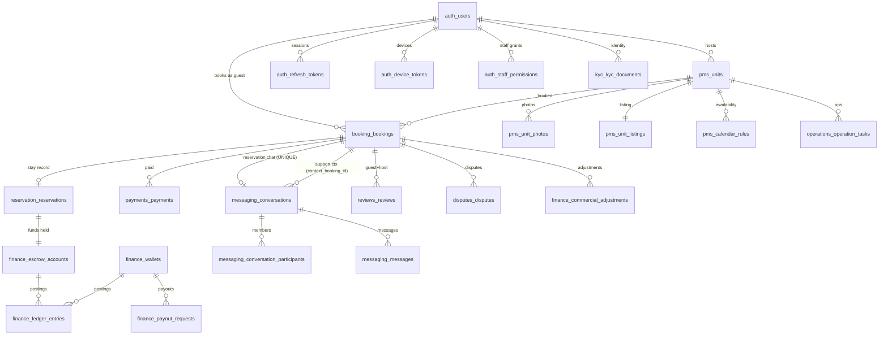

# Database Relationship Map

## Notes
- `conversations.booking_id` UNIQUE = the reservation thread;
  `context_booking_id` (non-unique FK) = support thread booking context.
- `escrow_accounts` is the funds-held liability record; `ledger_entries` is
  the immutable double-entry trail (authoritative for all KPIs).
- `payments` rows track Paymob intentions/proofs; `reservations` is the stay
  record distinct from the `bookings` request record.
