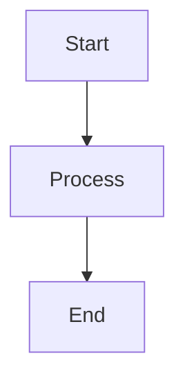

# Markdown Standards - StayOS

**Version**: 1.0.0  
**Last Updated**: 2026-07-12  
**Maintainer**: Documentation Team  
**Status**: Active

## 📋 Document Purpose

This document establishes standards for writing and formatting Markdown documents in the StayOS project. Consistent Markdown formatting ensures readability and maintainability across all documentation.

## 🎯 General Principles

### 1. Consistency

- Use consistent formatting across all documents
- Follow established patterns
- Use the same style for similar content
- Maintain uniform structure

### 2. Readability

- Write for human readers first
- Use clear, concise language
- Structure content logically
- Use formatting to enhance understanding

### 3. Maintainability

- Keep documents up-to-date
- Use relative links for internal references
- Avoid duplication
- Document document-specific conventions

## 📝 Document Structure

### Header Structure

```markdown
# Document Title

**Version**: 1.0.0  
**Last Updated**: 2026-07-12  
**Maintainer**: [Name/Team]  
**Status**: [Active | Draft | Deprecated]

## 📋 Document Purpose

Brief description of the document's purpose and audience.

## Table of Contents

- [Section 1](#section-1)
- [Section 2](#section-2)

## Section 1

Content...

## Section 2

Content...
```

### Section Headings

- Use H1 (`#`) for document title only
- Use H2 (`##`) for major sections
- Use H3 (`###`) for subsections
- Use H4 (`####`) for sub-subsections
- Don't skip heading levels
- Use sentence case for headings

## 🎨 Text Formatting

### Emphasis

```markdown
- **Bold**: Use for emphasis and key terms
- *Italic*: Use for technical terms and book titles
- `Code`: Use for inline code references
- ~~Strikethrough~~: Use for deleted content
```

### Lists

#### Unordered Lists

```markdown
- Item 1
- Item 2
  - Nested item 2.1
  - Nested item 2.2
- Item 3
```

#### Ordered Lists

```markdown
1. First item
2. Second item
   1. Nested item 2.1
   2. Nested item 2.2
3. Third item
```

#### Definition Lists

```markdown
**Term 1**: Definition 1
**Term 2**: Definition 2
```

## 💻 Code Blocks

### Inline Code

```markdown
Use `backticks` for inline code references like `function_name()`.
```

### Code Blocks

```markdown
```rust
fn main() {
    println!("Hello, StayOS!");
}
```

### Code Block Language

Always specify the language for syntax highlighting:

- `rust` for Rust code
- `cpp` for C++ code
- `bash` for shell scripts
- `markdown` for Markdown examples
- `json` for JSON data
- `yaml` for YAML configuration

### Code Block Annotations

```markdown
```rust
// Good: Clear, idiomatic Rust
pub fn example() {
    // Implementation
}

// Bad: Unclear, non-idiomatic
pub fn ex() {
    // Implementation
}
```

## 🔗 Links

### Internal Links

```markdown
- Use descriptive link text
- Use relative paths for internal docs
- Use kebab-case for anchor links

[Document Title](path/to/document.md)
[Section Title](#section-title)
```

### External Links

```markdown
- Use descriptive link text
- Include the full URL
- Test links regularly

[StayOS Website](https://stayos.dev)
[Rust Documentation](https://doc.rust-lang.org/)
```

### Reference Links

```markdown
[StayOS]: https://stayos.dev
[Rust]: https://doc.rust-lang.org/

Visit [StayOS] for more information.
```

## 🖼️ Images and Diagrams

### Image Syntax

```markdown

```

### Image Guidelines

- Use descriptive alt text
- Keep images under 1MB when possible
- Use SVG for diagrams
- Store images in `docs/images/`
- Use relative paths

### Diagrams

Use Mermaid for diagrams:

```markdown


### ASCII Art

For simple diagrams, ASCII art is acceptable:

```markdown
┌─────────────┐
│   Kernel    │
├─────────────┤
│ Userspace   │
└─────────────┘
```

## 📊 Tables

### Table Syntax

```markdown
| Header 1 | Header 2 | Header 3 |
|----------|----------|----------|
| Cell 1   | Cell 2   | Cell 3   |
| Cell 4   | Cell 5   | Cell 6   |
```

### Table Guidelines

- Include header row
- Align columns consistently
- Keep tables simple
- Avoid overly wide tables
- Use tables for tabular data only

### Table Alignment

```markdown
| Left | Center | Right |
|:-----|:------:|------:|
| L    | C      | R     |
```

## 📋 Checklists

### Checklist Syntax

```markdown
- [ ] Uncompleted item
- [x] Completed item
```

### Checklist Guidelines

- Use checklists for tasks and requirements
- Keep checklists focused
- Use descriptive item text
- Update checklists regularly

## 📝 Blockquotes

### Blockquote Syntax

```markdown
> This is a blockquote.
> It can span multiple lines.
```

### Blockquote Guidelines

- Use for quotes and callouts
- Use for important notes
- Use for warnings
- Keep blockquotes concise

### Blockquote Types

```markdown
> **Note**: This is a note.

> **Warning**: This is a warning.

> **Tip**: This is a helpful tip.

> **Important**: This is important information.
```

## 🔢 Horizontal Rules

```markdown
---
```

Use horizontal rules to:
- Separate major sections
- Before footnotes
- Between different content types

## 📌 Footnotes

```markdown
This is a statement with a footnote[^1].

[^1]: This is the footnote content.
```

Use footnotes for:
- Additional context
- References
- Citations

## 🎯 Best Practices

### Line Length

- Keep lines under 100 characters when possible
- Break long lines at logical points
- Hard wrap for code blocks
- Soft wrap for prose

### Spacing

- Use one space after periods
- Use blank lines between paragraphs
- Use blank lines between list items when needed
- No trailing whitespace

### Punctuation

- Use proper punctuation
- Use Oxford commas for clarity
- Use proper quotation marks
- Use proper apostrophes

### Capitalization

- Use sentence case for headings
- Use title case for document titles
- Use proper capitalization for proper nouns
- Be consistent with terminology

## 🚨 Common Mistakes

### Avoid These

1. **Inconsistent Heading Levels**: Don't skip levels
2. **Missing Alt Text**: Always provide alt text for images
3. **Broken Links**: Test all links
4. **Over-formatting**: Don't overuse bold/italic
5. **Long Lines**: Keep lines readable
6. **Missing Language Specifiers**: Always specify code block language
7. **Inconsistent List Formatting**: Use consistent list styles
8. **Unclear Link Text**: Use descriptive link text

## 🛠️ Tools

### Linters

- **markdownlint**: Markdown linting
- **remark**: Markdown processor with plugins
- **textlint**: Extensible linting tool

### Formatters

- **Prettier**: Code and Markdown formatter
- **markdown-it-cli**: Markdown formatter

### Validators

- **MDL**: Markdown linter
- **markdown-link-check**: Link checker

## 📚 Examples

### Good Example

```markdown
# Window Management

## Overview

The window manager handles window lifecycle and positioning.

## Creating a Window

Use the `Window::new()` function to create a new window:

```rust
let window = Window::new("My Window", 800, 600)?;
```

### Parameters

- `title`: The window title
- `width`: The window width in pixels
- `height`: The window height in pixels

## Window Lifecycle

Windows follow this lifecycle:

1. Creation
2. Configuration
3. Display
4. Interaction
5. Destruction

> **Note**: Windows are automatically destroyed when dropped.

## See Also

- [Window API](../api/window.md)
- [Event Handling](../events.md)
```

### Bad Example

```markdown
# Window Management

windows are important for the os

## Creating

use Window::new()

```rust
let w = Window::new();
```

its easy to make windows

1. create
2. show
3. hide
```

## 📞 Contact

For questions about Markdown standards, contact:

- **Documentation Team**: docs@stayos.dev
- **GitHub**: @islamelbaz2010

---

**Consistent Markdown formatting ensures readable and maintainable documentation. Follow these standards in all documentation.**
