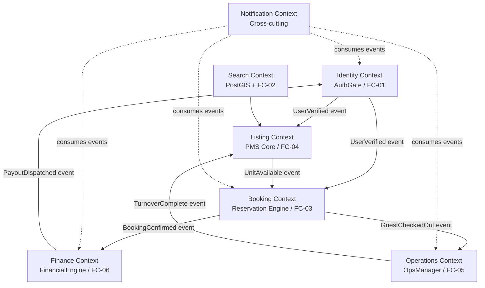

# 02 — Domain-Driven Design

**Cross-references**: [01_SYSTEM_OVERVIEW.md](01_SYSTEM_OVERVIEW.md) · [05_DATABASE_DESIGN.md](05_DATABASE_DESIGN.md) · [06_EVENT_CATALOG.md](06_EVENT_CATALOG.md) · [ARCHITECTURE.md](../../ARCHITECTURE.md) · [PRODUCT_CANON.md](../../PRODUCT_CANON.md)

---

## 1. Bounded Contexts



### Context Boundaries

| Bounded Context | Alias | Owns | Does Not Own |
|-----------------|-------|------|-------------|
| Identity | `auth` | User profiles, KYC status, sessions, OAuth tokens | Bookings, property data |
| Listing | `pms` | Unit definitions, calendar, pricing rules, photos | Who is booking, financials |
| Search | `search` | Geo-spatial index, filter execution | Unit data itself (reads from `pms`) |
| Booking | `reservation` | Reservation lifecycle, payment auth, calendar locking | Payout, cleaning schedule |
| Finance | `finance` | Escrow, ledger entries, payouts, tax | Booking details |
| Operations | `ops` | Turnover tickets, field staff tasks, verification photos | What is being booked |
| Notification | `notify` | Message dispatch (WhatsApp/email/SMS) | Business logic of any domain |

---

## 2. Aggregates

### 2.1 Identity Context — `User` Aggregate

**Root**: `User`

| Entity / Value Object | Type | Description |
|-----------------------|------|-------------|
| `User` | Aggregate Root | UUID, phone, email, role, status |
| `KYCRecord` | Entity | Document type, OCR result, status, reviewer_id |
| `OAuthLink` | Value Object | provider (google/apple), provider_uid, linked_at |
| `Session` | Entity | JWT jti, issued_at, expires_at, revoked |

**Invariants**:
- A `User` with `role=HOST` cannot have an active listing until `KYCRecord.status = VERIFIED`.
- A `User` with `role=GUEST` cannot complete checkout until phone is OTP-verified.
- `Session` is invalidated when `KYCRecord` is rejected — forces re-authentication.

---

### 2.2 Listing Context — `Unit` Aggregate

**Root**: `Unit`

| Entity / Value Object | Type | Description |
|-----------------------|------|-------------|
| `Unit` | Aggregate Root | UUID, host_id, status, coordinates, property_type |
| `UnitListing` | Entity | Title (ar/en), description, photos[], amenities[], cultural_tags[] |
| `CalendarRule` | Entity | date_range, status (AVAILABLE / BLOCKED / BOOKED), price_override |
| `PricingTier` | Value Object | base_price_egp, weekend_multiplier, peak_multiplier |
| `UnitAddress` | Value Object | governorate, city, district, google_place_id, lat, lng |

**Invariants**:
- A `Unit` cannot transition to `LISTED` status without at least 5 photos and a verified host.
- `CalendarRule` date ranges cannot overlap within a single `Unit`.
- `PricingTier.base_price_egp` must be ≥ 100 EGP (system minimum — prevents zero-price fraud).

---

### 2.3 Booking Context — `Reservation` Aggregate

**Root**: `Reservation`

| Entity / Value Object | Type | Description |
|-----------------------|------|-------------|
| `Reservation` | Aggregate Root | UUID, unit_id, guest_id, status, check_in, check_out |
| `PaymentIntent` | Entity | provider (paymob/stripe), provider_ref, amount_egp, status |
| `PromoCodeApplication` | Value Object | code, discount_pct, applied_at |
| `GuestCount` | Value Object | adults, children, infants |
| `CancellationRecord` | Entity | cancelled_at, reason, refund_amount, initiator |

**Invariants** (from PRODUCT_CANON.md §8):
- `BR-INV-01`: Calendar lock acquired atomically via `SELECT ... FOR UPDATE` before `PaymentIntent` is created.
- A `Reservation` cannot transition from `PENDING_PAYMENT` to `CONFIRMED` without `PaymentIntent.status = CAPTURED`.
- A `Reservation` cannot be cancelled with 0% refund if cancellation is within 24 hours of booking and > 7 days before check-in.

---

### 2.4 Finance Context — `EscrowAccount` Aggregate

**Root**: `EscrowAccount`

| Entity / Value Object | Type | Description |
|-----------------------|------|-------------|
| `EscrowAccount` | Aggregate Root | UUID, reservation_id, balance_egp, status |
| `LedgerEntry` | Entity | entry_type (CREDIT/DEBIT), amount, reference, created_at |
| `FeeDistribution` | Value Object | guest_fee_pct, host_commission_pct, platform_net |
| `PayoutInstruction` | Entity | host_id, amount_egp, bank_account_ref, dispatched_at |
| `TaxWithholding` | Value Object | vat_pct, withholding_pct, governorate_code |

**Invariants**:
- `BR-FIN-01`: Escrow released at exactly T+24h post-check-in via Celery Beat — never earlier.
- Ledger entries are immutable — corrections are applied as reversal + new entry.
- `EscrowAccount` balance cannot go negative.

---

### 2.5 Operations Context — `TurnoverTicket` Aggregate

**Root**: `TurnoverTicket`

| Entity / Value Object | Type | Description |
|-----------------------|------|-------------|
| `TurnoverTicket` | Aggregate Root | UUID, unit_id, reservation_id, status, priority |
| `TaskChecklist` | Entity | tasks[], completed_at, verified_by_photo |
| `VerificationPhoto` | Value Object | s3_key, captured_at, uploader_id, task_ref |
| `FieldStaffAssignment` | Entity | staff_id, assigned_at, accepted_at, completed_at |
| `SupplyRequest` | Entity | items[], requested_at, fulfilled |

**Invariants**:
- `BR-OPS-01`: A `TurnoverTicket` MUST be created within 5 minutes of `GuestCheckedOut` event.
- `BR-INV-02`: `Unit.status` transitions to `READY_FOR_OCCUPANCY` only when all `TaskChecklist` items are checked and at least one `VerificationPhoto` is attached.
- A ticket cannot be `CLOSED` by the assigning manager — only by the assigned field staff member or a senior ops override.

---

## 3. Entities (Cross-Context)

| Entity | Context | Identifier | Lifecycle |
|--------|---------|-----------|---------|
| `User` | Identity | UUID | Created at signup; deactivated on ban/legal hold |
| `Unit` | Listing | UUID | Created by host; archived, not deleted |
| `Reservation` | Booking | UUID | Terminal states: CONFIRMED, CANCELLED, COMPLETED |
| `EscrowAccount` | Finance | UUID | One-to-one with Reservation; closed after payout |
| `TurnoverTicket` | Operations | UUID | Terminal states: CLOSED, VOIDED |
| `LedgerEntry` | Finance | UUID | Immutable — append-only |

---

## 4. Value Objects

Value objects have no identity — they are compared by value and are immutable.

| Value Object | Fields | Context |
|-------------|--------|---------|
| `Money` | `amount: Decimal`, `currency: str` (EGP/USD/SAR) | Finance, Booking |
| `DateRange` | `check_in: date`, `check_out: date` | Booking, Listing |
| `UnitAddress` | `lat: float`, `lng: float`, `governorate: str`, `city: str`, `google_place_id: str` | Listing |
| `GuestCount` | `adults: int`, `children: int`, `infants: int` | Booking |
| `FeeDistribution` | `guest_fee_pct: Decimal`, `host_commission_pct: Decimal` | Finance |
| `CulturalTag` | `tag: Enum(FAMILY_ONLY, HALAL_CERTIFIED, MIXED, COUPLES_WELCOME)` | Listing |
| `OTPToken` | `code: str(6)`, `expires_at: datetime`, `phone: str` | Identity |
| `PaymentProvider` | `provider: Enum(PAYMOB, STRIPE)`, `provider_ref: str` | Booking |

---

## 5. Domain Repositories (Interfaces)

Each repository is an interface at the domain layer; the implementation is SQLAlchemy at the infrastructure layer.

```
IUserRepository
  find_by_id(user_id: UUID) → User
  find_by_phone(phone: str) → User | None
  save(user: User) → None
  find_pending_kyc() → list[User]

IUnitRepository
  find_by_id(unit_id: UUID) → Unit
  find_available(viewport: BoundingBox, check_in: date, check_out: date, filters: SearchFilters) → list[Unit]
  save(unit: Unit) → None
  lock_calendar(unit_id: UUID, date_range: DateRange) → CalendarRule  # FOR UPDATE

IReservationRepository
  find_by_id(reservation_id: UUID) → Reservation
  find_by_guest(guest_id: UUID) → list[Reservation]
  find_by_unit(unit_id: UUID, date_range: DateRange) → list[Reservation]
  save(reservation: Reservation) → None

IEscrowRepository
  find_by_reservation(reservation_id: UUID) → EscrowAccount
  find_pending_release(as_of: datetime) → list[EscrowAccount]
  save(account: EscrowAccount) → None
  append_entry(account_id: UUID, entry: LedgerEntry) → None

ITurnoverTicketRepository
  find_by_id(ticket_id: UUID) → TurnoverTicket
  find_open_by_unit(unit_id: UUID) → list[TurnoverTicket]
  find_by_staff(staff_id: UUID) → list[TurnoverTicket]
  save(ticket: TurnoverTicket) → None
```

---

## 6. Domain Services

Domain services contain business logic that does not naturally belong to a single aggregate.

| Service | Purpose | Collaborators |
|---------|---------|-------------|
| `ReservationPricer` | Calculates total booking price including base rate, weekend multiplier, peak multiplier, promo discount, guest service fee, and host commission | `Unit.PricingTier`, `PromoCodeApplication`, `FeeDistribution` |
| `CalendarLockService` | Atomically acquires calendar lock for a date range; raises `CalendarConflictError` on overlap | `IUnitRepository.lock_calendar` (uses `SELECT FOR UPDATE SKIP LOCKED`) |
| `EscrowReleaseService` | Determines escrow release eligibility (T+24h rule), computes fee split, creates payout instruction | `EscrowAccount`, `FeeDistribution`, `TaxWithholding` |
| `KYCVerificationService` | Orchestrates OCR (AWS Textract) → biometric match (Rekognition) → status update → event emit | `KYCRecord`, `IUserRepository` |
| `TurnoverDispatcher` | Selects the nearest available field staff for a unit's location, creates ticket and assignment | `TurnoverTicket`, `FieldStaffAssignment`, `IUnitRepository` |
| `TaxCalculator` | Applies governorate-specific VAT and withholding rates to a `Money` amount | `TaxWithholding`, governorate tax table |
