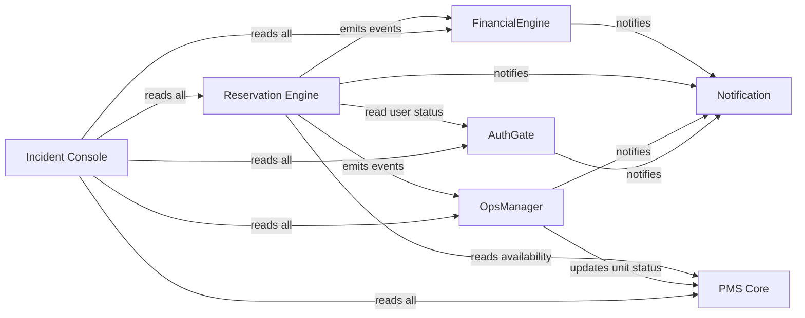

# 03 — Services (Modular Monolith → Microservices Roadmap)

**Cross-references**: [01_SYSTEM_OVERVIEW.md](01_SYSTEM_OVERVIEW.md) · [02_DOMAIN_DRIVEN_DESIGN.md](02_DOMAIN_DRIVEN_DESIGN.md) · [06_EVENT_CATALOG.md](06_EVENT_CATALOG.md) · [11_DEPLOYMENT_ARCHITECTURE.md](11_DEPLOYMENT_ARCHITECTURE.md) · [ARCHITECTURE.md](../../ARCHITECTURE.md)

---

## 1. Phase 1 Deployment Model

Phase 1 is a **modular monolith**: all service modules run as a single FastAPI application deployed as one ECS Fargate task. Service boundaries are enforced by Python package structure and import rules, not network. Physical separation (separate containers, separate databases) is a Phase 2 decision triggered by scale signals.

**Package structure**:
```
app/
  auth/          ← AuthGate module
  pms/           ← PMS Core + Search module
  reservation/   ← Reservation Engine module
  ops/           ← OpsManager module
  finance/       ← FinancialEngine module
  notify/        ← Notification module (Celery tasks only)
  shared/        ← Cross-cutting: DB session, event bus, base models
```

**Import rule**: Modules may only import from `shared/`. Direct cross-module imports are forbidden. Cross-module communication occurs via domain events (Outbox pattern — ADR-013) or repository interfaces.

---

## 2. Service Definitions

### 2.1 AuthGate — Identity & Access

| Attribute | Value |
|-----------|-------|
| **Feature** | FC-01 |
| **Package** | `app/auth/` |
| **Owner** | Backend Lead |
| **Phase** | Phase 1 |
| **Deployment** | Co-located (Phase 1), standalone ECS task (Phase 2) |

**Responsibilities**:
- User registration and profile management
- OTP delivery via Twilio SMS; 6-digit code, 5-minute TTL (Redis key)
- Social OAuth via Firebase Authentication (Google, Apple)
- JWT issuance and verification (RS256, 1-hour expiry, 30-day refresh)
- KYC orchestration: upload pre-signed S3 URL → Textract OCR → Rekognition biometric → status update → event emit
- Role assignment: GUEST, HOST, FIELD_STAFF, OPS_MANAGER, ADMIN
- Session revocation (logout, ban, KYC rejection)

**Produces events**: `user.registered`, `user.kyc_verified`, `user.kyc_rejected`, `user.banned`

**Consumes events**: `finance.payout_dispatched` (to update host dashboard notification)

**External dependencies**: Twilio Verify API, Firebase Admin SDK, AWS Textract, AWS Rekognition, AWS S3 (`stayos-kyc-{env}` bucket)

**Scaling trigger**: CPU > 70% sustained; OTP send volume > 10K/hour

---

### 2.2 PMS Core — Property Management System

| Attribute | Value |
|-----------|-------|
| **Feature** | FC-02 (Search), FC-04 (PMS) |
| **Package** | `app/pms/` |
| **Owner** | Backend Lead |
| **Phase** | Phase 1 |
| **Deployment** | Co-located (Phase 1) |

**Responsibilities**:
- Unit CRUD (create, update, archive — never delete)
- Calendar management: date range blocking, availability rules, minimum stay
- Pricing configuration: base price, weekend rate, peak multiplier, custom dates
- Photo management: generate S3 pre-signed upload URLs; trigger Lambda resize pipeline
- Spatial search: PostGIS `ST_DWithin` and viewport queries; pg_trgm Arabic/English text search
- Map data API: listing pins, price overlays, clustering hints
- Unit status state machine: `PENDING_VERIFICATION → LISTED → SUSPENDED → ARCHIVED`
- KPI calculations: ADR (Average Daily Rate), RevPAR, Occupancy Rate

**Produces events**: `unit.listed`, `unit.suspended`, `unit.calendar_blocked`, `unit.status_changed`

**Consumes events**: `ops.turnover_complete` (→ set unit status to `READY_FOR_OCCUPANCY`)

**External dependencies**: AWS S3 (`stayos-listings-{env}` bucket), AWS Lambda (image resize), Google Maps API (geocoding)

**Scaling trigger**: Search query p99 > 500ms; listing count > 50K

---

### 2.3 Reservation Engine — Booking Lifecycle

| Attribute | Value |
|-----------|-------|
| **Feature** | FC-03 |
| **Package** | `app/reservation/` |
| **Owner** | Backend Lead |
| **Phase** | Phase 1 |
| **Deployment** | Co-located (Phase 1); first candidate for extraction (Phase 2) — highest write concurrency |

**Responsibilities**:
- Booking initiation: validate availability, compute price, acquire calendar lock (`SELECT FOR UPDATE`)
- Payment intent creation: route to Paymob or Stripe based on payment method
- Webhook processing: Paymob/Stripe payment confirmation callbacks
- Calendar lock promotion: `PENDING_PAYMENT → CONFIRMED` on payment capture
- Cancellation processing: refund calculation, calendar release, escrow void
- Check-in / check-out recording: trigger downstream events
- Promo code validation and application

**Invariants**: BR-INV-01 (calendar lock before payment), BR-BOOK-01 (no double-booking)

**Produces events**: `booking.payment_confirmed`, `booking.cancelled`, `booking.checked_in`, `booking.checked_out`

**Consumes events**: `user.kyc_verified` (unblock checkout for pending reservations)

**External dependencies**: Paymob API, Stripe API

**Scaling trigger**: Booking throughput > 50 concurrent checkout sessions; calendar lock contention > 5%

---

### 2.4 OpsManager — Field Operations

| Attribute | Value |
|-----------|-------|
| **Feature** | FC-05 |
| **Package** | `app/ops/` |
| **Owner** | Ops Lead |
| **Phase** | Phase 1 |
| **Deployment** | Co-located (Phase 1) |

**Responsibilities**:
- Turnover ticket creation on `booking.checked_out` event (BR-OPS-01: within 5 minutes)
- Field staff assignment: proximity-based dispatch using unit coordinates
- Checklist management: predefined tasks per unit type
- Photo verification gate: blocks ticket closure until ≥ 1 photo attached per critical task
- Offline sync: reconcile SQLite-cached field staff state on reconnect
- Supply tracking: consumable usage per turnover
- Ticket escalation: auto-escalate if not accepted within 30 minutes

**Invariants**: BR-OPS-01 (ticket within 5 min), BR-INV-02 (unit status update after close)

**Produces events**: `ops.ticket_created`, `ops.ticket_assigned`, `ops.turnover_complete`

**Consumes events**: `booking.checked_out`

**External dependencies**: AWS S3 (`stayos-ops-photos-{env}` bucket), WhatsApp Business API (field staff notifications)

**Scaling trigger**: Concurrent open tickets > 500

---

### 2.5 FinancialEngine — Treasury & Ledger

| Attribute | Value |
|-----------|-------|
| **Feature** | FC-06 |
| **Package** | `app/finance/` |
| **Owner** | Backend Lead + Finance Advisor |
| **Phase** | Phase 1 |
| **Deployment** | Co-located (Phase 1); second extraction candidate — regulatory and audit isolation |

**Responsibilities**:
- Double-entry ledger: every transaction creates paired DEBIT + CREDIT entries
- Escrow creation on `booking.payment_confirmed`; T+24h release via Celery Beat
- Fee split: guest service fee (3–5% of GTV), host commission (8–12% of GTV), platform net
- VAT and withholding tax calculation per governorate
- Payout batch: aggregate unlocked host balances, dispatch via Paymob disbursement API
- Refund processing for cancellations
- Financial reporting: host payout history, platform revenue, tax liability

**Invariants**: BR-FIN-01 (T+24h escrow), ledger immutability, no negative escrow balance

**Produces events**: `finance.escrow_created`, `finance.escrow_released`, `finance.payout_dispatched`, `finance.refund_processed`

**Consumes events**: `booking.payment_confirmed`, `booking.cancelled`

**External dependencies**: Paymob disbursement API, Stripe Refunds API

**Scaling trigger**: Payout batch processing time > 10 minutes; ledger table > 10M rows (trigger partitioning)

---

### 2.6 Notification Service — Cross-Cutting

| Attribute | Value |
|-----------|-------|
| **Package** | `app/notify/` |
| **Owner** | Backend Lead |
| **Phase** | Phase 1 |
| **Deployment** | Celery workers (separate ECS task even in Phase 1 — async by design) |

**Responsibilities**:
- Route domain events to notification channels: WhatsApp → email → SMS (in priority order)
- Template rendering: Arabic and English message templates per event type
- Delivery receipt tracking
- Retry with exponential backoff on delivery failure
- WhatsApp template pre-approval management (Meta Business API)
- Unsubscribe / opt-out handling per channel

**Consumes events**: All domain events that require user notification (see [06_EVENT_CATALOG.md](06_EVENT_CATALOG.md))

**Produces**: No domain events (side-effect only service)

**External dependencies**: WhatsApp Business API (Meta), AWS SES, Twilio SMS

**Scaling trigger**: Message queue depth > 1,000; WhatsApp API rate limit approach

---

### 2.7 Incident Console — FC-07 (UI Only)

FC-07 is a Next.js admin dashboard, not a backend service. It reads from all service endpoints via the internal API. No new service boundary is created.

**Provides**:
- Booking override controls (admin-initiated cancel, refund, rebooking)
- User ban/suspension controls
- Global kill-switch for any listing, unit, or property manager account
- Real-time dispute queue with communication bridges (WhatsApp, email compose)
- Audit log viewer

---

## 3. Dependency Graph



---

## 4. Ownership Matrix

| Service | Primary Owner | Backup | Escalation |
|---------|-------------|--------|-----------|
| AuthGate | Backend Lead | Founder | Security incident |
| PMS Core | Backend Lead | Product Lead | Listing data corruption |
| Reservation Engine | Backend Lead | Founder | Double-booking incident |
| OpsManager | Ops Lead | Backend Lead | SLA breach |
| FinancialEngine | Backend Lead | Finance Advisor | Payout failure |
| Notification | Backend Lead | Ops Lead | WhatsApp outage |

Full ownership matrix: [docs/OWNERSHIP_MATRIX.md](../OWNERSHIP_MATRIX.md).

---

## 5. Scaling Strategy per Service

| Service | Phase 1 | Phase 2 (10K listings) | Phase 3 (100K listings) |
|---------|---------|----------------------|------------------------|
| AuthGate | Single ECS task | 2× tasks; Redis session cache | Standalone service; Firebase scales automatically |
| PMS Core + Search | Single task + PostGIS | Read replica for search; Algolia for full-text | Separate search service; PostGIS for geo only |
| Reservation Engine | Single task with row locks | Extract to own service; Redis distributed lock | Sharded by geography; CQRS for read/write split |
| OpsManager | Single task + Celery | Scale Celery workers by concurrency | Separate service; dedicated DB |
| FinancialEngine | Single task + Celery Beat | Extract to own service; pgPartman for ledger | Partitioned ledger + read replica for reporting |
| Notification | Celery workers (2–4) | Scale workers by queue depth | Multi-region workers; WhatsApp batch API |
