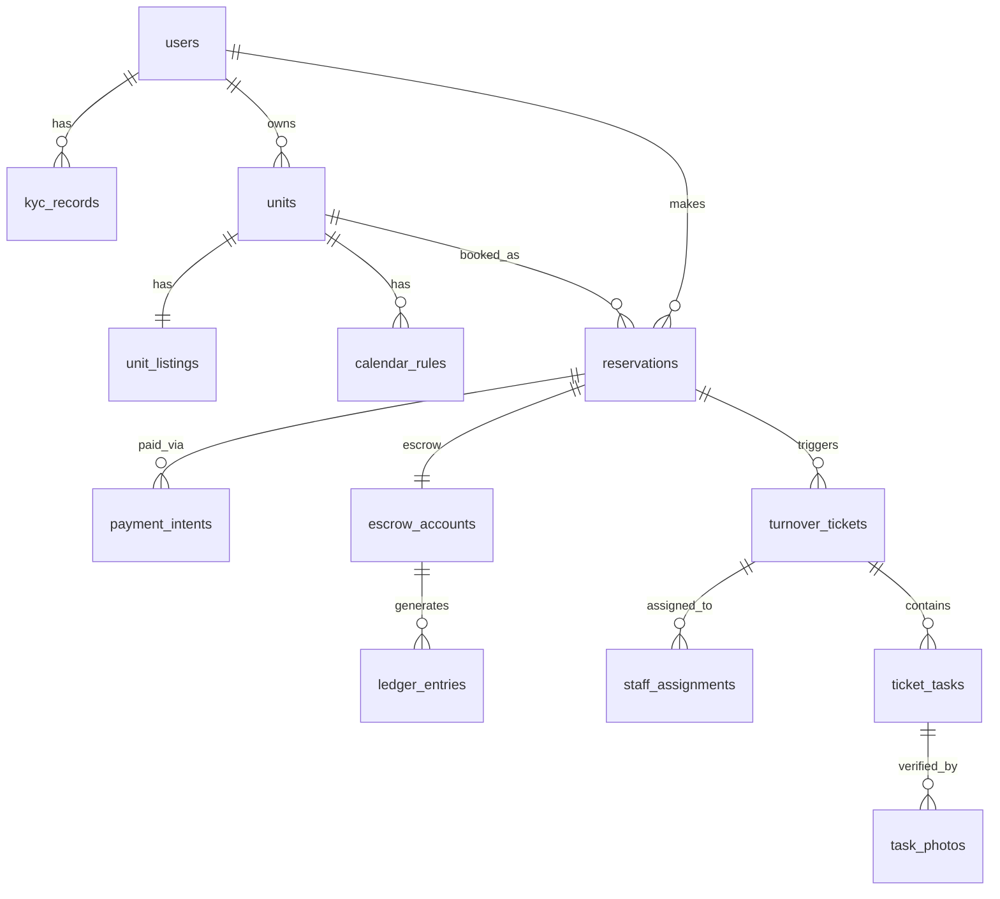

# 05 — Database Design

**Cross-references**: [02_DOMAIN_DRIVEN_DESIGN.md](02_DOMAIN_DRIVEN_DESIGN.md) · [ADR-005](../architecture/adr/ADR-005-database-strategy.md) · [ADR-010](../architecture/adr/ADR-010-search-architecture.md) · [11_DEPLOYMENT_ARCHITECTURE.md](11_DEPLOYMENT_ARCHITECTURE.md)

---

## 1. Database Stack

| Component | Technology | Purpose |
|-----------|-----------|---------|
| Primary DB | PostgreSQL 16 | All relational data |
| Spatial extension | PostGIS 3 | Geo-spatial queries (FC-02) |
| Text search extension | pg_trgm | Arabic/English trigram similarity |
| Cache / broker | Redis 7 | OTP TTL · Celery broker · SSE pub/sub |
| Object storage | AWS S3 | Binary files (photos, KYC docs) — not in PostgreSQL |

**No ORM magic for migrations**: Alembic for schema migrations; all migrations are plain SQL wrapped in Alembic scripts.

---

## 2. Schema Overview

```
auth schema:          users · sessions · kyc_records · oauth_links
pms schema:           units · unit_listings · calendar_rules · pricing_tiers · photos
reservation schema:   reservations · payment_intents · promo_codes · promo_applications
finance schema:       escrow_accounts · ledger_entries · payout_instructions · tax_configs
ops schema:           turnover_tickets · ticket_tasks · task_photos · staff_assignments · supply_requests
notify schema:        notification_log · message_templates
outbox schema:        outbox_events  (transactional outbox for all domain events)
```

---

## 3. Table Definitions

### 3.1 `auth.users`

```sql
CREATE TABLE auth.users (
    id              UUID PRIMARY KEY DEFAULT gen_random_uuid(),
    phone           VARCHAR(20) UNIQUE NOT NULL,     -- E.164 format
    email           VARCHAR(255) UNIQUE,
    display_name    VARCHAR(255),
    role            user_role NOT NULL DEFAULT 'GUEST',
    status          user_status NOT NULL DEFAULT 'ACTIVE',
    language_pref   CHAR(2) NOT NULL DEFAULT 'ar',   -- ar | en
    firebase_uid    VARCHAR(128) UNIQUE NOT NULL,
    created_at      TIMESTAMPTZ NOT NULL DEFAULT NOW(),
    updated_at      TIMESTAMPTZ NOT NULL DEFAULT NOW()
);

CREATE TYPE user_role AS ENUM ('GUEST', 'HOST', 'FIELD_STAFF', 'OPS_MANAGER', 'ADMIN');
CREATE TYPE user_status AS ENUM ('ACTIVE', 'SUSPENDED', 'BANNED', 'PENDING_KYC');

CREATE INDEX idx_users_phone ON auth.users (phone);
CREATE INDEX idx_users_role ON auth.users (role);
CREATE INDEX idx_users_status ON auth.users (status);
```

### 3.2 `auth.kyc_records`

```sql
CREATE TABLE auth.kyc_records (
    id              UUID PRIMARY KEY DEFAULT gen_random_uuid(),
    user_id         UUID NOT NULL REFERENCES auth.users(id) ON DELETE CASCADE,
    document_type   kyc_document_type NOT NULL,
    s3_key          VARCHAR(512) NOT NULL,           -- encrypted bucket
    ocr_result      JSONB,                           -- Textract output
    biometric_score DECIMAL(5,4),                    -- Rekognition confidence
    status          kyc_status NOT NULL DEFAULT 'PENDING',
    reviewer_id     UUID REFERENCES auth.users(id),  -- admin who reviewed
    reviewed_at     TIMESTAMPTZ,
    rejection_reason TEXT,
    created_at      TIMESTAMPTZ NOT NULL DEFAULT NOW()
);

CREATE TYPE kyc_document_type AS ENUM ('NATIONAL_ID', 'PASSPORT', 'DRIVERS_LICENSE');
CREATE TYPE kyc_status AS ENUM ('PENDING', 'VERIFIED', 'REJECTED', 'EXPIRED');

CREATE INDEX idx_kyc_user_id ON auth.kyc_records (user_id);
CREATE INDEX idx_kyc_status ON auth.kyc_records (status);
```

### 3.3 `pms.units`

```sql
CREATE TABLE pms.units (
    id              UUID PRIMARY KEY DEFAULT gen_random_uuid(),
    host_id         UUID NOT NULL REFERENCES auth.users(id),
    property_type   property_type NOT NULL,
    status          unit_status NOT NULL DEFAULT 'PENDING_VERIFICATION',
    coordinates     GEOMETRY(POINT, 4326) NOT NULL,
    governorate     VARCHAR(100) NOT NULL,
    city            VARCHAR(100) NOT NULL,
    district        VARCHAR(100),
    google_place_id VARCHAR(255),
    max_guests      SMALLINT NOT NULL CHECK (max_guests BETWEEN 1 AND 50),
    bedrooms        SMALLINT NOT NULL CHECK (bedrooms >= 0),
    bathrooms       SMALLINT NOT NULL CHECK (bathrooms >= 1),
    created_at      TIMESTAMPTZ NOT NULL DEFAULT NOW(),
    updated_at      TIMESTAMPTZ NOT NULL DEFAULT NOW()
);

CREATE TYPE property_type AS ENUM ('APARTMENT', 'VILLA', 'CHALET', 'HOTEL_ROOM', 'RESORT_UNIT', 'STUDIO');
CREATE TYPE unit_status AS ENUM ('PENDING_VERIFICATION', 'LISTED', 'SUSPENDED', 'ARCHIVED');

CREATE INDEX idx_units_host_id ON pms.units (host_id);
CREATE INDEX idx_units_status ON pms.units (status);
CREATE INDEX idx_units_coordinates ON pms.units USING GIST (coordinates);  -- spatial index
```

### 3.4 `pms.unit_listings`

```sql
CREATE TABLE pms.unit_listings (
    id              UUID PRIMARY KEY DEFAULT gen_random_uuid(),
    unit_id         UUID NOT NULL UNIQUE REFERENCES pms.units(id) ON DELETE CASCADE,
    title_ar        VARCHAR(255) NOT NULL,
    title_en        VARCHAR(255),
    description_ar  TEXT NOT NULL,
    description_en  TEXT,
    amenities       TEXT[] NOT NULL DEFAULT '{}',
    cultural_tags   TEXT[] NOT NULL DEFAULT '{}',   -- FAMILY_ONLY, HALAL_CERTIFIED, etc.
    base_price_egp  INTEGER NOT NULL CHECK (base_price_egp >= 100),
    weekend_mult    DECIMAL(4,2) NOT NULL DEFAULT 1.0,
    peak_mult       DECIMAL(4,2) NOT NULL DEFAULT 1.0,
    min_nights      SMALLINT NOT NULL DEFAULT 1,
    max_nights      SMALLINT NOT NULL DEFAULT 30,
    search_vector   TSVECTOR,                        -- pg_trgm + tsvector for FTS
    updated_at      TIMESTAMPTZ NOT NULL DEFAULT NOW()
);

CREATE INDEX idx_unit_listings_unit_id ON pms.unit_listings (unit_id);
CREATE INDEX idx_unit_listings_base_price ON pms.unit_listings (base_price_egp);
CREATE INDEX idx_unit_listings_search ON pms.unit_listings USING GIN (search_vector);
CREATE INDEX idx_unit_listings_amenities ON pms.unit_listings USING GIN (amenities);
CREATE INDEX idx_unit_listings_cultural_tags ON pms.unit_listings USING GIN (cultural_tags);

-- Trigger to keep search_vector in sync
CREATE TRIGGER trig_unit_listings_search_vector
    BEFORE INSERT OR UPDATE ON pms.unit_listings
    FOR EACH ROW EXECUTE FUNCTION update_unit_search_vector();
```

### 3.5 `pms.calendar_rules`

```sql
CREATE TABLE pms.calendar_rules (
    id              UUID PRIMARY KEY DEFAULT gen_random_uuid(),
    unit_id         UUID NOT NULL REFERENCES pms.units(id) ON DELETE CASCADE,
    date_from       DATE NOT NULL,
    date_to         DATE NOT NULL,
    status          calendar_status NOT NULL,
    price_override  INTEGER,                         -- NULL = use listing base price
    reservation_id  UUID REFERENCES reservation.reservations(id), -- set when BOOKED
    created_at      TIMESTAMPTZ NOT NULL DEFAULT NOW(),

    CONSTRAINT chk_date_range CHECK (date_to > date_from),
    EXCLUDE USING GIST (unit_id WITH =, daterange(date_from, date_to, '[)') WITH &&)
    WHERE (status != 'AVAILABLE')                   -- no overlapping blocked/booked ranges
);

CREATE TYPE calendar_status AS ENUM ('AVAILABLE', 'BLOCKED', 'BOOKED', 'HOLD');

CREATE INDEX idx_calendar_unit_id ON pms.calendar_rules (unit_id, date_from, date_to);
```

**Exclusion constraint** (`EXCLUDE USING GIST`) prevents overlapping BLOCKED or BOOKED calendar entries at the database level — the ultimate safeguard against double-booking.

### 3.6 `reservation.reservations`

```sql
CREATE TABLE reservation.reservations (
    id              UUID PRIMARY KEY DEFAULT gen_random_uuid(),
    unit_id         UUID NOT NULL REFERENCES pms.units(id),
    guest_id        UUID NOT NULL REFERENCES auth.users(id),
    status          reservation_status NOT NULL DEFAULT 'PENDING_PAYMENT',
    check_in        DATE NOT NULL,
    check_out       DATE NOT NULL,
    adults          SMALLINT NOT NULL DEFAULT 1,
    children        SMALLINT NOT NULL DEFAULT 0,
    infants         SMALLINT NOT NULL DEFAULT 0,
    total_amount_egp INTEGER NOT NULL,              -- guest-facing total (incl. service fee)
    host_amount_egp  INTEGER NOT NULL,              -- amount host receives (after commission)
    platform_fee_egp INTEGER NOT NULL,              -- platform take
    guest_fee_egp    INTEGER NOT NULL,              -- guest service fee component
    payment_method  VARCHAR(50),                    -- FAWRY, MEEZA, VODAFONE_CASH, CARD
    checked_in_at   TIMESTAMPTZ,
    checked_out_at  TIMESTAMPTZ,
    cancelled_at    TIMESTAMPTZ,
    cancel_reason   TEXT,
    refund_amount_egp INTEGER,
    created_at      TIMESTAMPTZ NOT NULL DEFAULT NOW(),
    updated_at      TIMESTAMPTZ NOT NULL DEFAULT NOW(),

    CONSTRAINT chk_checkout_after_checkin CHECK (check_out > check_in)
);

CREATE TYPE reservation_status AS ENUM (
    'PENDING_PAYMENT', 'CONFIRMED', 'CHECKED_IN',
    'CHECKED_OUT', 'CANCELLED', 'DISPUTED', 'COMPLETED'
);

CREATE INDEX idx_reservations_unit_id ON reservation.reservations (unit_id);
CREATE INDEX idx_reservations_guest_id ON reservation.reservations (guest_id);
CREATE INDEX idx_reservations_status ON reservation.reservations (status);
CREATE INDEX idx_reservations_checkin ON reservation.reservations (check_in);
```

### 3.7 `reservation.payment_intents`

```sql
CREATE TABLE reservation.payment_intents (
    id              UUID PRIMARY KEY DEFAULT gen_random_uuid(),
    reservation_id  UUID NOT NULL REFERENCES reservation.reservations(id) ON DELETE CASCADE,
    provider        payment_provider NOT NULL,
    provider_ref    VARCHAR(255) NOT NULL,           -- Paymob order_id or Stripe payment_intent_id
    amount_egp      INTEGER NOT NULL,
    status          payment_status NOT NULL DEFAULT 'PENDING',
    metadata        JSONB,                           -- provider-specific data
    created_at      TIMESTAMPTZ NOT NULL DEFAULT NOW(),
    captured_at     TIMESTAMPTZ
);

CREATE TYPE payment_provider AS ENUM ('PAYMOB', 'STRIPE');
CREATE TYPE payment_status AS ENUM ('PENDING', 'AUTHORIZED', 'CAPTURED', 'FAILED', 'REFUNDED', 'CANCELLED');

CREATE UNIQUE INDEX idx_payment_intents_provider_ref ON reservation.payment_intents (provider, provider_ref);
```

### 3.8 `finance.escrow_accounts`

```sql
CREATE TABLE finance.escrow_accounts (
    id              UUID PRIMARY KEY DEFAULT gen_random_uuid(),
    reservation_id  UUID NOT NULL UNIQUE REFERENCES reservation.reservations(id),
    status          escrow_status NOT NULL DEFAULT 'HELD',
    amount_egp      INTEGER NOT NULL,
    held_at         TIMESTAMPTZ NOT NULL DEFAULT NOW(),
    release_eligible_at TIMESTAMPTZ NOT NULL,       -- held_at + INTERVAL '24 hours'
    released_at     TIMESTAMPTZ,
    voided_at       TIMESTAMPTZ,

    CONSTRAINT chk_positive_amount CHECK (amount_egp > 0)
);

CREATE TYPE escrow_status AS ENUM ('HELD', 'RELEASED', 'VOIDED', 'DISPUTED');

CREATE INDEX idx_escrow_status ON finance.escrow_accounts (status);
CREATE INDEX idx_escrow_release_eligible ON finance.escrow_accounts (release_eligible_at)
    WHERE status = 'HELD';
```

### 3.9 `finance.ledger_entries`

```sql
CREATE TABLE finance.ledger_entries (
    id              UUID PRIMARY KEY DEFAULT gen_random_uuid(),
    account_id      UUID NOT NULL,                  -- user_id for host; 'PLATFORM' sentinel
    account_type    ledger_account_type NOT NULL,
    entry_type      CHAR(6) NOT NULL CHECK (entry_type IN ('CREDIT', 'DEBIT')),
    amount_egp      INTEGER NOT NULL CHECK (amount_egp > 0),
    reference_type  VARCHAR(50) NOT NULL,            -- 'RESERVATION', 'PAYOUT', 'REFUND', etc.
    reference_id    UUID NOT NULL,
    description     TEXT,
    created_at      TIMESTAMPTZ NOT NULL DEFAULT NOW()
    -- NO updates or deletes — append-only
);

CREATE TYPE ledger_account_type AS ENUM ('HOST', 'GUEST', 'PLATFORM', 'ESCROW');

CREATE INDEX idx_ledger_account_id ON finance.ledger_entries (account_id, created_at DESC);
CREATE INDEX idx_ledger_reference ON finance.ledger_entries (reference_type, reference_id);
```

### 3.10 `ops.turnover_tickets`

```sql
CREATE TABLE ops.turnover_tickets (
    id              UUID PRIMARY KEY DEFAULT gen_random_uuid(),
    unit_id         UUID NOT NULL REFERENCES pms.units(id),
    reservation_id  UUID REFERENCES reservation.reservations(id),
    status          ticket_status NOT NULL DEFAULT 'OPEN',
    priority        ticket_priority NOT NULL DEFAULT 'NORMAL',
    due_by          TIMESTAMPTZ NOT NULL,            -- check-in time of next reservation
    created_at      TIMESTAMPTZ NOT NULL DEFAULT NOW(),
    closed_at       TIMESTAMPTZ,
    voided_at       TIMESTAMPTZ
);

CREATE TYPE ticket_status AS ENUM ('OPEN', 'ASSIGNED', 'IN_PROGRESS', 'PENDING_REVIEW', 'CLOSED', 'VOIDED');
CREATE TYPE ticket_priority AS ENUM ('NORMAL', 'URGENT', 'EMERGENCY');

CREATE INDEX idx_tickets_unit_id ON ops.turnover_tickets (unit_id);
CREATE INDEX idx_tickets_status ON ops.turnover_tickets (status);
CREATE INDEX idx_tickets_due_by ON ops.turnover_tickets (due_by) WHERE status NOT IN ('CLOSED', 'VOIDED');
```

### 3.11 `outbox.outbox_events`

```sql
CREATE TABLE outbox.outbox_events (
    id              UUID PRIMARY KEY DEFAULT gen_random_uuid(),
    aggregate_type  VARCHAR(100) NOT NULL,           -- 'Reservation', 'User', etc.
    aggregate_id    UUID NOT NULL,
    event_type      VARCHAR(255) NOT NULL,           -- 'booking.payment_confirmed'
    payload         JSONB NOT NULL,
    created_at      TIMESTAMPTZ NOT NULL DEFAULT NOW(),
    processed_at    TIMESTAMPTZ,
    failed_at       TIMESTAMPTZ,
    retry_count     SMALLINT NOT NULL DEFAULT 0
);

CREATE INDEX idx_outbox_unprocessed ON outbox.outbox_events (created_at)
    WHERE processed_at IS NULL AND failed_at IS NULL;
```

---

## 4. Key Relationships (ERD Summary)



---

## 5. Indexes Strategy

| Index Type | Tables | Reason |
|-----------|--------|--------|
| GIST spatial | `units.coordinates` | PostGIS proximity and viewport queries |
| GIN full-text | `unit_listings.search_vector` | Arabic/English text search |
| GIN array | `unit_listings.amenities`, `cultural_tags` | Array containment queries |
| GIST range exclusion | `calendar_rules` (daterange) | Double-booking prevention at DB level |
| Partial index | `outbox_events` (unprocessed) | Fast outbox polling without full scan |
| Partial index | `escrow_accounts` (HELD, by release date) | Celery Beat escrow release query |
| Composite | `reservations (unit_id, status, check_in)` | Host dashboard queries |

---

## 6. Constraints

| Constraint | Table | Type | Enforces |
|-----------|-------|------|---------|
| No overlapping blocked dates | `calendar_rules` | GIST EXCLUDE | Double-booking prevention |
| Minimum price | `unit_listings.base_price_egp` | CHECK ≥ 100 | No zero-price fraud |
| Positive escrow | `escrow_accounts.amount_egp` | CHECK > 0 | Financial integrity |
| Ledger append-only | `ledger_entries` | No UPDATE/DELETE via RLS | Audit immutability |
| Guest count | `units.max_guests` | CHECK 1–50 | Data validity |
| Date range | `reservations` | CHECK check_out > check_in | Prevents reversed dates |

---

## 7. Partitioning (Phase 2+ Triggers)

| Table | Partition Strategy | Trigger |
|-------|-------------------|---------|
| `ledger_entries` | Range by `created_at` (monthly) | > 1M rows or query > 200ms |
| `outbox_events` | Range by `created_at` (weekly) | > 500K rows |
| `reservations` | Range by `check_in` (yearly) | > 5M rows |
| `calendar_rules` | Range by `date_from` (yearly) | > 10M rows |

Partitioning implementation: `pg_partman` extension for automated range partition creation.
