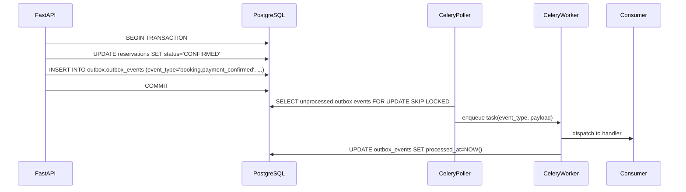

# 06 — Event Catalog

**Cross-references**: [02_DOMAIN_DRIVEN_DESIGN.md](02_DOMAIN_DRIVEN_DESIGN.md) · [03_MICROSERVICES.md](03_MICROSERVICES.md) · [ADR-013](../architecture/adr/ADR-013-event-driven-architecture.md) · [07_SEQUENCE_DIAGRAMS.md](07_SEQUENCE_DIAGRAMS.md)

---

## 1. Event Architecture

StayOS uses the **Transactional Outbox pattern** (ADR-013). Events are not published directly to a queue — they are written to `outbox.outbox_events` in the same database transaction as the state change. A Celery Beat poller reads unprocessed outbox rows and dispatches them to the Celery task queue (Redis broker).

This guarantees: if the state change commits, the event will eventually be delivered. If the transaction rolls back, no event is emitted.



---

## 2. Event Envelope Schema

All events share a common envelope:

```json
{
  "event_id": "01J3KF2XQR8VMSD4WX7Y9Z1HBN",
  "event_type": "booking.payment_confirmed",
  "aggregate_type": "Reservation",
  "aggregate_id": "a1b2c3d4-...",
  "schema_version": 1,
  "occurred_at": "2026-07-13T14:23:01.000Z",
  "payload": { ... }
}
```

- `event_id`: UUID v7 (time-ordered). Used for idempotency.
- `schema_version`: increment only on breaking payload changes. Consumers must handle both versions during migration windows.
- `occurred_at`: time of state change, not dispatch time.

---

## 3. Event Definitions

### 3.1 Identity Domain

#### `user.registered`

| Attribute | Value |
|-----------|-------|
| **Producer** | AuthGate |
| **Consumers** | Notification (welcome message) |
| **Trigger** | User completes OTP verification and creates account |

```json
{
  "user_id": "uuid",
  "phone": "+201234567890",
  "role": "GUEST",
  "language_pref": "ar"
}
```

---

#### `user.kyc_verified`

| Attribute | Value |
|-----------|-------|
| **Producer** | AuthGate (KYC service) |
| **Consumers** | Reservation Engine (unblock pending checkouts), Notification (success message) |
| **Trigger** | KYC record status transitions to `VERIFIED` |

```json
{
  "user_id": "uuid",
  "kyc_record_id": "uuid",
  "role": "HOST",
  "verified_at": "2026-07-13T14:00:00Z"
}
```

**Idempotency**: Consumer checks if unblock already applied via `idempotency_key = f"kyc_unblock:{user_id}"` in Redis (TTL 24h).

---

#### `user.kyc_rejected`

| Attribute | Value |
|-----------|-------|
| **Producer** | AuthGate |
| **Consumers** | Notification (rejection with resubmission instructions) |
| **Trigger** | KYC record status transitions to `REJECTED` |

```json
{
  "user_id": "uuid",
  "rejection_reason": "DOCUMENT_EXPIRED",
  "can_resubmit": true
}
```

---

#### `user.banned`

| Attribute | Value |
|-----------|-------|
| **Producer** | AuthGate (admin action) |
| **Consumers** | Reservation Engine (cancel active reservations), Notification |
| **Trigger** | Admin sets user status to `BANNED` |

```json
{
  "user_id": "uuid",
  "ban_reason": "FRAUD",
  "affected_reservation_ids": ["uuid", "uuid"]
}
```

---

### 3.2 Booking Domain

#### `booking.initiated`

| Attribute | Value |
|-----------|-------|
| **Producer** | Reservation Engine |
| **Consumers** | PMS Core (hold calendar), FinancialEngine (pre-create escrow record) |
| **Trigger** | Guest initiates checkout; calendar lock acquired |

```json
{
  "reservation_id": "uuid",
  "unit_id": "uuid",
  "guest_id": "uuid",
  "check_in": "2026-08-01",
  "check_out": "2026-08-07",
  "total_amount_egp": 4200,
  "payment_method": "FAWRY"
}
```

---

#### `booking.payment_confirmed`

| Attribute | Value |
|-----------|-------|
| **Producer** | Reservation Engine (on payment webhook) |
| **Consumers** | FinancialEngine (start escrow), PMS Core (mark calendar BOOKED), Notification (confirmation to guest + host) |
| **Trigger** | Paymob or Stripe payment webhook delivers `CAPTURED` status |
| **Priority** | HIGH — escrow timer must start immediately |

```json
{
  "reservation_id": "uuid",
  "unit_id": "uuid",
  "guest_id": "uuid",
  "host_id": "uuid",
  "payment_intent_id": "uuid",
  "provider": "PAYMOB",
  "amount_egp": 4200,
  "check_in": "2026-08-01",
  "check_out": "2026-08-07"
}
```

**Retry strategy**: Exponential backoff, max 5 retries over 30 minutes. After 5 failures, dead letter queue + PagerDuty alert.

**Idempotency key**: `f"payment_confirmed:{payment_intent_id}"` — exactly-once processing regardless of duplicate webhook delivery.

---

#### `booking.cancelled`

| Attribute | Value |
|-----------|-------|
| **Producer** | Reservation Engine |
| **Consumers** | FinancialEngine (void escrow or process refund), PMS Core (release calendar), Notification |
| **Trigger** | Guest, host, or admin initiates cancellation |

```json
{
  "reservation_id": "uuid",
  "unit_id": "uuid",
  "guest_id": "uuid",
  "host_id": "uuid",
  "cancelled_by": "GUEST",
  "cancellation_reason": "CHANGE_OF_PLANS",
  "refund_amount_egp": 3500,
  "refund_policy_applied": "STANDARD_48H"
}
```

---

#### `booking.checked_in`

| Attribute | Value |
|-----------|-------|
| **Producer** | Reservation Engine |
| **Consumers** | FinancialEngine (start T+24h escrow release timer), Notification (welcome message to guest) |
| **Trigger** | Host or field staff records check-in |

```json
{
  "reservation_id": "uuid",
  "unit_id": "uuid",
  "guest_id": "uuid",
  "host_id": "uuid",
  "checked_in_at": "2026-08-01T15:00:00Z"
}
```

---

#### `booking.checked_out`

| Attribute | Value |
|-----------|-------|
| **Producer** | Reservation Engine |
| **Consumers** | OpsManager (create turnover ticket — BR-OPS-01), Notification |
| **Trigger** | Host or field staff records check-out |
| **Priority** | HIGH — OpsManager must create ticket within 5 minutes |

```json
{
  "reservation_id": "uuid",
  "unit_id": "uuid",
  "guest_id": "uuid",
  "host_id": "uuid",
  "checked_out_at": "2026-08-07T11:00:00Z",
  "next_check_in": "2026-08-08T15:00:00Z"   // null if no next booking
}
```

**Retry strategy**: Exponential backoff, max 10 retries. OpsManager is the most critical consumer — failure must be surfaced immediately.

---

### 3.3 Finance Domain

#### `finance.escrow_created`

| Attribute | Value |
|-----------|-------|
| **Producer** | FinancialEngine |
| **Consumers** | Notification (escrow confirmation to host) |
| **Trigger** | `booking.payment_confirmed` processed |

```json
{
  "escrow_account_id": "uuid",
  "reservation_id": "uuid",
  "host_id": "uuid",
  "amount_egp": 3780,
  "release_eligible_at": "2026-08-02T15:00:00Z"
}
```

---

#### `finance.escrow_released`

| Attribute | Value |
|-----------|-------|
| **Producer** | FinancialEngine (Celery Beat scheduled job) |
| **Consumers** | Notification (payout queued notification to host) |
| **Trigger** | T+24h after check-in AND no active dispute |

```json
{
  "escrow_account_id": "uuid",
  "reservation_id": "uuid",
  "host_id": "uuid",
  "released_amount_egp": 3780,
  "released_at": "2026-08-02T15:00:00Z"
}
```

---

#### `finance.payout_dispatched`

| Attribute | Value |
|-----------|-------|
| **Producer** | FinancialEngine |
| **Consumers** | AuthGate (update host balance display), Notification (payout receipt to host) |
| **Trigger** | Paymob disbursement API call succeeds |

```json
{
  "payout_instruction_id": "uuid",
  "host_id": "uuid",
  "amount_egp": 3780,
  "bank_account_last4": "7823",
  "dispatched_at": "2026-08-03T09:00:00Z"
}
```

---

#### `finance.refund_processed`

| Attribute | Value |
|-----------|-------|
| **Producer** | FinancialEngine |
| **Consumers** | Notification (refund confirmation to guest) |
| **Trigger** | Refund successfully processed via Paymob or Stripe |

```json
{
  "reservation_id": "uuid",
  "guest_id": "uuid",
  "refund_amount_egp": 3500,
  "refund_method": "ORIGINAL_PAYMENT_METHOD",
  "expected_days": 5
}
```

---

### 3.4 Operations Domain

#### `ops.ticket_created`

| Attribute | Value |
|-----------|-------|
| **Producer** | OpsManager |
| **Consumers** | Notification (alert to ops manager) |
| **Trigger** | `booking.checked_out` processed |

```json
{
  "ticket_id": "uuid",
  "unit_id": "uuid",
  "reservation_id": "uuid",
  "priority": "NORMAL",
  "due_by": "2026-08-08T14:00:00Z"
}
```

---

#### `ops.ticket_assigned`

| Attribute | Value |
|-----------|-------|
| **Producer** | OpsManager |
| **Consumers** | Notification (WhatsApp to field staff) |
| **Trigger** | Field staff assigned to ticket |

```json
{
  "ticket_id": "uuid",
  "unit_id": "uuid",
  "staff_id": "uuid",
  "assigned_at": "2026-08-07T11:15:00Z",
  "due_by": "2026-08-08T14:00:00Z"
}
```

---

#### `ops.turnover_complete`

| Attribute | Value |
|-----------|-------|
| **Producer** | OpsManager |
| **Consumers** | PMS Core (set unit status to `READY_FOR_OCCUPANCY` — BR-INV-02) |
| **Trigger** | Field staff closes ticket with all tasks verified |

```json
{
  "ticket_id": "uuid",
  "unit_id": "uuid",
  "completed_at": "2026-08-08T10:30:00Z",
  "verified_by_staff_id": "uuid"
}
```

---

### 3.5 Listing Domain

#### `unit.calendar_blocked`

| Attribute | Value |
|-----------|-------|
| **Producer** | PMS Core |
| **Consumers** | SSE stream (push real-time update to active search sessions) |
| **Trigger** | Host blocks calendar manually or calendar rule applied |

```json
{
  "unit_id": "uuid",
  "date_from": "2026-08-10",
  "date_to": "2026-08-15",
  "reason": "MANUAL_BLOCK"
}
```

---

## 4. Retry Strategy Summary

| Event Type | Max Retries | Backoff | Dead Letter |
|-----------|------------|---------|------------|
| `booking.payment_confirmed` | 5 | Exponential (1s, 2s, 4s, 8s, 16s) | DLQ + PagerDuty |
| `booking.checked_out` | 10 | Exponential (5s, 10s, 20s…) | DLQ + PagerDuty |
| `ops.ticket_created` | 10 | Exponential (5s, 10s, 20s…) | DLQ + PagerDuty |
| `finance.escrow_released` | 5 | Exponential (30s, 60s…) | DLQ + alert |
| `finance.payout_dispatched` | 3 | Fixed 60s | DLQ + finance alert |
| All notification events | 3 | Exponential (10s, 30s, 90s) | DLQ (no alert — non-critical) |
| All other events | 3 | Exponential (5s, 15s, 45s) | DLQ |

---

## 5. Idempotency Implementation

All Celery task handlers check for duplicate processing before executing:

```python
def handle_payment_confirmed(event: dict) -> None:
    idempotency_key = f"event:{event['event_id']}"
    if redis_client.set(idempotency_key, "1", nx=True, ex=86400):
        # First time processing — run the handler
        _do_handle_payment_confirmed(event)
    # else: already processed — silently skip
```

TTL of 24 hours covers the window for most retry scenarios. For finance events, TTL is 7 days.
