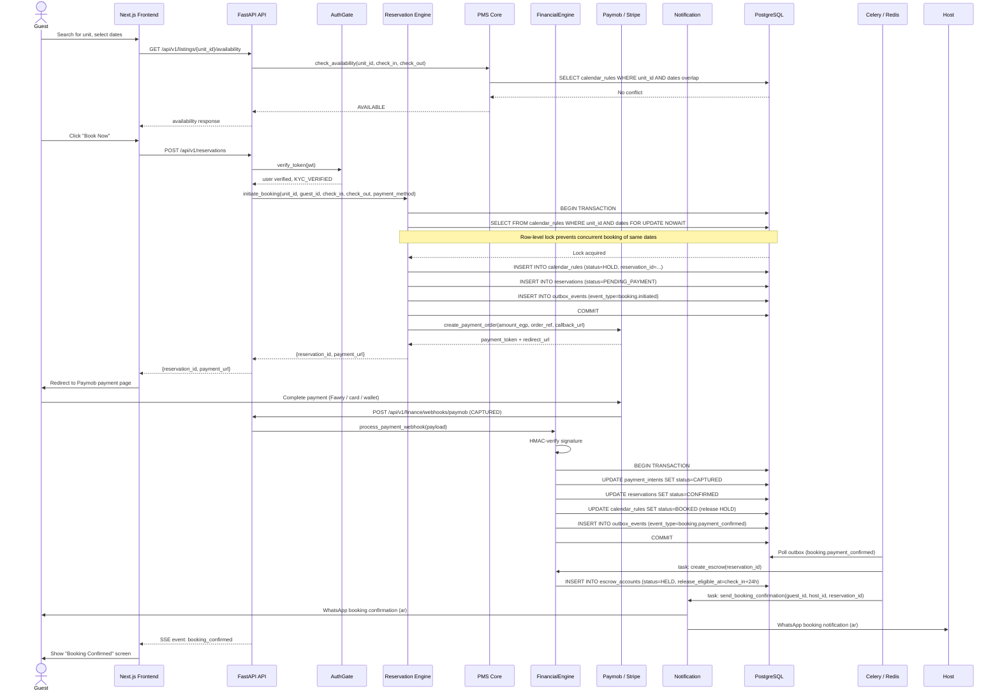
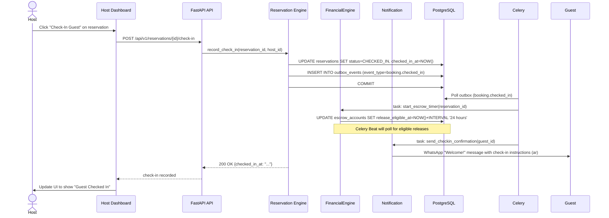
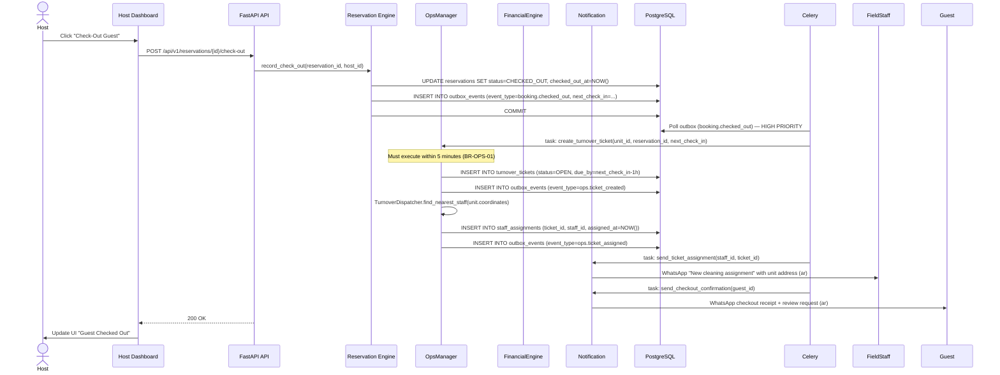
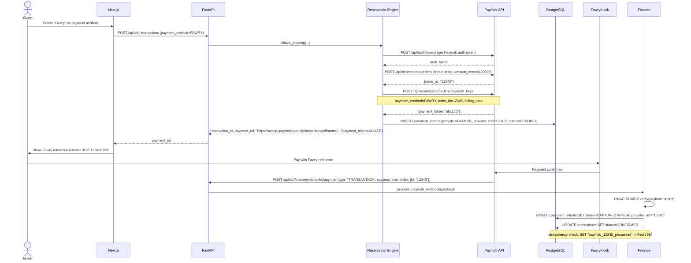
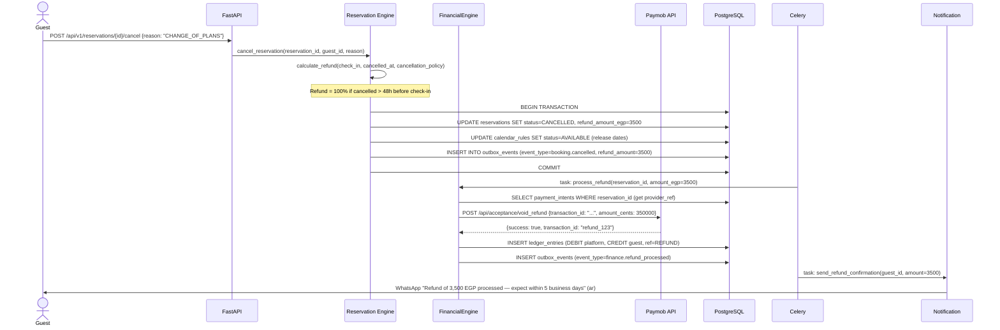
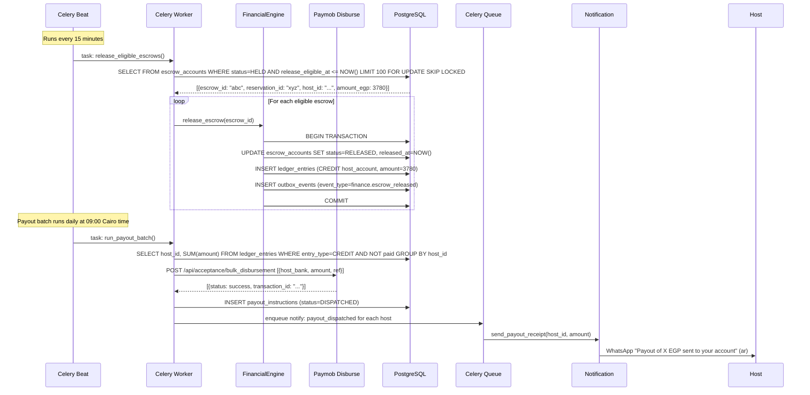
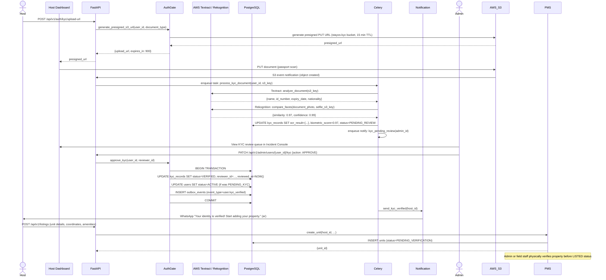
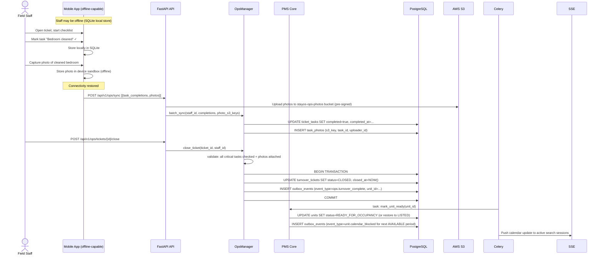

# 07 — Sequence Diagrams

**Cross-references**: [06_EVENT_CATALOG.md](06_EVENT_CATALOG.md) · [03_MICROSERVICES.md](03_MICROSERVICES.md) · [ADR-003](../architecture/adr/ADR-003-payment-provider.md) · [ADR-013](../architecture/adr/ADR-013-event-driven-architecture.md)

---

## 1. Booking Flow (Guest → Confirmed Reservation)

---

## 2. Check-In Flow

---

## 3. Check-Out Flow

---

## 4. Payment Flow (Paymob — Egyptian Rails)

---

## 5. Refund Flow

---

## 6. Escrow Release Flow

---

## 7. Host Approval (KYC + Listing Verification)

---

## 8. Operations — Turnover Completion

