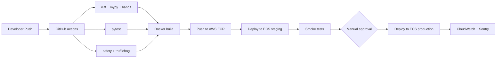

# 11 — Deployment Architecture

**Cross-references**: [01_SYSTEM_OVERVIEW.md](01_SYSTEM_OVERVIEW.md) · [ADR-007](../architecture/adr/ADR-007-deployment-strategy.md) · [ADR-001](../architecture/adr/ADR-001-frontend-framework.md) · [12_SCALABILITY_PLAN.md](12_SCALABILITY_PLAN.md) · [10_SECURITY_MODEL.md](10_SECURITY_MODEL.md)

---

## 1. Cloud Provider and Region

**Primary**: AWS `me-central-1` (UAE — Abu Dhabi)

Rationale (ADR-007):
- ~20–40ms latency from Egypt and GCC
- CloudFront edge nodes in Cairo and Riyadh
- RDS PostgreSQL with PostGIS available
- ElastiCache (Redis) available
- S3 buckets in-region (no cross-region transfer for primary data)
- Neutral MENA region acceptable for Egypt regulatory compliance

---

## 2. Architecture Diagram

```
┌─────────────────────────────────────────────────────────────────────┐
│                    Global Edge Layer                                │
│                                                                     │
│  AWS CloudFront (CDN)                                               │
│  ├── /ar/**, /en/**, /api/v1/stream/** → ALB (dynamic)             │
│  ├── Static assets (JS, CSS, images) → S3 (listings bucket)        │
│  └── Listing photos (public) → S3 via Origin Access Control        │
│                                                                     │
│  Vercel (Next.js frontend deployment)                               │
│  └── SSR pages → served from Vercel Edge Network                   │
└───────────────────────┬─────────────────────────────────────────────┘
                        │ HTTPS (TLS 1.3)
┌───────────────────────▼─────────────────────────────────────────────┐
│                    AWS me-central-1 (UAE)                           │
│                                                                     │
│  ┌─────────────────────────────────────────────────────────────┐   │
│  │  VPC (10.0.0.0/16)                                          │   │
│  │                                                             │   │
│  │  Public Subnet (10.0.1.0/24, 10.0.2.0/24)                  │   │
│  │  ├── AWS ALB (Application Load Balancer)                    │   │
│  │  │   ├── HTTPS listener :443 → Target Group: FastAPI        │   │
│  │  │   └── WebSocket upgrade → Target Group: SSE              │   │
│  │  └── NAT Gateway (outbound traffic for ECS tasks)           │   │
│  │                                                             │   │
│  │  Private Subnet (10.0.10.0/24, 10.0.11.0/24)               │   │
│  │  ├── ECS Cluster (Fargate)                                  │   │
│  │  │   ├── FastAPI API Service (2 tasks × 1vCPU/2GB)         │   │
│  │  │   ├── Celery Worker Service (4 tasks × 0.5vCPU/1GB)     │   │
│  │  │   └── Celery Beat Service (1 task × 0.25vCPU/512MB)     │   │
│  │  ├── RDS PostgreSQL 16 (Multi-AZ, db.r7g.large)            │   │
│  │  │   └── PostGIS 3 extension enabled                        │   │
│  │  ├── ElastiCache Redis 7 (cache.r7g.medium, Multi-AZ)       │   │
│  │  └── VPC Endpoints (S3, Secrets Manager, ECR, CloudWatch)  │   │
│  │                                                             │   │
│  │  AWS Services (accessed via VPC endpoints)                  │   │
│  │  ├── S3: stayos-listings-prod, stayos-kyc-prod, stayos-ops-prod│
│  │  ├── Secrets Manager: stayos/* secrets                      │   │
│  │  ├── Textract + Rekognition (KYC processing)                │   │
│  │  ├── SES (transactional email)                              │   │
│  │  ├── Lambda (S3 image resize trigger)                       │   │
│  │  ├── CloudWatch (logs + metrics)                            │   │
│  │  └── ECR (container registry)                               │   │
│  └─────────────────────────────────────────────────────────────┘   │
└─────────────────────────────────────────────────────────────────────┘
```

---

## 3. ECS Fargate Services

### 3.1 FastAPI API Service

| Attribute | Value |
|-----------|-------|
| **Image** | `{ecr_account}.dkr.ecr.me-central-1.amazonaws.com/stayos-api:latest` |
| **CPU** | 1 vCPU |
| **Memory** | 2 GB |
| **Tasks** | 2 (minimum) — 10 (maximum, auto-scaling) |
| **Health check** | `GET /health` → HTTP 200 within 5s |
| **Scaling policy** | ALBRequestCountPerTarget > 500 → scale out |
| **Port** | 8000 (uvicorn) → mapped to ALB target group |

**Container start command**: `uvicorn app.main:app --host 0.0.0.0 --port 8000 --workers 4`

---

### 3.2 Celery Worker Service

| Attribute | Value |
|-----------|-------|
| **Image** | Same as API image (shared codebase) |
| **CPU** | 0.5 vCPU |
| **Memory** | 1 GB |
| **Tasks** | 4 (minimum) — 20 (maximum) |
| **Scaling policy** | Redis queue depth > 100 unprocessed tasks → scale out |
| **Queues** | `high` (payment, checkout) · `default` (notifications, ops) · `low` (reporting, sync) |

**Container start command**: `celery -A app.celery_app worker --loglevel=info -Q high,default,low --concurrency=4`

---

### 3.3 Celery Beat Service

| Attribute | Value |
|-----------|-------|
| **Image** | Same as API image |
| **CPU** | 0.25 vCPU |
| **Memory** | 512 MB |
| **Tasks** | 1 (always exactly 1 — never scale Celery Beat) |
| **Scheduled tasks** | Escrow release check (every 15 min) · Payout batch (daily 09:00 Cairo) · Outbox poller (every 10s) |

**Container start command**: `celery -A app.celery_app beat --loglevel=info --scheduler celery.beat:PersistentScheduler`

---

## 4. Frontend Deployment (Vercel)

Next.js 14 (App Router) deployed to **Vercel** with the following configuration:

| Attribute | Value |
|-----------|-------|
| **Framework** | Next.js 14 |
| **Region** | Vercel Edge Network (automatic — closest to user) |
| **Environment** | Production: `stayos.com` · Preview: `*.vercel.app` |
| **Environment variables** | `NEXT_PUBLIC_API_URL`, `NEXT_PUBLIC_FIREBASE_CONFIG`, `NEXT_PUBLIC_GOOGLE_MAPS_KEY` |
| **Build command** | `next build` |
| **Output** | `standalone` (for server components) |

**API proxying**: Next.js API routes at `/api/proxy/*` forward requests to `https://api.stayos.com/api/v1/*` adding the Firebase JWT from cookies. This prevents direct browser-to-backend API calls.

**ISR (Incremental Static Regeneration)**: Listing detail pages (`/ar/listings/[id]`) use `revalidate = 60` — cached for 60 seconds, then regenerated on next request.

---

## 5. PostgreSQL (RDS)

| Attribute | Value |
|-----------|-------|
| **Engine** | PostgreSQL 16 |
| **Instance** | `db.r7g.large` (2 vCPU, 16 GB RAM) |
| **Multi-AZ** | Yes (automatic failover) |
| **Storage** | 100 GB gp3 SSD, auto-scaling to 1 TB |
| **Extensions** | PostGIS 3, pg_trgm, uuid-ossp, pg_partman |
| **Backup** | Automated daily snapshot + 7-day retention; point-in-time recovery to 5-minute precision |
| **Encryption** | AES-256 at rest |
| **Connection pooling** | PgBouncer on ECS (transaction mode, 100 max connections) |

**Separate databases per environment**: `stayos_prod`, `stayos_staging`, `stayos_dev`. Separate RDS instances for prod and staging. Dev uses a shared instance.

---

## 6. Redis (ElastiCache)

| Attribute | Value |
|-----------|-------|
| **Engine** | Redis 7 |
| **Node type** | `cache.r7g.medium` (2 vCPU, 6.38 GB) |
| **Cluster mode** | Disabled (Phase 1 — single primary + 1 replica for HA) |
| **Multi-AZ** | Yes (automatic failover to replica) |
| **Persistence** | AOF (append-only file) enabled — recover Celery tasks after restart |
| **Encryption** | In-transit TLS + at-rest encryption |

**Key namespaces**:
```
otp:{phone}                     # OTP code, TTL 300s
rate:{user_id}:{endpoint}       # Rate limit counter, TTL varies
event:{event_id}                # Idempotency key, TTL 86400s
celery:*                        # Celery broker keys
sse:{channel}                   # SSE pub/sub channels
```

---

## 7. CDN Configuration

**AWS CloudFront** distribution with two origin groups:

| Origin | Path Pattern | Cache TTL |
|--------|-------------|-----------|
| S3 listings bucket (via OAC) | `/photos/*` | 7 days |
| ALB (FastAPI API) | `/api/v1/*` | No cache (TTL=0) |
| Vercel | `*` (default) | Vercel-managed |

**Cache invalidation**: When a listing photo is updated, the Lambda resize pipeline sends a CloudFront invalidation for the specific path pattern.

---

## 8. CI/CD Pipeline



**Deployment strategy**: Rolling update on ECS (minimum 50% healthy tasks during deployment). Zero-downtime deployments.

**Database migrations**: Run as a one-off ECS task before the new API service tasks are deployed. Alembic migrations are backwards-compatible — old code can run against the new schema during the deployment window.

---

## 9. Environment Configuration

| Environment | AWS Account | RDS | Redis | ECS Tasks | Vercel |
|------------|------------|-----|-------|----------|--------|
| Development | Dev account | Shared RDS dev instance | ElastiCache dev | 1 task each | Preview deployments |
| Staging | Staging account | Dedicated RDS staging | ElastiCache staging | 2 tasks API | Staging domain |
| Production | Prod account | Multi-AZ RDS prod | Multi-AZ Redis | 2–10 tasks | stayos.com |

---

## 10. Monitoring and Observability

| Tool | What it monitors |
|------|----------------|
| **CloudWatch Metrics** | ECS task CPU/memory, ALB request count, RDS connections, Redis memory |
| **CloudWatch Logs** | Structured JSON logs from all FastAPI services and Celery workers |
| **CloudWatch Alarms** | API p99 latency > 2s, error rate > 1%, RDS storage < 20%, Redis memory > 80% |
| **Sentry** | Unhandled exceptions in FastAPI and Next.js (with source maps) |
| **Celery Flower** | Celery worker monitoring — task success/failure rates, queue depth |

**PagerDuty integration**: CloudWatch Alarms → SNS → PagerDuty for P0/P1 incidents.
