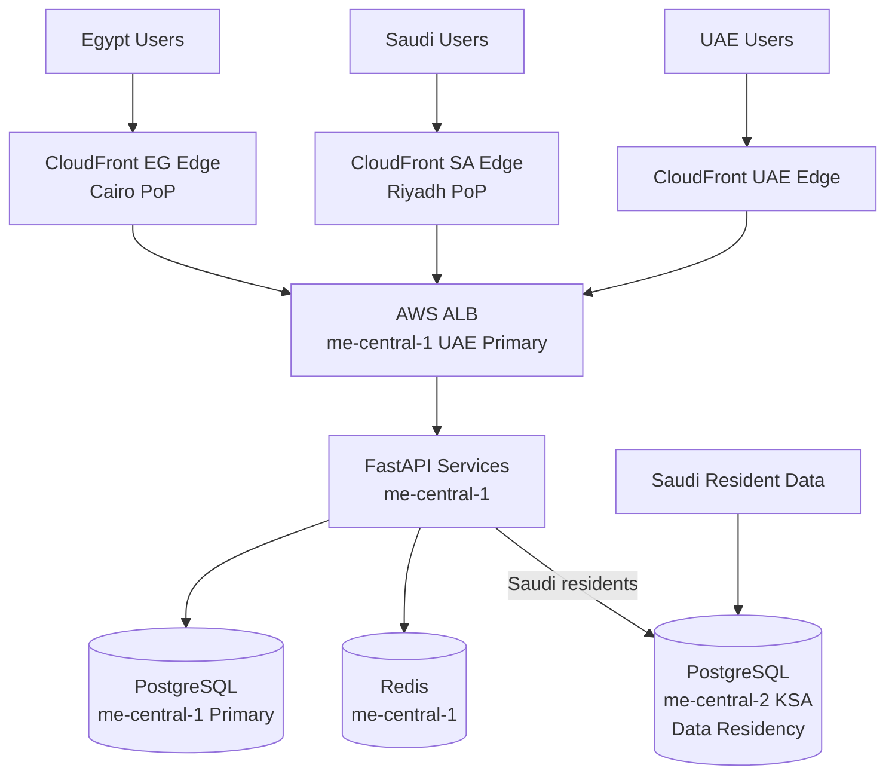

# 12 — Scalability Plan

**Cross-references**: [11_DEPLOYMENT_ARCHITECTURE.md](11_DEPLOYMENT_ARCHITECTURE.md) · [ADR-015](../architecture/adr/ADR-015-multi-region-expansion.md) · [03_MICROSERVICES.md](03_MICROSERVICES.md) · [MASTER_CONTEXT.md](../../MASTER_CONTEXT.md)

---

## 1. Scale Stages

| Stage | Market | Listings | Bookings/Month | GTV/Month | Infrastructure |
|-------|--------|----------|---------------|-----------|---------------|
| **Phase 1** | Egypt (Cairo + Red Sea) | 500 | 200 | $60K | Single AWS region, modular monolith |
| **Phase 2** | Egypt (nationwide) | 3,000 | 1,500 | $500K | Read replicas, Algolia search, service extraction |
| **Phase 3** | Egypt + Saudi Arabia | 10,000 | 6,000 | $2M | Multi-region, KSA AWS region |
| **Phase 4** | Egypt + KSA + UAE | 25,000 | 18,000 | $6M | Full microservices, CDN per region |
| **Phase 5** | MENA (5+ countries) | 60,000 | 50,000 | $16M | Global edge, dedicated ML infra |

---

## 2. Egypt Scale (Phase 1 → Phase 2)

### Phase 1 Bottlenecks and Mitigations

**Bottleneck 1: Search query performance**

- Phase 1: PostGIS + pg_trgm on single RDS instance
- Trigger: Search p99 > 500ms at > 1,000 concurrent search sessions
- Mitigation: Add RDS read replica; route `GET /listings` queries to replica
- Phase 2 action: Migrate full-text search to Algolia (ADR-010); PostGIS remains for geo-spatial

**Bottleneck 2: Booking write contention**

- Phase 1: Row-level locks on `calendar_rules` using `SELECT FOR UPDATE`
- Trigger: > 5% lock wait timeout rate during peak Eid booking periods
- Mitigation: Redis-based distributed lock as pre-filter (reduces DB contention by 80%)
- Implementation: `if not redis.set(f"cal_lock:{unit_id}:{date_range}", "1", nx=True, ex=30): raise CalendarConflict`

**Bottleneck 3: Celery worker throughput**

- Phase 1: 4 Celery workers (20 concurrent tasks)
- Trigger: Notification queue depth > 500 messages
- Mitigation: Scale Celery workers horizontally via ECS auto-scaling (queue depth trigger)
- No code changes required — ECS auto-scaling is configuration only

**Bottleneck 4: Database connections**

- Phase 1: PgBouncer with 100 max connections
- Trigger: PgBouncer connection wait > 50ms
- Mitigation: Increase `max_client_conn` in PgBouncer; add second PgBouncer instance

### Phase 2 Architecture Changes

| Change | Trigger | Effort |
|--------|---------|--------|
| RDS read replica (search) | Search p99 > 500ms | Low — RDS console + SQLAlchemy read/write split |
| Algolia for full-text search | Arabic search NPS < 7.0 | Medium — 2 sprint days (pre-planned in ADR-010) |
| Extract Reservation Engine to separate ECS service | Booking failures > 0.1% due to shared memory | Medium |
| Redis Cluster mode | Single Redis node > 70% memory | Low — ElastiCache config change |
| Ledger table partitioning | ledger_entries > 1M rows | Low — pg_partman setup |

---

## 3. GCC Scale — Egypt + Saudi Arabia (Phase 3)

### Multi-Region Architecture

### Saudi Arabia Expansion Requirements (Phase 3)

**Regulatory — Data Residency**:
- Saudi resident user data (profile, KYC, booking history) must be stored in AWS `me-central-2` (KSA)
- Financial transaction data for Saudi users: store in KSA region per NCA requirements
- Architecture: The `user.country` field routes all database writes for Saudi users to the KSA RDS instance via a read/write routing layer in SQLAlchemy

**Payment Rail Expansion**:
- HyperPay: Saudi local payment aggregator (Mada debit network, STC Pay)
- PaymentRouter abstraction (from ADR-003) accepts new provider adapters without schema changes
- New `payment_provider` enum value: `HYPERPAY`
- Paymob disbursement for Saudi hosts → replaced with HyperPay disbursement

**Language**:
- Gulf Arabic (`ar-SA`) has dialectal differences from Egyptian Arabic (`ar-EG`)
- Content layer: property descriptions and UI copy are locale-tagged
- Search: Algolia supports Arabic locales independently

**Local staff**:
- OpsManager `staff_assignments` scoped by region (new `region` column on `users` table for FIELD_STAFF)

### UAE Expansion (Phase 3 — parallel to Saudi)

- AWS `me-central-1` (UAE) is the primary region — UAE expansion does not require a new region
- UAE payment rails: Network International, FAB Pay
- ADGM / DIFC compliance requires data processing agreement (DPA) review
- No new infrastructure region needed

---

## 4. Global Scale (Phase 4–5)

### Architecture at 60,000 Listings

**Database**:
- Full microservices with dedicated PostgreSQL per service (AuthDB, ListingDB, ReservationDB, FinanceDB, OpsDB)
- Each database can be scaled independently
- Finance database: partitioned ledger, read replicas for reporting
- Listing database: PostGIS spatial index for geo queries; Algolia for all text search

**Event Bus**:
- At Phase 1–2: Transactional Outbox + Celery (Redis broker)
- At Phase 4+: Replace with AWS EventBridge (managed pub/sub) or Apache Kafka (self-managed, if volume demands)
- Trigger for migration: event throughput > 50K events/hour sustained

**CQRS (Command Query Responsibility Segregation)**:
- Reservation Engine: Write path (booking creation, payment processing) stays on PostgreSQL with row locks
- Read path (availability calendar, booking history): ElasticSearch or dedicated read model updated via events
- Trigger: Read:write query ratio > 20:1 causing database read pressure

**Caching Layer**:
- Listing pages: Redis cache with 60-second TTL (reduces DB reads by ~70% for popular listings)
- Search results: Redis cache for common viewport + filter combinations (TTL 30 seconds)
- Invalidation: Cache busted on `unit.calendar_blocked` or `unit.listing_updated` events

### Edge Computing (Phase 5)

- `GET /listings` (search): Cached at CloudFront edge for common filter combinations (geo + amenity queries with high overlap)
- Listing detail pages: Vercel Edge Runtime for SSR — serves from nearest Vercel PoP
- Authentication tokens: Verified at edge (Firebase Admin SDK initialized at edge) to reduce origin latency

---

## 5. Scalability Metrics and Triggers

| Metric | Phase 1 Target | Phase 2 Alert | Phase 3 Alert |
|--------|---------------|--------------|--------------|
| API p99 latency | < 500ms | > 800ms | > 1000ms |
| Search p99 latency | < 2s | > 1.5s | > 1s (tighten) |
| Database CPU | < 50% | > 70% | > 85% |
| Redis memory | < 60% | > 70% | > 80% |
| Celery queue depth | < 50 | > 200 | > 500 |
| Booking error rate | < 0.5% | > 1% | > 0.5% (tighten) |
| Double-booking incidents | 0 | > 0 (immediate incident) | > 0 |

---

## 6. Cost Scaling Model

| Stage | Monthly AWS Cost | Monthly Vercel | Total Infrastructure |
|-------|-----------------|---------------|---------------------|
| Phase 1 (500 listings) | ~$1,200 | ~$20 (Pro plan) | ~$1,220/month |
| Phase 2 (3K listings) | ~$3,500 | ~$150 | ~$3,650/month |
| Phase 3 (10K, multi-region) | ~$12,000 | ~$400 | ~$12,400/month |
| Phase 4 (25K) | ~$35,000 | ~$1,000 | ~$36,000/month |
| Phase 5 (60K) | ~$80,000 | ~$2,000 | ~$82,000/month |

Infrastructure cost as a % of GTV at Phase 5 ($16M/month): ~0.5%. Well within unit economics targets.
