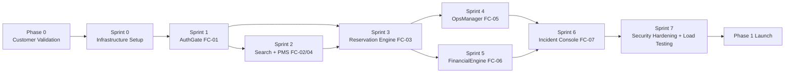

# 13 — Implementation Order

**Cross-references**: [14_ENGINEERING_BACKLOG.md](14_ENGINEERING_BACKLOG.md) · [03_MICROSERVICES.md](03_MICROSERVICES.md) · [PRODUCT_CANON.md](../../PRODUCT_CANON.md) · [docs/02_product/MVP_FREEZE.md](../02_product/MVP_FREEZE.md)

---

## 1. Phase Gate Reminder

**Phase 1 engineering begins only after Phase 0 gates clear**:
- [ ] 50 traveler interviews
- [ ] 30 host/property manager interviews
- [ ] 10 manual bookings completed
- [ ] Guest NPS ≥ 7.0 / Host NPS ≥ 7.0
- [ ] Founding wedge identified and validated

Gate conditions: [docs/phase--1/reports/16_REQUIRED_VALIDATIONS.md](../phase--1/reports/16_REQUIRED_VALIDATIONS.md)

---

## 2. Critical Path

**Critical path**: Auth → Booking → Finance. These three cannot be parallelized because each depends on the prior. Everything else can be parallelized around this spine.

---

## 3. Sprint 0 — Infrastructure Foundation (2 weeks)

**Goal**: All infrastructure in place before first line of application code is written.

| Task | Owner | Days |
|------|-------|------|
| AWS account setup (prod + staging) | DevOps | 2 |
| VPC, subnets, security groups | DevOps | 1 |
| RDS PostgreSQL 16 + PostGIS setup | DevOps | 1 |
| ElastiCache Redis 7 | DevOps | 0.5 |
| ECS cluster + Fargate task definitions | DevOps | 2 |
| AWS Secrets Manager structure | DevOps | 0.5 |
| ECR container registry | DevOps | 0.5 |
| ALB + HTTPS + ACM certificate | DevOps | 1 |
| CloudFront distributions | DevOps | 1 |
| S3 buckets (listings + KYC + ops) | DevOps | 0.5 |
| PgBouncer setup | DevOps | 0.5 |
| GitHub Actions CI/CD pipeline | DevOps | 2 |
| Vercel project setup | Frontend Lead | 0.5 |
| Firebase project setup | Backend Lead | 0.5 |
| Alembic migration baseline | Backend Lead | 0.5 |
| Sentry + CloudWatch dashboards | DevOps | 1 |

**Sprint 0 exit criteria**: `GET /health` on the API returns 200; CI/CD deploys a hello-world service to staging.

---

## 4. Sprint 1 — AuthGate (FC-01) (3 weeks)

**Goal**: Any user can sign up, verify phone, optionally use Google/Apple SSO, and upload KYC documents. Hosts cannot list until KYC is approved.

### Backend Tasks (FastAPI)

| Task | Days | Depends On |
|------|------|-----------|
| User model + Alembic migration | 1 | Sprint 0 |
| OTP: Twilio Verify integration + Redis TTL | 2 | Sprint 0 |
| Firebase Admin SDK setup + JWT verification middleware | 1 | Sprint 0 |
| Social OAuth (Google/Apple) endpoint | 1 | Firebase |
| KYC upload: pre-signed S3 URL generation | 1 | S3 KYC bucket |
| KYC processing: Textract + Rekognition Celery task | 3 | Celery worker |
| KYC status endpoint + admin review endpoint | 1 | KYC task |
| Role assignment API | 0.5 | User model |
| Audit log implementation | 1 | User model |
| Session revocation (logout) | 0.5 | JWT middleware |

### Frontend Tasks (Next.js)

| Task | Days | Depends On |
|------|------|-----------|
| Auth pages: phone entry, OTP verification, SSO buttons | 3 | Firebase JS SDK |
| KYC upload flow (document scan + selfie) | 2 | Pre-signed URL API |
| Profile page | 1 | Auth API |
| RTL layout foundation (Arabic-first) | 2 | Next.js i18n config |
| Arabic typography setup (Cairo/Tajawal font) | 0.5 | RTL layout |

**Sprint 1 exit criteria**: A user can register, verify phone, and log in. A host can upload KYC. An admin can approve KYC. No property listing is possible without verified KYC.

---

## 5. Sprint 2 — PMS Core + Search (FC-02, FC-04) (3 weeks)

**Can begin in parallel with Sprint 1 on backend (frontend must wait for auth).**

### Backend Tasks

| Task | Days | Depends On |
|------|------|-----------|
| Unit model + calendar_rules + unit_listings migrations | 2 | Sprint 0 |
| PostGIS spatial index setup | 0.5 | RDS |
| Unit CRUD endpoints | 2 | Unit model |
| Photo upload: pre-signed S3 URL + Lambda resize pipeline | 3 | S3 listings bucket |
| Calendar management endpoints | 2 | Unit model |
| Pricing tier endpoints | 1 | Unit model |
| Spatial search endpoint (PostGIS viewport + radius) | 2 | PostGIS |
| Full-text search (pg_trgm + Arabic unaccent) | 2 | Unit listing model |
| Unit status state machine + listing verification flow | 1.5 | Unit model |
| PMS KPI calculations (ADR, RevPAR, occupancy) | 2 | Reservation model (read-only) |

### Frontend Tasks

| Task | Days | Depends On |
|------|------|-----------|
| Search page: map (Google Maps) + listing cards | 4 | Auth sprint RTL |
| Listing detail page (ISR) | 2 | Search endpoint |
| Host dashboard: create/edit listing form | 3 | Unit CRUD endpoints |
| Photo upload UI | 2 | Photo upload endpoint |
| Calendar management UI (date picker, block/unblock) | 3 | Calendar endpoints |
| Pricing UI | 1.5 | Pricing endpoint |

**Sprint 2 exit criteria**: A verified host can create a listing with photos. A guest can search by location and dates and see a listing detail page.

---

## 6. Sprint 3 — Reservation Engine (FC-03) (3 weeks)

**Depends on Sprint 1 (Auth) and Sprint 2 (PMS) being complete.**

### Backend Tasks

| Task | Days | Depends On |
|------|------|-----------|
| Reservation model migration | 1 | Sprint 0 |
| Payment intent model migration | 0.5 | Reservation |
| Calendar lock service (SELECT FOR UPDATE) | 2 | Calendar model |
| Booking initiation endpoint | 2 | Lock service |
| Paymob integration: order + payment key + iframe | 3 | Secrets Manager |
| Stripe integration: payment intent | 2 | Secrets Manager |
| Payment routing (Paymob vs Stripe by method) | 1 | Both integrations |
| Paymob webhook handler + HMAC verification | 2 | Paymob |
| Stripe webhook handler | 1 | Stripe |
| Booking confirmation flow (status transitions) | 2 | Webhook handlers |
| Promo code model + application endpoint | 2 | Reservation model |
| Cancellation endpoint + refund calculation | 2 | Paymob/Stripe |
| Check-in / check-out endpoints | 1 | Reservation model |
| SSE stream for booking status | 1 | Redis pub/sub |
| Outbox events for all reservation events | 1 | Outbox pattern |

### Frontend Tasks

| Task | Days | Depends On |
|------|------|-----------|
| Checkout flow: dates, guests, payment method selection | 3 | Booking endpoint |
| Paymob iframe integration | 2 | Paymob endpoint |
| Stripe payment element (card form) | 2 | Stripe endpoint |
| Booking confirmation page | 1 | SSE stream |
| Guest reservations list | 1.5 | Reservations endpoint |
| Host reservations list | 1.5 | Reservations endpoint |
| Cancellation flow | 1.5 | Cancel endpoint |

**Sprint 3 exit criteria**: A guest can complete a full booking with Fawry or card payment. Host receives WhatsApp notification. Booking appears in both guest and host dashboards.

---

## 7. Sprint 4 — OpsManager (FC-05) (2 weeks)

**Depends on Sprint 3 (checkout endpoint must be working).**

### Backend Tasks

| Task | Days | Depends On |
|------|------|-----------|
| TurnoverTicket model migration | 1 | Sprint 0 |
| Ticket creation Celery task (triggered by checkout event) | 2 | Event outbox |
| TurnoverDispatcher (proximity-based staff assignment) | 2 | PostGIS unit coordinates |
| Ticket CRUD endpoints | 1.5 | Ticket model |
| Checklist task management endpoints | 1 | Ticket model |
| Photo verification endpoint (ops S3 bucket) | 1.5 | S3 ops bucket |
| Ticket closure + unit status update event | 1 | Unit model |
| Offline sync endpoint (batch SQLite upload) | 2 | All ticket endpoints |
| Ticket escalation logic | 1 | Ticket model |

### Mobile App (React Native — Field Staff)

| Task | Days | Depends On |
|------|------|-----------|
| SQLite local store setup | 2 | React Native scaffold |
| Ticket list and detail screens | 3 | SQLite + API sync |
| Checklist interaction | 2 | Ticket model |
| Camera capture + offline photo queue | 3 | AWS S3 pre-signed URL |
| Sync on reconnect (background sync) | 2 | Sync endpoint |

**Sprint 4 exit criteria**: A turnover ticket is automatically created within 5 minutes of checkout. Field staff sees it on mobile. Field staff can complete checklist and attach photos. Ticket closure updates unit status.

---

## 8. Sprint 5 — FinancialEngine (FC-06) (2 weeks)

**Depends on Sprint 3 (payment confirmed event must be live).**

### Backend Tasks

| Task | Days | Depends On |
|------|------|-----------|
| Escrow and ledger migrations | 1 | Sprint 0 |
| Escrow creation on payment_confirmed event | 2 | Event outbox |
| T+24h escrow release (Celery Beat task) | 2 | Celery Beat |
| Double-entry ledger service | 3 | Ledger model |
| Fee split calculation (guest fee + host commission) | 1.5 | Reservation amounts |
| Tax withholding calculator (VAT by governorate) | 1.5 | Tax config table |
| Payout batch Celery Beat task (daily) | 2 | Paymob disbursement API |
| Host balance + payout history endpoints | 1 | Ledger model |
| Refund processing (on cancellation event) | 2 | Cancellation flow |
| Admin revenue report endpoint | 1 | Ledger model |

**Sprint 5 exit criteria**: Escrow holds funds after booking, releases 24h after check-in. Host receives payout via Paymob within 24h of release. All transactions recorded in double-entry ledger.

---

## 9. Sprint 6 — Incident Console (FC-07) + Integration (2 weeks)

**Depends on all prior sprints.**

### Tasks

| Task | Days | Depends On |
|------|------|-----------|
| Incident Console UI (Next.js admin dashboard) | 4 | All API endpoints |
| Dispute queue + resolution workflow | 2 | All service endpoints |
| Emergency delist endpoint | 1 | Unit status endpoint |
| User ban / suspend endpoint + audit log | 1 | User model |
| WhatsApp notification templates (all 8 templates) | 2 | WhatsApp Business API |
| End-to-end booking flow integration test | 3 | All sprints |

---

## 10. Sprint 7 — Security Hardening + Performance (2 weeks)

**Final sprint before Phase 1 launch.**

| Task | Days |
|------|------|
| AWS WAF rules configuration | 1 |
| Load testing (Locust): 500 concurrent search sessions | 2 |
| Load testing: 50 concurrent booking sessions (calendar lock contention test) | 2 |
| Penetration test (authentication bypass, injection, IDOR) | 3 |
| S3 KYC bucket access audit | 0.5 |
| Secrets rotation dry-run | 0.5 |
| CloudWatch alarm configuration | 1 |
| Runbook creation (payment outage, double-booking, payout failure) | 2 |

---

## 11. Parallel Work Opportunities

| Sprint | Can Parallel With |
|--------|-----------------|
| Infra (Sprint 0) | Phase 0 customer validation (different team) |
| PMS backend (Sprint 2 early) | Auth backend (Sprint 1) |
| OpsManager backend (Sprint 4) | FinancialEngine backend (Sprint 5) |
| Mobile app development | Sprints 3–4 backend in parallel |
| WhatsApp template submission | Sprint 1 (submit templates early — 72h review) |
| Firebase project setup | Sprint 0 |

---

## 12. Timeline Summary

| Sprint | Duration | Cumulative | Milestone |
|--------|---------|-----------|---------|
| Phase 0 (customer validation) | Variable | Pre-Phase 1 | Gate cleared |
| Sprint 0 (infra) | 2 weeks | 2 weeks | Infrastructure ready |
| Sprint 1 (auth) | 3 weeks | 5 weeks | Users can sign up and KYC |
| Sprint 2 (PMS + search) | 3 weeks | 8 weeks | Hosts can list; guests can search |
| Sprint 3 (booking) | 3 weeks | 11 weeks | Full booking + payment working |
| Sprint 4 (ops) | 2 weeks | 13 weeks | Turnover automation live |
| Sprint 5 (finance) | 2 weeks | 15 weeks | Escrow + payouts live |
| Sprint 6 (incident + integration) | 2 weeks | 17 weeks | Admin tools + integration |
| Sprint 7 (hardening) | 2 weeks | 19 weeks | Production-ready |

**Total Phase 1 build time**: ~19 weeks from gate clearance. Within the 6-month ($150K) budget from PRODUCT_CANON.md §5.
